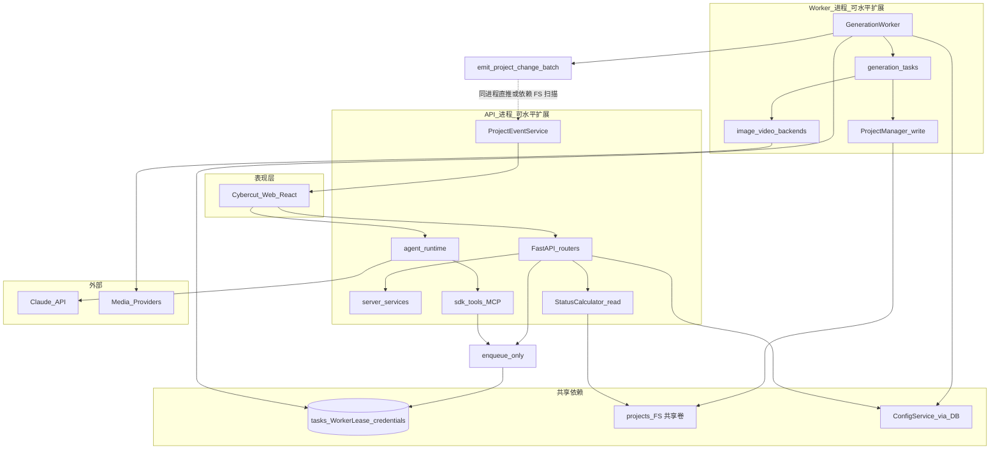
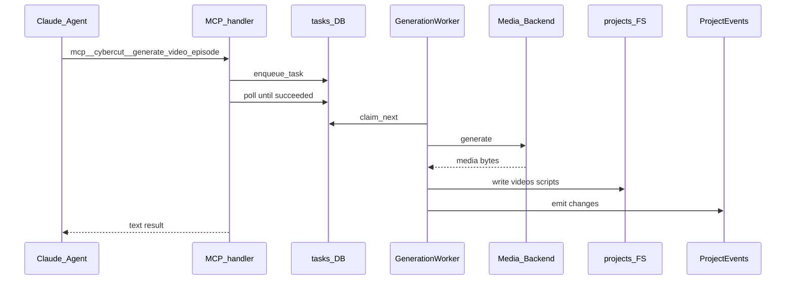
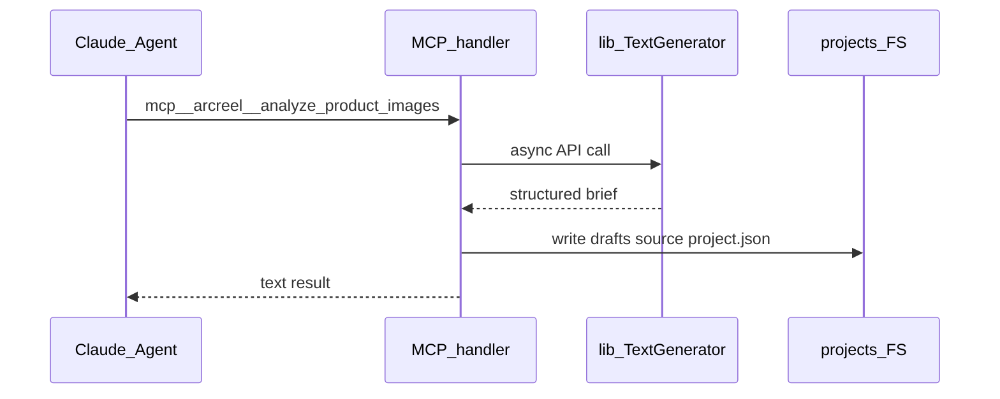
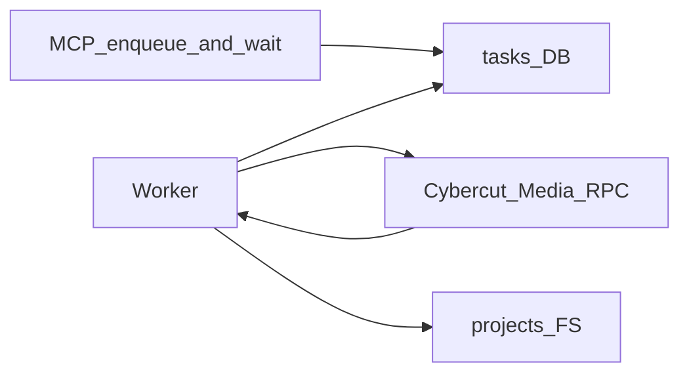
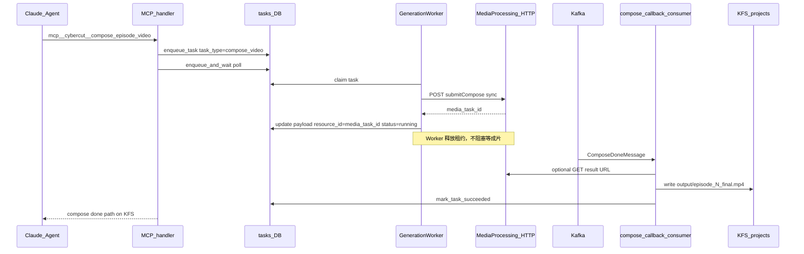

# Cybercut Agentic 技术方案撰写计划

## 目标与约束

- **交付物**：新建 [`docs/架构/cybercut-agentic-technical-proposal.md`](docs/架构/cybercut-agentic-technical-proposal.md)（作者 wanghaobo，中文，通俗易懂）。
- **产品定位**（你已确认）：**独立 Cybercut 产品**，技术架构与 [ArcReel](.) 同构（React + FastAPI + Claude Agent SDK + `GenerationQueue`/`Worker` + FS 真相源），**不**要求在 ArcReel monorepo 内扩展 `content_mode`。
- **端到端示例**（你已确认）：**营销短视频主路径**（分镜/单镜视频用模式 I；**成片合成**用模式 IV：媒体服务同步 `task_id` + Kafka 回调，见 §3.5.4）。高光切片等与合成同骨架，正文仅列举。
- **姊妹文档**：开篇说明「ArcReel 为参考实现」，并链接 [module-architecture.md](docs/架构/module-architecture.md)、[full-interaction-flow.md](docs/架构/full-interaction-flow.md)、[end-to-end-architecture.md](docs/架构/end-to-end-architecture.md)、[project-data-structure.md](docs/架构/project-data-structure.md)。

---

## 文档结构（建议目录）

### 1. 背景与建设目标（约 1 页）

- Cybercut Agentic 要解决的问题：用户用 **对话 + 画布** 完成「商品/简报 → 分镜 → 视频 → 导出」，而非纯表单流水线。
- 与 ArcReel 关系：**架构克隆 + 品牌/部署/业务包独立**；实现时可从 ArcReel 抽离平台层代码或按模块重写，但**契约不变**（见下节原则）。
- 非目标（明确写清）：首版不做多 `content_mode`（仅 marketing）、不展开自定义供应商全量能力（可二期）。**部署上**允许开发态单体、生产态 **API / Worker 拆分**（见 §3 进程与部署模型）。

### 2. 架构原则（从四篇文档提炼为 Cybercut 约束）

用表格固定 5 条，避免团队各自理解：

| 原则 | Cybercut 落地 |
|------|----------------|
| 双入口、单队列 | Web `POST /generate/*` 与 Agent MCP 均写 **同一 `tasks` 表**；由 **Worker 进程池** 认领执行（可与 API 分机部署） |
| Agent 只编排、Worker 执行 | MCP 可 `enqueue_and_wait`；禁止在沙箱 Bash 里直连供应商 |
| FS 为剧本/媒体真相源 | `projects/{name}/`；DB 仅存任务、凭证、会话 |
| 四通道分工 | Assistant SSE / Tasks 轮询 / Project Events SSE / `getProject`（禁止用聊天消息代替画布刷新） |
| Profile 即能力包 | `agent_runtime_profile/` → 项目 `.claude/`（manifest + sha256） |

### 3. 架构分层（核心章节）

采用与 [module-architecture.md](docs/架构/module-architecture.md) 一致的 **7+1 层**，每层：**职责一句话 + Cybercut 目录映射 + 与 ArcReel 对照**。



**分层表（文档内展开）**：

| 层 | 模块 | Cybercut 建议路径 |
|----|------|-------------------|
| 表现层 | SPA、Copilot、画布、i18n | `frontend/` |
| 接入层 | REST、鉴权、校验 | `server/routers/` |
| 编排层 | 生成编排、事件、费用 | `server/services/` |
| Agent 层 | Session、SSE、MCP | `server/agent_runtime/`、`agent_runtime_profile/` |
| 调度层 | 入队、认领、去重 | `lib/generation_queue.py`、`lib/generation_worker.py` |
| 执行层 | 单任务逻辑、供应商 | `server/services/generation_tasks.py`、`lib/*_backends/` |
| 领域层 | 项目 FS、剧本、读时状态 | `lib/project_manager.py`、`lib/status_calculator.py` |
| 平台层 | ORM、凭证、配置 | `lib/db/`、`lib/config/` |

**进程与部署模型**（Cybercut 与 ArcReel 参考实现的差异点）：

| 维度 | ArcReel 参考实现（现状） | Cybercut 目标 |
|------|--------------------------|---------------|
| 耦合方式 | API 与 Worker **同进程**：`server/app.py` `lifespan` 内 `worker.start()` + `ProjectEventService.start()` | **逻辑解耦**：入队/认领只经 **DB `tasks` + `WorkerLease`**，进程可拆 |
| 开发/单机 | 一条 `uvicorn` 即可 | 可保留 **单体模式**（与 ArcReel 相同，便于本地调试） |
| 生产 | 多副本时多 Worker 抢同一队列 | **API Deployment** + **Worker Deployment** 独立扩缩容 |

**推荐拆分（生产）**：

```text
┌─────────────────────────────┐     ┌─────────────────────────────┐
│  cybercut-api (N replicas)   │     │ cybercut-worker (M replicas) │
│  • FastAPI + Agent Runtime   │     │ • GenerationWorker 循环      │
│  • MCP 入队 / REST 入队       │     │ • generation_tasks 执行      │
│  • Assistant / Project SSE   │     │ • 写 projects/ + 供应商 RPC  │
│  • ProjectEventService       │     │ • WorkerLease 心跳           │
│  • 不跑 generation_worker    │     │ • 不暴露公网 HTTP（可选 /health）│
└──────────────┬──────────────┘     └──────────────┬──────────────┘
               │                                    │
               └────────────┬───────────────────────┘
                            ▼
              ┌─────────────────────────────┐
              │ PostgreSQL（或共享 SQLite）   │
              │ tasks / worker_lease / creds  │
              └─────────────────────────────┘
                            │
              ┌─────────────────────────────┐
              │ 快手 KFS 挂载 → projects/      │
              │ 剧本/媒体/.claude 真相源       │
              └─────────────────────────────┘
```

**解耦契约（写进正式方案）**：

1. **队列**：API/MCP 只调用 `GenerationQueue.enqueue_task`；Worker 只调用 `claim_next_task` + 更新任务状态。双方共用 `DATABASE_URL`。
2. **Worker 存活**：`TaskRepository` / `WorkerLease` 心跳；MCP `enqueue_and_wait` 前 `is_worker_online()`（见 `lib/generation_queue_client.py`），避免无 Worker 时 Agent 空等。
3. **共享 FS（KFS）**：`CYBERCUT_DATA_DIR` 指向 KFS 挂载根，其下 `projects/{name}/` 对 **所有 API Pod + 所有 Worker Pod** 为同一路径；Worker 写的 `storyboards/`、`videos/`、`scripts/` 与 API/Copilot 读的 `.claude/` 均在 KFS 上，否则 `getProject` / Agent `cwd` 不一致。
4. **Project Events（拆分后）**：
   - **理想**：Worker 写盘后通过 **跨进程总线**（Redis Pub/Sub、NATS 等）通知 API 侧 `ProjectEventService`，低延迟 SSE。
   - **最小可行**：仅 API 跑 `ProjectEventService`，依赖对已订阅项目的 **FS 指纹轮询**（`server/services/project_events.py` 已有 `poll_interval` + `scan_now`）；Worker 进程内的 `emit_project_change_batch` **不会**直达 API，但共享卷 + 轮询仍可刷新画布（延迟 ≤ 轮询间隔）。
   - ArcReel 同进程时 in-process listener 是优化路径，不是拆分部署的必需条件。
5. **取消任务**：ArcReel 同进程用 `worker.request_cancel` 取消 inflight `asyncio.Task`；拆分后以 DB `cancelling` + Worker 轮询任务状态为主，运行中任务依赖 Worker 侧 cooperative cancel（正式方案注明需在 Cybercut Worker 入口实现/验证）。
6. **凭证与配置**：API、Worker 均通过 `ConfigService` + DB 读密钥；父进程 env 仍禁止 provider secret（与 `server/app.py` fail-fast 一致）。

**实现 checklist（Cybercut 新仓库，相对 ArcReel 增量）**：

- 增加 Worker 独立入口，例如 `uv run python -m cybercut.worker`（或 `scripts/run_worker.py`），只启动 `GenerationWorker` + 共享 `lib/`，不挂载 Assistant 路由。
- API `lifespan` 增加开关，例如 `CYBERCUT_RUN_EMBEDDED_WORKER=false` 时不 `worker.start()`（开发默认可 `true`）。
- Helm/K8s：两个 Deployment、同一 `DATABASE_URL`、同一 `projects` PVC；Worker HPA 按队列深度或 CPU，API HPA 按 QPS。
- 多 Worker 副本：沿用 `claim_next` **租约**（`TASK_WORKER_LEASE_TTL_SEC`），避免双执行；按 `provider_id` 池过滤（`generation_worker.ProviderPool`）。

**与 [end-to-end-architecture.md](docs/架构/end-to-end-architecture.md) §1.2 的关系**：该节描述 ArcReel **默认单体**；Cybercut 方案单独增 **§部署：API / Worker 拆分**，避免读者误以为必须同进程。

### 3.4 Claude Agent SDK 驱动的 Runtime 与项目目录（KFS）

> **写入正式方案**时独立成节（建议紧接「部署模型」之后）：说明 Copilot 如何跑起来、**每个项目在服务端长什么样**、`.claude` 落在哪、与 **快手 KFS** 如何作为分布式中心存储。

#### 3.4.1 Runtime 是谁在驱动（组件链）

Cybercut 的「Agent 对话」不是单独进程，而是 **API 进程内的 Agent Runtime**，用官方 **`claude-agent-sdk`** 拉起子会话：

```mermaid
sequenceDiagram
  participant FE as 前端_Copilot
  participant API as FastAPI_assistant
  participant SVC as AssistantService
  participant SM as SessionManager
  participant Actor as SessionActor
  participant SDK as ClaudeSDKClient
  participant MCP as sdk_tools_MCP
  participant KFS as KFS_projects

  FE->>API: POST sessions/send
  API->>SVC: send_message
  SVC->>SM: build ClaudeAgentOptions
  Note over SM: cwd = KFS/projects/{name}
  SVC->>Actor: query prompt
  Actor->>SDK: connect + receive_response
  SDK->>KFS: Read/Write/Bash cwd 下相对路径
  SDK->>MCP: mcp__cybercut__*
  MCP->>KFS: ProjectManager 读写
  SDK-->>Actor: stream messages
  Actor-->>SVC: on_message
  SVC-->>FE: Assistant SSE
```

| 组件 | 路径（ArcReel 参考） | 职责 |
|------|----------------------|------|
| `AssistantService` | `server/agent_runtime/service.py` | 会话 CRUD、发消息、SSE 投影、快照缓存 |
| `SessionManager` | `server/agent_runtime/session_manager.py` | 组装 `ClaudeAgentOptions`：`cwd`、沙箱、hooks、**`mcp_servers`**、system prompt 追加项目上下文 |
| `SessionActor` | `server/agent_runtime/session_actor.py` | **每会话一个 asyncio task**，串行化所有 `ClaudeSDKClient` 调用，避免并发乱序 |
| `build_cybercut_mcp_server` | `server/agent_runtime/sdk_tools/` | 进程内 MCP，closure 绑定 `project_name` |
| `SessionMetaStore` | DB `agent_sessions` 表 | 会话列表/状态（title、running/completed）；**不是**剧本真相源 |
| `SdkTranscriptAdapter` | `sdk_transcript_adapter.py` | 历史 turns 回放；默认 transcript **入库**（`ARCREEL_SDK_SESSION_STORE=db`） |

**关键一行**：`SessionManager` 为每个项目设置 `ClaudeAgentOptions.cwd = {projects_root}/{project_name}`，SDK 子进程的 Read/Edit/Bash 都相对于**该项目目录**（在 KFS 上的绝对路径）。

#### 3.4.2 服务端「数据根」与 KFS 挂载

ArcReel 用 `app_data_dir()` 解析应用数据根（[`lib/app_data_dir.py`](lib/app_data_dir.py)）：

| 环境变量（Cybercut 可改名） | 含义 |
|---------------------------|------|
| `CYBERCUT_DATA_DIR`（对应 `ARCREEL_DATA_DIR`） | **KFS 挂载点或子路径**，例如 `/mnt/kfs/cybercut` |
| 默认（未设置） | 开发机：`{仓库}/projects` |

**生产推荐布局（KFS 为唯一中心存储）**：

```text
/mnt/kfs/cybercut/                    ← CYBERCUT_DATA_DIR（所有 API/Worker Pod 相同挂载）
├── projects/
│   ├── ysl-027cd262/                 ← 单个项目 = Agent cwd + 业务真相源
│   │   ├── project.json
│   │   ├── CLAUDE.md                 ← SDK setting_sources 读的系统说明（项目副本）
│   │   ├── .claude/                  ← Skills / Agents / settings（项目副本）
│   │   │   ├── skills/manga-workflow/SKILL.md
│   │   │   ├── agents/analyze-assets.md
│   │   │   └── settings.json
│   │   ├── .cybercut_profile_manifest.json   ← 对应 .arcreel_profile_manifest.json
│   │   ├── source/ scripts/ drafts/ …
│   │   ├── storyboards/ videos/ output/ …
│   │   └── …
│   └── another-project/
├── .agent_data/                      ← 可选本地 transcript 兜底目录（store=off 时）
│   └── transcripts/
└── .arcreel.db 或不用（生产用 PostgreSQL）
```

- **API Pod**：必须挂载 KFS 到同一 `CYBERCUT_DATA_DIR`；跑 Agent + `ProjectEventService` + `getProject`。
- **Worker Pod**：只挂载同一 KFS + 连同一 DB；**不需要**安装 Claude SDK，不读 `.claude`（除非 Worker 任务要执行 skill 脚本——当前生成任务走 `generation_tasks`，不经过 Agent）。
- **PostgreSQL**：会话元数据、`tasks`、凭证；与 KFS 分工：**DB = 调度与平台态，KFS = 内容与 Agent 工作区**。

#### 3.4.3 两套「Profile」：镜像模板 vs 项目内 `.claude`

| 位置 | 在部署中的形态 | 作用 |
|------|----------------|------|
| **内置模板** `agent_runtime_profile/` | 打进 **API 镜像** 或 `CYBERCUT_PROFILE_DIR` 只读目录 | 产品发版的 Skills/Agents/`CLAUDE.marketing.md` **源**；升级产品 = 升镜像 + 启动时 `sync_all_agent_profiles` |
| **项目副本** `{KFS}/projects/{name}/.claude/` + `CLAUDE.md` | 落在 **KFS**，每项目一份 | SDK **`cwd` 实际读取**的配置；Agent Bash 用 `python .claude/skills/.../script.py` |

**同步机制**（建项与升级时，[`lib/profile_manifest.py`](lib/profile_manifest.py)）：

1. `create_project` → `sync_agent_profile(project_dir)`：从模板 **物化**到 KFS 项目目录。
2. API 启动 → `ProjectManager.sync_all_agent_profiles()`：按 manifest + sha256 升级**未改动的**内置 skill；用户改过的文件不覆盖（tombstone 不复活）。
3. manifest 文件在项目根：`.arcreel_profile_manifest.json`（Cybercut 可改名为 `.cybercut_profile_manifest.json`）。

**分布式注意**：

- 多 API 副本同时 `sync_all_agent_profiles` 时，对同一项目目录有 **文件锁**（`.profile_sync.lock`），KFS 需支持 **POSIX 锁或应用层单飞**（否则用「仅一个 admin Job 跑 sync」）。
- Agent 会话 **sticky 非必须**：任意 API 副本只要挂载同一 KFS + 同一 `project_name`，`cwd` 一致即可继续对话；transcript 在 DB 时不依赖本地盘。

#### 3.4.4 单项目目录结构（营销首版，与 ArcReel 对齐）

与 [project-data-structure.md](docs/架构/project-data-structure.md) 一致，`ProjectManager.SUBDIRS` 创建：

`source`、`scripts`、`drafts`、`characters`、`scenes`、`props`、`storyboards`、`videos`、`thumbnails`、`output`、`grids`（marketing 常用子集见该文档 §2）。

**Agent 在各阶段的读写习惯**（写入 E2E 示例时可引用）：

| 阶段 | Agent 主要写 | MCP / Bash |
|------|--------------|------------|
| 商品理解 | `drafts/.../step0_product_brief.md`、`source/*.txt` | `analyze_product_images`（MCP 直连） |
| 拆镜/剧本 | `scripts/episode_1.json`、`drafts/step*` | Skill 脚本 + `generate_episode_script` |
| 生成媒体 | `characters/`、`storyboards/`、`videos/` | MCP 入队；**Worker 在 KFS 上写文件** |

#### 3.4.5 SDK 配置要点（正式方案表格）

| 配置项 | 典型值 | 说明 |
|--------|--------|------|
| `cwd` | `{CYBERCUT_DATA_DIR}/projects/{name}` | 必须在 KFS 上 resolve 为所有 Pod 一致的绝对路径 |
| `setting_sources` | `["project"]` | 读项目内 `CLAUDE.md`、`.claude/settings.json` |
| `mcp_servers` | `{"cybercut": build_...}` | 进程内工具，绑定 `project_name` |
| `sandbox` | bwrap / sandbox-exec（Linux/mac） | Bash 在沙箱；**MCP 不在沙箱** |
| `ARCREEL_SDK_SESSION_STORE` → `CYBERCUT_SDK_SESSION_STORE` | `db`（生产） | transcript 入 PostgreSQL，API 扩缩容无状态 |
| `allowed_tools` | Read/Write/Bash/… + `mcp__cybercut__*` | 与 Skill 编排一致 |

#### 3.4.6 KFS 与拆分部署 checklist（增补 §3 实现清单）

- 所有 Cybercut 服务配置 **`CYBERCUT_DATA_DIR=/mnt/kfs/cybercut`**（示例），禁止每 Pod 本地盘存 `projects/`。
- KFS 挂载权限：API 读写；Worker 读写媒体目录；统一 uid/gid 或 KFS ACL。
- 启动顺序：KFS 可用 → DB 迁移 → API `sync_all_agent_profiles`（可选 Job）→ Worker 开始 claim。
- 监控：KFS 延迟/IO 错误与 Agent `cwd` 不存在（`FileNotFoundError`）告警。
- 备份：KFS 项目目录 = 业务备份单元；DB 备份 tasks/sessions 分离。

### 3.5 MCP 工具实现模式（SDK 外观不变，内部可多形态）

> **写入正式方案时独立成节**（建议编号 §4 或 §3.5，位于「架构分层」与「端到端示例」之间）。  
> 要点：对 `claude-agent-sdk` 的封装**不变**；变的是 handler **内部**走队列、直连 RPC，还是「入队 + 远端异步回调」。

#### 3.5.1 对 Agent 的固定契约（所有模式共用）

| 项 | 约定 |
|----|------|
| 声明 | `@tool(name, description, input_schema)` + `async handler(args)` |
| 注册 | `create_sdk_mcp_server(name="cybercut", tools=[...])` |
| 挂载 | `ClaudeAgentOptions(mcp_servers={"cybercut": server}, allowed_tools=[..., "mcp__cybercut__*"])` |
| 运行位置 | **server 主进程**（`sdk_tools/`），不进 Agent 沙箱；可访问 DB、`projects/`、外网 RPC |
| 返回 | `{"content": [{"type": "text", "text": "..."}]}`；失败 `"is_error": True`（勿把 gRPC 二进制塞给模型） |
| Agent 可见名 | `mcp__cybercut__<tool_name>`（与实现形态无关） |

参考：[`server/agent_runtime/sdk_tools/__init__.py`](server/agent_runtime/sdk_tools/__init__.py)、[`session_manager.py`](server/agent_runtime/session_manager.py) 中 `mcp_servers` / `allowed_tools`。

#### 3.5.2 决策树（能力形态 → 实现路线）

摘自 [`_archive/dev-md-backup/docs/agent-platform/02-extension-recipe.md`](_archive/dev-md-backup/docs/agent-platform/02-extension-recipe.md)：

| 形态 | 描述 | Cybercut 接入 |
|------|------|----------------|
| **A. 闭环 Agent** | 多步 Skill + Subagent + 多种 MCP | 营销主路径（`manga-workflow`） |
| **B. 远端单体 API** | 同步返回 `task_id`，结果 Kafka 异步回调 | **视频合成**（媒体处理服务）、高光切片等 |
| **C. 纯工具** | 只加一个 MCP，不改主工作流 | 查能力、读配置类 tool |

#### 3.5.3 四种实现模式 + ArcReel 对照举例

**模式 I — 入队 + Worker + 本地后端（重任务默认）**

- **流程**：MCP → `enqueue_and_wait` / `batch_enqueue_and_wait` → `tasks` 表 → `GenerationWorker` → `generation_tasks` → `image_backends` / `video_backends` → 写 FS → `ProjectEventService`。
- **ArcReel 举例**：
  - `mcp__arcreel__generate_video_episode` → [`enqueue_videos.py`](server/agent_runtime/sdk_tools/enqueue_videos.py)
  - `mcp__arcreel__generate_storyboards` → [`enqueue_storyboards.py`](server/agent_runtime/sdk_tools/enqueue_storyboards.py)
  - `mcp__arcreel__generate_assets` → [`enqueue_assets.py`](server/agent_runtime/sdk_tools/enqueue_assets.py)
- **前端同构**：`POST /api/v1/projects/{name}/generate/video/{id}` → 同一 `GenerationQueue`（`source=webui`）。
- **Cybercut 首版**：分镜/视频/资产 sheet **优先沿用模式 I**；Worker 内可先复用 ArcReel backends，再逐步替换为内部实现。



---

**模式 II — MCP 主进程内直连（轻量、秒级）**

- **流程**：MCP handler 内直接调 `lib`（`TextGenerator`、`ScriptGenerator`、`ConfigResolver` 等），**不入队**；完成后写 `drafts/` / `scripts/` / `project.json`。
- **ArcReel 举例**：
  - `mcp__arcreel__analyze_product_images` → [`analyze_product_images.py`](server/agent_runtime/sdk_tools/analyze_product_images.py)（多模态 LLM + 写 step0 简报）
  - `mcp__arcreel__generate_episode_script` / `normalize_drama_script` → [`text_generation.py`](server/agent_runtime/sdk_tools/text_generation.py)
  - `mcp__arcreel__get_video_capabilities` → 同上（只读 JSON 返回）
- **Cybercut**：商品理解、剧本生成、能力查询等 **用模式 II**；若未来要统一观测/取消，可再迁到模式 I。



---

**模式 III — 入队 + Worker 内 RPC（重任务，执行面在 Cybercut 微服务）**

- **流程**：对 Agent **仍表现为模式 I**（`enqueue_and_wait`、TaskHud、双入口不变）；差异在 Worker 的 `task_type` 分支里调用 **HTTP/gRPC Client**，而不是本地 `video_backends`。
- **ArcReel 现状**：尚无生产示例（backends 直连供应商）；Cybercut 若媒体渲染已在独立服务，推荐此形态。
- **Cybercut 举例（规划）**：
  - MCP：`generate_video_episode`（与模式 I 相同入参）
  - Worker：`generation_tasks.execute_*` → `lib/cybercut_media/client.render_shot(...)` → 轮询或同步拿 URL → 下载写入 `videos/`
- **契约**：C 组只定义 `task_type` + `payload`；D 组实现 RPC 与重试。



---

**模式 IV — 入队 + 远端异步 + 回调（B 类，伪同步）★ Cybercut 异步 MCP 标杆**

- **流程**：对 Agent 仍是 `enqueue_and_wait`（与模式 I 相同工具形态）；差异在 Worker **认领后**只负责「提交远端 + 把外部 `task_id` 写入 payload」，任务保持 `running`；**Kafka 消费者**收到完成消息后 `mark_task_succeeded`、拉取成片写入 KFS、`emit_project_change_batch`；MCP 侧轮询 DB 终态后返回文本给 Agent。
- **与模式 III 的区别**：III 假定 Worker 内 RPC **同步或短轮询**能结束任务；IV 假定媒体处理服务 **同步接口只返回 `task_id`**，真正成片在 Kafka 回调里才就绪。
- **价值**：Agent / TaskHud / 取消 / 失败 Toast 与分镜生成一致；媒体合成逻辑全部在既有 **媒体处理微服务**，Agent 平台不内嵌 ffmpeg 重管线。



#### 3.5.4 标杆示例：视频合成（媒体处理服务 + Kafka）

> **正式方案中作为「异步 MCP」主示例**（比归档高光切片更贴近 Cybercut 营销成片路径）。ArcReel 参考实现思路见 [`03-highlight-moments-example.md`](_archive/dev-md-backup/docs/agent-platform/03-highlight-moments-example.md)。

**业务场景**：各镜 `videos/scene_*.mp4` 已就绪后，用户说「合成第 1 集成片」或点「一键成片」。**不**在 Agent 沙箱里跑 ffmpeg，而是调 **媒体处理服务**（转场、配乐、编码、包装等）。

**远端契约（约定形态，具体字段对接媒体团队 OpenAPI）**：

| 步骤 | 方向 | 说明 |
|------|------|------|
| 1 提交 | Cybercut Worker → 媒体服务 `POST /compose/submit`（示例） | 请求体：`project_id`、`episode`、KFS 上各镜视频路径或 signed URL、`output_spec`（分辨率/码率） |
| 2 同步响应 | 媒体服务 → Worker | **`{ "task_id": "media-xxx" }`**，无成片文件 |
| 3 异步结果 | 媒体服务 → Kafka topic | 消息含 `media_task_id`、`status`、`output_url` 或内网路径、错误码 |
| 4 落盘 | Cybercut 消费者 | 下载/拷贝到 `{KFS}/projects/{name}/output/episode_{N}_final.mp4`，可选写 `project.json` 元数据 |

**平台侧映射（`tasks` 表）**：

| 字段 | 取值 |
|------|------|
| `task_type` | `compose_video`（或 `media_compose`） |
| `media_type` | `video`（占用 video 并发池，与单镜生成共享限流策略时需单独评估） |
| `resource_id` | 提交前 `episode_1`；提交后更新为 **`media_task_id`**（与归档高光示例一致） |
| `payload` | `script_file`、`shot_paths[]`、`media_task_id`、`kafka_topic`（若由提交方注册） |

**组件与文件（Cybercut 新仓库建议）**：

```text
server/agent_runtime/sdk_tools/
└── compose_video.py              # mcp__cybercut__compose_episode_video → enqueue_and_wait

server/services/
└── compose_tasks.py              # Worker dispatch：读 KFS 镜头列表 → 调媒体 client 提交

lib/media_compose/                # 或 lib/cybercut_media/
├── client.py                     # submit_compose() 同步 HTTP/gRPC
├── models.py                     # SubmitRequest / SubmitResponse(task_id)
└── kafka_consumer.py             # ComposeDoneMessage → mark_task_succeeded + 写 KFS

server/routers/
├── compose.py                    # 可选：POST .../compose/episode/{n} WebUI 双入口
└── media_callbacks.py            # 可选：Webhook 兜底（Kafka 为主）

agent_runtime_profile/.claude/skills/
└── compose-video/SKILL.md        # 阶段 8：各镜视频就绪后 dispatch / 调 MCP
```

**双入口（与模式 I 一致）**：

| 入口 | 调用 |
|------|------|
| Copilot | `mcp__cybercut__compose_episode_video({ "episode": 1 })` |
| 画布/概览 | `POST /api/v1/projects/{name}/compose/episode/{n}` → 同一 `enqueue_task` |

**Kafka 消费者部署位置**：

| 选项 | 说明 |
|------|------|
| **推荐：跑在 API 进程** | `app.py` lifespan 启动 consumer（与 ArcReel 归档一致）；只消费、写 DB+KFS，不占 GPU |
| 备选：独立 `cybercut-consumer` Deployment | 与 API 同 DB、同 KFS 挂载；API 多副本时 consumer 需 **单实例或 consumer group** 防重复写盘 |

**回调完成后前端感知**：消费者写 KFS → `emit_project_change_batch`（`video_ready` / `output_ready` 类 change）→ API 上 `ProjectEventService` 推 SSE → `getProject` 显示 `output/episode_*_final.mp4`。

**与 ArcReel marketing 现状**：ArcReel 营销路径默认 **剪映草稿导出**（`jianying_draft_service`）；Cybercut 方案将 **服务端成片合成** 定为模式 IV 标杆，剪映导出可保留为并行能力（模式 II 或纯 REST，不经 Kafka）。

**其它可复用模式 IV 的能力**（正文列表即可）：高光切片 `REEL_CLIP_ENHANCE`、智能包装、批量转码等——与合成共用「submit + task_id + Kafka + tasks」骨架，仅换 `task_type` 与 client。

#### 3.5.5 模式对照表（写入方案用）

| 模式 | 耗时 | 是否写 tasks | Worker | 远端 RPC | Cybercut 首版 | ArcReel 代表 tool |
|------|------|--------------|--------|----------|---------------|-------------------|
| I 本地队列+后端 | 分钟级 | 是 | 是 | 否（直连供应商） | **主路径：分镜/视频/资产** | `generate_video_*` |
| II MCP 直连 lib | 秒级 | 否 | 否 | 可选（lib 内 HTTP） | **剧本/商品理解/查能力** | `analyze_product_images` |
| III 队列+Worker+RPC | 分钟级 | 是 | 是 | **是（执行在微服务）** | 媒体服务拆分后 | （规划） |
| IV 队列+异步回调 | 分钟～小时 | 是 | 提交后释放 | 是（仅 submit 同步） | **成片合成 + 同类媒体管线** | 归档 highlight；**Cybercut：`compose_episode_video`** |

#### 3.5.6 反模式（方案中明确禁止）

- 在 **沙箱 Bash** 里调 Cybercut RPC 或供应商 API（无 DB/队列/事件）。
- 在 MCP 里对 **长耗时 RPC 硬阻塞** 且 **不写 tasks**（Copilot 占满 turn，TaskHud/Events 不同步）。
- 用聊天消息代替 **Project Events + getProject** 通知画布刷新。

#### 3.5.7 工作组分工（与 MCP 模式挂钩）

| 模式 | 主要负责组 |
|------|------------|
| I / III / IV | **C**（MCP + Skill）+ **D**（Worker + task dispatch + RPC client） |
| II | **C** + **E**（写 FS 规范） |
| IV 提交 | **C**（MCP + Skill）+ **D**（`compose_tasks` + `media_compose/client`） |
| IV Kafka 回调 | **B**（consumer 启动/路由）+ **D**（写 KFS + `mark_task_succeeded`）+ **E**（`output/` 约定） |

---

### 4. 端到端示例：营销短视频（主路径，约 2–3 页）

按 **用户时间线 + 双入口** 写，避免只列 API：

**阶段表**（对齐 [full-interaction-flow.md](docs/架构/full-interaction-flow.md) §3–§8，改名为 Cybercut 产品语言）：

| 阶段 | 用户动作 | 前端 | 后端/Agent | 持久化 |
|------|----------|------|------------|--------|
| 1 建项 | 向导创建 marketing 项目 | `CreateProjectModal` | `POST /projects` → `create_project` + `sync_agent_profile` | `projects/{name}/` 骨架 |
| 2 进工作台 | 打开项目 | `useTasksSSE` + `useProjectEventsSSE` + Copilot | 订阅 events/tasks | — |
| 3 对话编排 | 「按简报生成广告」 | Assistant SSE | `manga-workflow` → subagent + MCP/`Bash` 脚本 | `drafts/`、`scripts/episode_1.json` |
| 4 资产生成 | Agent 或画布触发 | MCP / `POST /generate/characters` | 入队 → Worker → sheet 图 | `characters/` 等 |
| 5 分镜/视频 | 同上双入口 | `generate_storyboard_*` / `POST .../storyboard` | `tasks` → Worker | `storyboards/`、`videos/` |
| 6 感知完成 | 时间轴刷新 | `changes` SSE → `getProject` | `emit_project_change_batch` | 读时 `progress` |
| 7 成片 | 「合成第 N 集」或导出 | Copilot / 成片按钮 | **模式 IV**：`compose_episode_video` MCP → Worker 提交媒体服务得 `task_id` → **Kafka** 回调写 `output/episode_N_final.mp4`；可选剪映草稿（REST，不经 Kafka） | `output/` on KFS |

**配套 mermaid 时序图**（文档内 1 张）：用户 → Copilot → MCP 入队 → Worker → FS → ProjectEvents → 画布刷新；旁路标注「用户点击时间轴生成」走 `generate.py` 汇入同队列。

**数据目录**：摘 [project-data-structure.md](docs/架构/project-data-structure.md) §2 的 marketing 树（`ad_units`、`product_images`、`drafts/step*`），说明 Cybercut 首版可 **原样沿用** 该 schema，仅改品牌与默认供应商配置。

### 5. 模块拆解与团队分工（约 1.5 页）

按 **可并行交付的边界** 拆 6 个工作组（非 org chart，是 MVP 分工建议）：

| 工作组 | 负责模块 | 交付物 | 依赖 |
|--------|----------|--------|------|
| **A. 客户端** | `frontend/`、四条通道 Hook、`api.ts` | 项目大厅、工作台、时间轴、Copilot UI、i18n zh/en/vi | B 的 OpenAPI 契约 |
| **B. API 与平台** | `server/app.py`、`routers/`、`lib/db`、`lib/config`、认证 | REST 契约、任务查询、设置页凭证 | — |
| **C. Agent 与 Profile** | `agent_runtime/`、`agent_runtime_profile/` | `SKILL.marketing.md`、subagent（analyze/generate-assets）、MCP 注册、沙箱策略 | B、D |
| **D. 调度与执行** | `generation_queue*`、`generation_worker`、`generation_tasks`、`*_backends` | 入队/去重/Worker 池、分镜/视频任务实现 | B 配置解析 |
| **E. 项目领域** | `project_manager`、`status_calculator`、`script_models`、validators | 目录规范、`getProject` 读时状态、迁移脚本 | B |
| **F. 质量与运维** | CI、**API/Worker 双镜像部署**、ffmpeg、Worker lease 监控 | compose/k8s 双服务、`is_worker_online` 告警 | 全员 |

**协作规则**（简短写入文档）：

- C 与 D 的契约 = **`task_type` + `payload` 字段**（新增任务类型只改 D 的 dispatch + C 的 MCP，不改 DB schema）。
- A 与 C：画布刷新 **只认 Project Events**，Tasks 只显示队列状态。
- E 拥有 `projects/` schema；C 的 Skill 禁止手改 `project.json` 结构（与 full-interaction-flow §6.4 一致）。

### 6. Cybercut 新仓库建议结构（fork 落地）

一页「从 ArcReel 迁移/checklist」：

- 首批拷贝/重写：`server/agent_runtime` 骨架、`lib/generation_*`、`lib/project_manager`（按需裁剪 content_mode）、`agent_runtime_profile` marketing 包、`frontend` 工作台核心路由。
- **部署拆分**：独立 Worker 入口 + API `CYBERCUT_RUN_EMBEDDED_WORKER`；compose/k8s 双服务模板；共享 DB + `projects` 卷。
- 重命名与配置：`AUTH_*`、产品名、默认 `projects/` 路径、供应商 registry（Cybercut 默认 Ark/内部网关）。
- **模式 IV 成片**：`lib/media_compose/` + `compose_tasks.py` + `sdk_tools/compose_video.py` + Kafka consumer（API lifespan 或独立 consumer 部署）。
- 测试门禁：对齐 ArcReel CI；集成测试含「Worker 提交 mock media task_id → 模拟 Kafka → `output/` 落盘 + task succeeded」。

### 7. 分期交付（MVP 三阶段）

| 阶段 | 范围 | 验收 |
|------|------|------|
| **M1 平台骨架** | B+E：建项、getProject、FS 布局、tasks 表 | 能创建空项目并列表展示进度 |
| **M2 Agent 编排** | C：Copilot + marketing workflow 到剧本/资产 JSON | 对话产出 `episode_1.json` 无结构错误 |
| **M3 生成闭环** | D+A：分镜+视频双入口、Events+轮询、时间轴展示 | 单镜生成成功且画布自动刷新 |
| **M4 成片** | 模式 IV：`compose_video` MCP + 媒体服务 submit + Kafka consumer + KFS `output/`；可选剪映草稿 | Agent 触发合成后 TaskHud 可见；回调落盘且画布/SSE 刷新 |

### 8. 风险与开放问题

- **API / Worker 拆分**：共享 `projects/` 卷缺失或路径不一致 → 任务成功但画布不刷新；需监控 Worker lease 与 `is_worker_online`。
- **多 Worker 副本**：靠 DB 租约认领，禁止无 lease 双跑；按 provider 池限流（`ProviderPool`）。
- **跨进程 Project Events**：轮询有延迟；高实时要求需 Redis/NATS 等（二期）。
- **跨进程取消**：需验证 `cancelling` 状态在 Worker 侧生效；模式 IV 还需约定媒体服务侧取消 API（或 Kafka 终态 `cancelled`）。
- **模式 IV 幂等**：Kafka 至少一次投递 → consumer 按 `media_task_id` 去重写盘；避免重复合成覆盖。
- **模式 IV 与 Worker**：提交后任务 `running` 但 Worker 已释放租约，**勿**让其它 Worker 再次 claim 同一行（payload 标记 `submitted=true` 或专用 `status=awaiting_callback`）。
- Agent 成本与会话存储：`ARCREEL_SDK_SESSION_STORE` 同类配置需在 Cybercut 命名。
- 密钥：坚持 DB 凭证、env 仅 `AUTH_*`（与 `server/app.py` fail-fast 一致）。

### 9. 附录

- ArcReel 参考文档链接表。
- 可选：OpenAPI 领域 Tag 与 Cybercut 首版路由对照（从 [end-to-end-architecture.md](docs/架构/end-to-end-architecture.md) 摘 marketing 相关子集，不必 115 条全表）。

---

## 实施步骤（确认后执行）

1. 新建 `docs/架构/cybercut-agentic-technical-proposal.md`，按上述目录撰写（含 **§Agent SDK Runtime + KFS**、**§MCP 模式**、**§异步 MCP 标杆：视频合成（submit task_id + Kafka）**）；图表约 **9 张**（模式 IV 合成序列为正式方案必含，非附录）。
2. 在 [module-architecture.md](docs/架构/module-architecture.md)、[full-interaction-flow.md](docs/架构/full-interaction-flow.md) 的「延伸阅读/相关文档」各加一行指向新方案（保持姊妹文档互链）。
3. **不修改**业务代码；仅文档。

---

## 不写进正式方案正文的内容（避免范围膨胀）

- 模式 IV **完整代码 diff**（按 §3.5.4 文件树写接口级说明即可；实现细节进开发 task）。
- 高光 `REEL_CLIP_ENHANCE` 仅作「与合成同骨架」列举，不单独展开（归档 03）。
- drama/narration/reference_video 等多模式细节。
- 115 API 全表复制。
