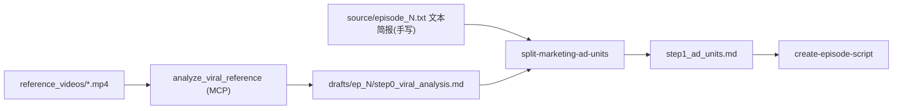
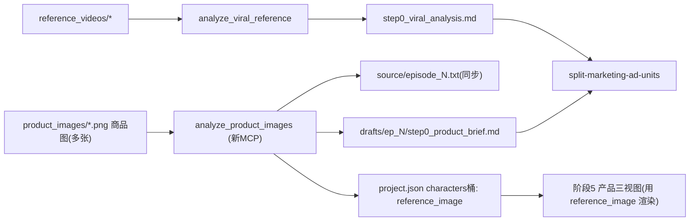

## 背景：当前爆款复刻流

缺口：没有商品图上传入口，产品简报只能手写文本；商品图无法做内容理解，也无法绑定到产品做参考。

## 目标流（新增商品图理解）

## 关键设计决策（已与用户确认）
- 商品图既生成产品简报，又作为产品**输入参考图**：阶段 5 仍用它渲染产品三视图（保留风格），通过 `characters` 桶的 `reference_image` 字段绑定（机制已存在，见 `lib/asset_types.py:35` 与 `server/services/generation_tasks.py:870`）。
- 产品简报**两处落地**：`drafts/episode_N/step0_product_brief.md`（结构化）+ `source/episode_N.txt`（供 `generate_overview` 与 split 复用）。
- 允许**多张**商品图；创建向导与项目内素材页两处均可上传。

## 实施步骤

### 1. 后端上传通道（[server/routers/files.py](server/routers/files.py)）
- `ALLOWED_EXTENSIONS` 新增 `"product_images": [".png", ".jpg", ".jpeg", ".webp"]`。
- `upload_file` 的 `_sync()` 新增 `product_images` 分支：存到 `project_dir / "product_images"`，沿用 `normalize_uploaded_image` 压缩；多张时用 `name` 或原文件名（不强制单一文件名，保留多张）。
- `relative_path` 分支补 `product_images/{filename}`。
- `list_project_files` 的 `files` dict 新增 `"product_images": []`。

### 2. 新 MCP 工具 analyze_product_images（新文件 `server/agent_runtime/sdk_tools/analyze_product_images.py`）
仿照 [analyze_viral_reference.py](server/agent_runtime/sdk_tools/analyze_product_images.py) 结构：
- 参数：`episode`（必填）、`image_paths`（可选，默认取 `product_images/` 全部图）、`dry_run`。
- 校验 `content_mode == "marketing"`；解析图片路径（限定项目目录内）。
- 用 `TextGenerator.create(TextTaskType.STYLE_ANALYSIS, ...)` + `images=[ImageInput(path=p) ...]` 做多模态分析，prompt 产出结构化产品简报（产品名、品类、核心卖点、规格/材质、目标受众、视觉特征、建议口播方向）。
- 落盘：
  - 写 `drafts/episode_{N}/step0_product_brief.md`
  - 写/合并 `source/episode_{N}.txt`（brief 的纯文本段，供 `generate_overview` 与 split 读）
  - 合并写 `project.json` 的 `characters` 桶：为分析出的每个产品建条目并设 `reference_image = product_images/<对应图>`（**只填缺失、不覆盖已有**，用 `ProjectManager.update_project` 的 RMW）
- 返回摘要：产品数、图片数、文件路径。

### 3. 注册工具（[server/agent_runtime/sdk_tools/__init__.py](server/agent_runtime/sdk_tools/__init__.py)）
- import + 加入 `ARCREEL_MCP_TOOL_IDS` 元组 + `build_arcreel_mcp_server` 的 tools 列表，id 为 `analyze_product_images`。
- 三语补 `tool_name_analyze_product_images`（`frontend/src/i18n/{zh,en,vi}/dashboard.ts`），否则 `tests/test_frontend_mcp_tool_i18n.py` 失败。

### 4. 新 subagent（新文件 `agent_runtime_profile/.claude/agents/analyze-product-images.md`）
仿 [analyze-viral-reference.md](agent_runtime_profile/.claude/agents/analyze-viral-reference.md)：定位 `product_images/` → 调 `mcp__arcreel__analyze_product_images` → 校验产物 → 返回摘要。

### 5. 工作流编排（[SKILL.marketing.md](agent_runtime_profile/.claude/skills/manga-workflow/SKILL.marketing.md)）
- 阶段 0：上传清单补「商品图放入 `product_images/`」。
- 状态检测新增（置于现阶段 2 之前/并列）：`product_images/` 有图且 `drafts/episode_{N}/step0_product_brief.md` 不存在 → **阶段 2.3 商品图内容理解**（dispatch `analyze-product-images`，产物兼作 `source/episode_N.txt`，从而满足阶段 2 的源文件条件）。
- 阶段 1（资产提取）：说明对 marketing 产品**合并**而非覆盖（保留 analyze_product_images 写入的 `reference_image`）。

### 6. split 与剧本 prompt 消费产品简报
- [split-marketing-ad-units.md](agent_runtime_profile/.claude/agents/split-marketing-ad-units.md) Step 1：若存在 `step0_product_brief.md` 必须读取，作为简报真相源（与 viral_analysis 并列）。
- [lib/script_generator.py](lib/script_generator.py)：加 `_load_product_brief(episode)`（仿 `_load_viral_analysis`），marketing 时传入。
- [lib/prompt_builders_script.py](lib/prompt_builders_script.py) `build_marketing_prompt`：新增 `product_brief_md: str | None`，仿 `viral_analysis_md` 注入 `<product_brief>` 块。

### 7. 前端上传入口
- [frontend/src/api.ts](frontend/src/api.ts)：`listFiles` 结果类型补 `product_images`；upload 支持 `product_images` 类型。
- [WizardStep3MarketingReference.tsx](frontend/src/components/pages/create-project/WizardStep3MarketingReference.tsx)：在参考视频旁新增「商品图（可多张）」上传区；`value` 扩展 `productImageFiles: File[]`。
- [CreateProjectModal.tsx](frontend/src/components/pages/CreateProjectModal.tsx) `handleCreate`：创建后依次上传 `productImageFiles` 到 `product_images`。
- [SourceFilesPage.tsx](frontend/src/components/canvas/SourceFilesPage.tsx)：仿参考视频区，新增「商品图」展示+上传区；`API.listFiles` 读取 `product_images`。
- 三语 i18n：`upload_product_image` / `product_image_step_title` 等（`frontend/src/i18n/{zh,en,vi}/dashboard.ts` 与 `templates.ts`）。

### 8. 测试
- 后端：`analyze_product_images` 工具单测（mock TextGenerator，dry_run + 落盘 + project.json 合并断言）；`files.py` product_images 上传/列举单测。
- 前端：`WizardStep3MarketingReference` / `CreateProjectModal` 商品图上传断言。
- i18n 一致性（`tests/test_i18n_consistency.py`、`tests/test_frontend_mcp_tool_i18n.py`）三语补齐。

## 范围说明
- 不改图生/视频后端能力，仅新增「商品图 → 简报 + 产品参考绑定」这一前置环节。
- 商品图→产品名映射由多模态模型在分析时产出；多张图各建一个产品条目。