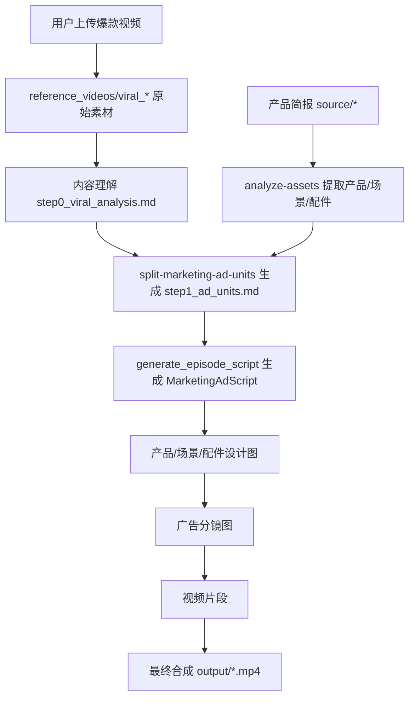

# 营销爆款复刻 Workflow 方案

## 目标边界

不新增 `content_mode`，仍然使用 `marketing`。爆款复刻是 marketing 下的一个可选前置分支：



## 需要改的核心文件

### 1. Workflow 入口

修改 [`agent_runtime_profile/.claude/skills/manga-workflow/SKILL.marketing.md`](agent_runtime_profile/.claude/skills/manga-workflow/SKILL.marketing.md)。

新增一个阶段 0.5，插在“项目设置/源文件准备”和“资产提取/广告镜头拆分”之前：

- 检查 `reference_videos/` 或 `source/` 中是否存在爆款视频文件。
- 若用户选择“爆款复刻”，要求先上传 `.mp4/.mov/.webm`。
- 若 `drafts/episode_{N}/step0_viral_analysis.md` 不存在，则 dispatch 新 subagent `analyze-viral-reference`。
- 若存在，则继续原有阶段 1/3。

当前状态检测里已有 marketing 的 step1：

```markdown
- content_mode == marketing: `drafts/episode_{N}/step1_ad_units.md`
```

建议新增前置检测：

```markdown
- marketing 且存在爆款参考视频，但 `drafts/episode_{N}/step0_viral_analysis.md` 不存在？ → 爆款内容理解阶段
```

### 2. 新增内容理解 subagent

新增 [`agent_runtime_profile/.claude/agents/analyze-viral-reference.md`](agent_runtime_profile/.claude/agents/analyze-viral-reference.md)。

职责：

- 读取项目 `project.json`。
- 定位爆款参考视频路径，例如 `reference_videos/viral_reference.mp4`。
- 调用后端 MCP 工具或脚本做内容理解。
- 输出 `drafts/episode_{N}/step0_viral_analysis.md`。

建议 `step0_viral_analysis.md` 固定结构：

```markdown
# 爆款视频内容理解

## 基础信息
- 时长：
- 画幅：
- 平台风格：
- 目标受众：

## 结构拆解
| 段落 | 时间段 | 画面动作 | 口播/字幕 | 情绪/节奏 | 复刻要点 |

## 可复刻模板
- 开头 hook：
- 中段卖点展开：
- 信任背书/反差点：
- CTA：

## 禁止照搬
- 不复刻具体人物、品牌、logo、原始台词中的可识别表达。
```

### 3. 新增后端 MCP 工具

如果内容理解需要确定性处理视频，新增 `server/agent_runtime/sdk_tools/analyze_viral_reference.py`，并在 [`server/agent_runtime/sdk_tools/__init__.py`](server/agent_runtime/sdk_tools/__init__.py) 注册。

工具建议名：

```text
mcp__arcreel__analyze_viral_reference
```

输入：

```json
{
  "episode": 1,
  "video_path": "reference_videos/viral_reference.mp4",
  "dry_run": false
}
```

输出：

```json
{
  "analysis_path": "drafts/episode_1/step0_viral_analysis.md",
  "duration_seconds": 32,
  "segments_count": 5
}
```

第一版可以先做“抽帧 + 生成理解 prompt + 调用文本/多模态 backend”的工具；若多模态能力暂时不稳定，也可以先让工具抽帧并让 subagent 读取关键帧描述。

### 4. 文件上传与存储

后端已有项目子目录 `reference_videos/`，marketing 爆款视频建议放这里，而不是 `source/`。

需要确认/扩展 [`server/routers/files.py`](server/routers/files.py)：

- 允许上传 `reference_videos` 类型。
- 允许扩展名 `.mp4/.mov/.webm`。
- `list_project_files()` 已有枚举结构，可以增加或复用 `reference_videos` 分组。

前端可在后续 UI 中加入口；首版也可以让用户通过现有上传接口或文件系统放入 `reference_videos/`，由 Agent workflow 检测。

### 5. 修改广告镜头拆分 subagent

修改 [`agent_runtime_profile/.claude/agents/split-marketing-ad-units.md`](agent_runtime_profile/.claude/agents/split-marketing-ad-units.md)。

当前它只读取：

```markdown
Read `project.json`：overview、characters（产品）、scenes、props。
Read 本集源文件。
```

新增：

- 如果存在 `drafts/episode_{N}/step0_viral_analysis.md`，必须读取。
- 拆 `step1_ad_units.md` 时同时参考产品简报和爆款结构。
- 明确“复刻结构，不复制具体人设、品牌、台词、logo”。

镜头表建议增加可选列：

```markdown
| 镜头 ID | 参考段落 | hook | voiceover | 时长 | segment_break | 产品 | 场景 | 配件 |
```

### 6. 修改剧本生成 prompt

修改 [`lib/prompt_builders_script.py`](lib/prompt_builders_script.py) 的 `build_marketing_prompt()`。

新增可选参数：

```python
viral_analysis_md: str | None = None
```

如果存在，注入：

```markdown
<viral_analysis>
...
</viral_analysis>
```

并加入约束：

- 只借鉴节奏、镜头结构、卖点展开方式。
- 禁止复制原视频人物、品牌、台词、logo、音乐名。
- `video_prompt.dialogue` 仍用本项目 `voiceover + cta`，不要照搬爆款原声。

### 7. 修改剧本生成加载逻辑

修改 [`lib/script_generator.py`](lib/script_generator.py)：

- marketing 模式下，除了读取 `step1_ad_units.md`，也尝试读取同目录 `step0_viral_analysis.md`。
- 将内容传给 `build_marketing_prompt()`。
- 没有 `step0_viral_analysis.md` 时保持现有 marketing 流程不变。

### 8. 前端最小入口

首版可以不做复杂 UI，只在“源文件/成片输出”附近新增“爆款参考视频”区域。涉及：

- [`frontend/src/api.ts`](frontend/src/api.ts)：类型加 `reference_videos` 文件分组。
- [`frontend/src/components/canvas/SourceFilesPage.tsx`](frontend/src/components/canvas/SourceFilesPage.tsx)：展示并上传参考视频。
- [`frontend/src/i18n/{zh,en,vi}/dashboard.ts`](frontend/src/i18n/zh/dashboard.ts)：新增三语文案。

如果想更轻量，第一版可以先不加 UI，仅允许手动放入 `projects/<project>/reference_videos/viral_reference.mp4`，workflow 检测即可。

## 推荐实施顺序

1. 新增 `analyze-viral-reference` subagent 和 `step0_viral_analysis.md` 格式约定。
2. 修改 `SKILL.marketing.md`，把爆款内容理解作为 marketing 的可选前置阶段。
3. 修改 `split-marketing-ad-units.md`，让广告镜头拆分读取 `step0_viral_analysis.md`。
4. 修改 `build_marketing_prompt()` 与 `ScriptGenerator`，把爆款分析作为可选 prompt 输入。
5. 新增 MCP 工具 `analyze_viral_reference`，负责抽帧/内容理解/落盘。
6. 补前端上传/展示 `reference_videos`。
7. 加测试：prompt 注入、workflow 文件检测、MCP 工具落盘、i18n key 一致性。

## 测试重点

- 没有爆款视频时，现有 marketing 流程不变。
- 有爆款视频但没有 `step0_viral_analysis.md` 时，workflow 先进入内容理解阶段。
- 有 `step0_viral_analysis.md` 时，`split-marketing-ad-units` 能把爆款结构映射为本项目产品广告镜头。
- `MarketingAdScript.ad_units[].video_prompt.dialogue` 继续填充旁白，保证直出人声。
- 生成视频、合成视频仍走现有 `generate-storyboards` / `generate-video` / `compose-video`。