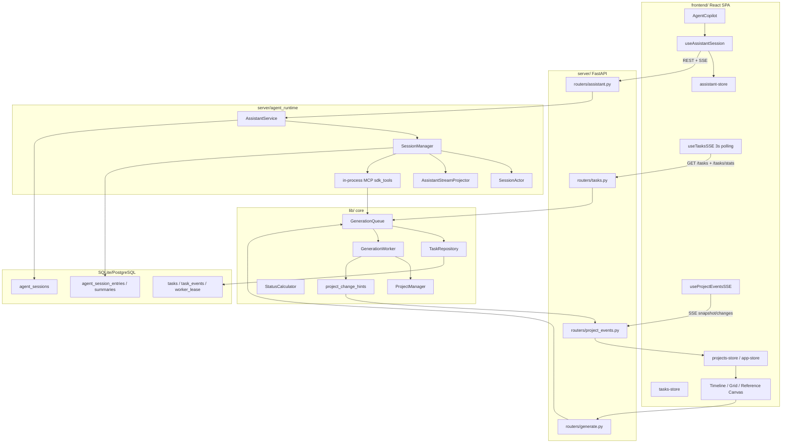

# Agent Runtime 迁移参考设计

作者：wanghaobo

## 1. 目标与范围

本文面向后续把当前 Claude Agent Runtime 替换为公司内部 coze-like 平台的方案设计。目标不是重写 ArcReel 的生成链路，而是复用当前仓库已经稳定下来的产品边界：

- Assistant 会话负责“对话、流式输出、工具调用编排”。
- GenerationQueue 负责“媒体生成任务入队、状态轮询、取消与失败收敛”。
- ProjectManager 与项目文件负责“项目内容真相源”。
- StatusCalculator 与 ProjectEventService 负责“状态读时计算和前端实时刷新”。

迁移时应优先保持 HTTP 契约、前端 store 形状、任务队列表结构和项目文件结构不变，只替换 Agent Client 与流式消息适配层。

## 2. 当前系统总览



核心设计是“三条通道分离”：

1. Assistant 通道：发送消息后立刻 ACK，模型输出通过 SSE 传给聊天 UI。
2. Task 通道：生成任务写入 DB，前端每 3 秒轮询任务列表和统计。
3. Project Events 通道：项目文件变化后通过 SSE 通知前端刷新项目数据。

这三条通道互相协作，但不能互相替代。Agent 可以触发任务，任务完成可以刷新项目，项目刷新不依赖聊天流本身。

## 3. Assistant Runtime 设计

### 3.1 对外 HTTP 契约

入口位于 `server/routers/assistant.py`，路径前缀是 `/api/v1/projects/{project_name}/assistant`。

| Endpoint | 作用 | 迁移要求 |
| --- | --- | --- |
| `POST /sessions/send` | 发送消息；可省略 `session_id` 懒创建会话；返回 `{ status, session_id }` | 保持非阻塞 ACK，不等待模型完整输出 |
| `GET /sessions` | 列项目下会话，可按 status 过滤 | 保持 `SessionMeta[]` |
| `GET /sessions/{session_id}` | 读取会话元数据 | 保持 project ownership 校验 |
| `GET /sessions/{session_id}/snapshot` | 历史回放和重连快照 | 保持 `AssistantSnapshot` schema |
| `GET /sessions/{session_id}/stream` | SSE：`snapshot`、`patch`、`delta`、`status`、`question` | 新平台事件必须适配成这些事件 |
| `POST /sessions/{session_id}/interrupt` | 中断当前 turn | 保持“accepted + 后续 SSE 收敛”语义 |
| `POST /sessions/{session_id}/questions/{question_id}/answer` | AskUserQuestion 人机交互闭环 | 如内部平台有表单/确认节点，应映射到该接口 |
| `GET /skills` | Slash command / skill 列表 | 可以换数据源，但前端 shape 尽量不变 |

当前 `SendRequest` 支持 `content`、最多 5 张 base64 image、可选 `session_id`。替换平台如果使用 file_id/url，应在后端 adapter 里转换，不要让前端同时兼容两套协议。

### 3.2 后端分层

当前调用链：

```text
assistant.py
  -> AssistantService.send_or_create()
    -> SessionManager.send_new_session() / send_message()
      -> SessionActor
        -> ClaudeSDKClient.query()
        -> ClaudeSDKClient.receive_response()
      -> StreamProjector
        -> snapshot / patch / delta / status / question
```

各层职责：

- `AssistantService`：项目校验、会话元数据、prompt 构造、snapshot 构建、SSE 输出。
- `SessionManager`：活跃 session 管理、并发容量、沙箱/权限、MCP 工具注册、消息 buffer、订阅者管理。
- `SessionActor`：每个会话一个 async task，串行化 `query / interrupt / disconnect`，避免多个协程同时操作同一个 SDK client。
- `AssistantStreamProjector`：把 SDK 原始消息投影为前端 Turn/snapshot。
- `SessionMetaStore` 与 `SessionRepository`：维护 `agent_sessions` 元数据。
- `DbSessionStore`：把 SDK transcript 镜像到 DB。

迁移时最理想的替换点是 `SessionActor` 的 `client_factory` 和 `SessionManager._build_options()` 附近。上层继续认为自己在管理“一个可 query、可 interrupt、可 receive_response 的 agent client”。

### 3.3 SSE 生命周期

当前 SSE 不是裸 generator，而是 async context manager：

```text
SessionManager.stream_messages()
  replay buffer
  -> _replay_done
  -> live messages
  -> _idle heartbeat
  -> _queue_overflow
```

`AssistantService.stream_events()` 先回放 buffer，遇到 `_replay_done` 后构建 `snapshot`，然后实时输出 `patch/delta/question/status`。非 running 会话只发完成态 snapshot + status 后关闭。

迁移必须保留：

- `async with stream_messages(...)` 的确定性清理。
- `_idle` 上检查 `request.is_disconnected()` 的断线检测。
- running 会话可以重连并拿到完整 snapshot。
- terminal status 后前端关闭 SSE，刷新会话列表标题。

### 3.4 前端会话状态

主要文件：

- `frontend/src/hooks/useAssistantSession.ts`
- `frontend/src/stores/assistant-store.ts`
- `frontend/src/types/assistant.ts`
- `frontend/src/components/copilot/AgentCopilot.tsx`

前端状态模型：

```text
sessions[]
currentSessionId
turns[]
draftTurn
sending / interrupting / answeringQuestion
sessionStatus
pendingQuestion
skills[]
isDraftSession
```

发送流程：

1. 前端先插入 optimistic user turn。
2. 设置 `sessionStatus = running`、`sending = true`。
3. 调 `POST /sessions/send`。
4. 后端返回 `session_id`。
5. 前端连接 `/stream`。
6. SSE 的真实 user turn 与 optimistic turn 按文本去重。
7. terminal status 到达后关闭流、清理 draft、刷新 session 列表。

新平台不要直接改 UI 组件。应在后端或 `useAssistantSession` 下方增加 adapter，把内部平台事件归一化为现有 Turn 体系。

## 4. 任务提交、轮询与 Worker 设计

### 4.1 WebUI 入队

生成入口在 `server/routers/generate.py`。以分镜和视频为例：

```text
POST /projects/{project_name}/generate/storyboard/{segment_id}
POST /projects/{project_name}/generate/video/{segment_id}
```

路由只做：

1. 项目/脚本/资源存在性校验。
2. `TaskSpec.from_request()` 做结构校验。
3. `GenerationQueue.enqueue_task()` 入队。
4. 返回 `{ success, task_id, message }`。

它不等待生成完成。生成完成由 Worker 异步处理，状态由任务轮询和 Project Events 反馈给前端。

### 4.2 Agent 工具入队

Agent 工具位于 `server/agent_runtime/sdk_tools/`，它们运行在 server 主进程内，不在 agent sandbox 内。这样工具可以访问 DB、项目文件和 provider HTTP，而不需要给沙箱开放数据库和公网权限。

工具通过 `lib/generation_queue_client.py` 调用队列：

- `enqueue_task_only()`：只入队。
- `wait_for_task()`：轮询单个任务直到终态。
- `enqueue_and_wait()`：入队并等待，失败/取消时抛明确异常。
- `batch_enqueue_and_wait()`：批量任务编排。

WebUI 是 fire-and-forget；Agent 工具通常 enqueue-and-wait。迁移到内部平台时应保留这两个使用模式。

### 4.3 队列表结构

`tasks` 是生成任务的主表：

| 字段 | 作用 |
| --- | --- |
| `task_id` | 主键 |
| `project_name` | 项目名 |
| `task_type` | `storyboard`、`video`、`character`、`scene`、`prop`、`grid`、`reference_video` |
| `media_type` | `image` 或 `video`，Worker 按 lane claim |
| `resource_id` | segment/asset/grid/unit 标识 |
| `script_file` | 关联剧本 |
| `payload_json` | prompt、provider、duration 等输入 |
| `status` | `queued/running/cancelling/succeeded/failed/cancelled` |
| `result_json` | 任务结果 |
| `error_message` | 失败原因 |
| `source` | `webui`、`agent` 或 `skill` |
| `dependency_*` | 依赖任务编排 |
| `provider_id/provider_job_id` | provider 路由与重启恢复 |
| `queued_at/started_at/finished_at/updated_at` | 生命周期时间 |

关键索引：

- `(status, queued_at)`：按队列顺序 claim。
- `(project_name, updated_at)`：项目任务列表。
- `(status, provider_id, queued_at)`：provider 池过滤。
- active partial unique index：同一 `project_name + task_type + resource_id + script_file` 在 `queued/running/cancelling` 下去重。

辅助表：

- `task_events`：状态变更 append-only 事件。旧 `/tasks/stream` SSE 仍可用，但前端现在不消费。
- `worker_lease`：单 active worker 租约，Skill 等待任务时用它判断 worker 是否在线。

### 4.4 Worker 状态机

Worker 在 `lib/generation_worker.py`，核心不变量：

```text
queued -> running -> succeeded
queued -> running -> failed
queued -> cancelled
queued -> running -> cancelling -> cancelled
```

设计要点：

- Worker 通过 `worker_lease` 保证同名 lease 下只有一个 active worker。
- 每个 provider 有独立 image/video 并发池。
- `claim_next_task()` 只 claim 当前 media lane 且依赖已成功的任务。
- Provider 池满时，SQL 层过滤对应 provider，避免反复 claim 同一个任务。
- `mark_succeeded()` / `mark_failed()` 用 `WHERE status='running'` 防止覆盖外部取消。
- 取消 running 任务时，API 先把 DB 写成 `cancelling` 并同步给本进程 worker 发 `Task.cancel()`。
- Worker finally 看到终态写入 0 rows 时，再兜底 `mark_task_cancelled()`，避免任务卡在中间态。

迁移 Agent Runtime 不应改这套状态机。内部平台触发生成时，继续写同一张 `tasks` 表即可。

### 4.5 前端任务轮询

虽然 hook 名叫 `useTasksSSE`，实际已经改为 3 秒轮询：

```text
GET /api/v1/tasks?project_name=...
GET /api/v1/tasks/stats?project_name=...
```

返回写入 `tasks-store`：

```text
tasks[]
stats: queued/running/cancelling/succeeded/failed/cancelled/total
connected
```

UI 使用方式：

- 顶栏显示 `queued + running`。
- TaskHud 展示任务列表、失败原因、取消入口。
- Timeline/Grid/Reference Canvas 按 `task_type + resource_id + status` 判断按钮 loading。
- `useTaskFailureNotifications` 监听 failed 转换并推送通知。

内部平台触发任务后，只要仍写 `source='agent'` 的队列任务，前端任务 UI 无需改。

## 5. Project Events 与项目状态跟踪

### 5.1 项目真相源

ArcReel 项目数据不以 DB 表为主，而以项目目录为主：

```text
projects/{project_name}/project.json
projects/{project_name}/scripts/*.json
projects/{project_name}/storyboards/*
projects/{project_name}/videos/*
projects/{project_name}/characters|scenes|props/*
```

`project.json` 保存项目级元数据、角色、场景、道具和剧集索引。`scripts/*.json` 保存 episode 结构、分镜/视频产物引用和 `generated_assets`。

Agent 或内部平台不应绕过现有工具直接修改任意文件。推荐路径是：

```text
Agent tool / workflow callback
  -> ProjectManager / 现有 router/service
  -> project_change_source(...)
  -> emit_project_change_hint / emit_project_change_batch
```

### 5.2 StatusCalculator

`lib/status_calculator.py` 的设计原则是“读时计算，不持久化冗余状态”。

计算内容：

- 单集：`draft/scripted/in_production/completed`。
- 项目 phase：`setup/worldbuilding/scripting/production/completed`。
- 进度：资产完成率、剧本完成率、视频完成率。
- 汇总：characters/scenes/props/episodes_summary。

`server/routers/projects.py` 明确只允许 episode 持久化 `title/script_file/generation_mode`，`scenes_count/status/storyboards/videos` 这类统计字段禁止写回 `project.json`。

迁移时要保留文件结构和 `generated_assets.storyboard_image / video_clip` 字段，状态计算就能继续工作。

### 5.3 ProjectEventService

Project Events 负责让前端知道项目文件变了。

触发来源：

- `webui`：用户在 UI 中编辑或生成。
- `worker`：后台生成任务完成。
- `filesystem`：文件系统扫描发现变化。

服务流程：

```text
emit_project_change_hint / emit_project_change_batch
  -> ProjectEventService
    -> rebuild snapshot
    -> fingerprint diff
    -> broadcast SSE "changes"
```

SSE 入口：

```text
GET /api/v1/projects/{project_name}/events/stream
```

事件：

- `snapshot`：首次连接，携带 `fingerprint`。
- `changes`：携带 `batch_id`、`fingerprint`、`source`、`changes[]`。

生成完成时 `generation_tasks.py` 会发 `storyboard_ready`、`video_ready`、`grid_ready`、`reference_video_ready` 或资产 `updated`，并附带受影响 asset fingerprint。

### 5.4 前端 Project Events 消费

`frontend/src/hooks/useProjectEventsSSE.ts` 处理：

1. 连接项目事件 SSE。
2. snapshot fingerprint 变化时刷新项目。
3. changes 到达时更新 asset fingerprints。
4. invalidate entity revision key，打破图片/视频缓存。
5. 对重要变更发 toast 或 workspace notification。
6. 调 `API.getProject()` 全量刷新 project + scripts。
7. `storyboard_ready/video_ready/grid_ready` 后刷新 cost 或 grid cache。

这条通道是画布刷新主通道，不应替换为“聊天消息里告诉前端生成好了”。聊天流只负责对话体验。

## 6. 数据库设计汇总

| 表 | 模型文件 | 说明 | 迁移建议 |
| --- | --- | --- | --- |
| `tasks` | `lib/db/models/task.py` | 生成任务主表 | 保持不变 |
| `task_events` | `lib/db/models/task.py` | 任务状态事件 | 保持，用于审计和可选 SSE |
| `worker_lease` | `lib/db/models/task.py` | 单 active worker 租约 | 保持 |
| `agent_sessions` | `lib/db/models/session.py` | Assistant 会话元数据 | 可把 `sdk_session_id` 映射为内部平台 conversation id |
| `agent_session_entries` | `lib/agent_session_store/models.py` | SDK transcript mirror | 新平台需要等价 transcript adapter，或只保留 normalized turns |
| `agent_session_summaries` | `lib/agent_session_store/models.py` | session summary | 可由内部平台 summary 或本地归纳填充 |

如果内部平台区分 `conversation_id` 和 `run_id`：

- 对外 `session_id` 仍保持 ArcReel 的稳定会话 ID。
- `agent_sessions.sdk_session_id` 可以继续存主 conversation id。
- run id 属于单轮执行态，不建议暴露给前端；可放在 runtime adapter 内存态、transcript payload，或新增 runtime-specific metadata。

不要把生成任务直接塞进 agent transcript。生成任务已有 `tasks/task_events` 作为独立事实源。

## 7. 替换为内部 coze-like 平台的推荐架构

### 7.1 最小替换范围

```text
保留：
  frontend/components
  frontend/stores
  assistant.py HTTP 契约
  AssistantService 大部分编排
  GenerationQueue / GenerationWorker
  ProjectManager / StatusCalculator / ProjectEventService

替换或新增：
  RuntimeClient 抽象
  CozeLikeRuntimeClient
  Runtime stream -> Turn/SSE adapter
  Tool gateway / workflow callback bridge
  Credential/config resolver
```

### 7.2 RuntimeClient 建议接口

后端内部可以抽出类似接口：

```text
create_session(project_name, prompt, attachments, locale) -> session_id
send_message(session_id, prompt, attachments) -> accepted
stream(session_id) -> async iterator[RuntimeEvent]
interrupt(session_id) -> accepted
get_transcript(session_id) -> raw transcript
delete_session(session_id) -> bool
```

`RuntimeEvent` 再映射到现有前端事件：

| 内部平台事件 | ArcReel SSE |
| --- | --- |
| conversation history | `snapshot` |
| assistant text delta | `delta` with `draft_turn` |
| message completed | `patch` append/replace_last |
| workflow/tool started | `patch` with `tool_use` 或 `task_progress` |
| workflow/tool result | `patch` with `tool_result` |
| human input requested | `question` |
| run completed/failed/cancelled | `status` |

前端只应看到 ArcReel schema。

### 7.3 工具调用与工作流回调

当前 Claude SDK 通过 in-process MCP tool 直接调用 Python 函数。内部平台通常有三种情况：

#### 方案 A：平台支持 server-side tool callback

推荐。平台发起 tool call 时调用 ArcReel 后端：

```text
Internal Agent Platform
  -> POST /internal/agent-tools/{tool_name}
  -> existing sdk_tools service function
  -> GenerationQueue / ProjectManager
```

要求：

- callback 带 signed token 或 mTLS。
- tool_name 白名单。
- project_name 从 ArcReel session 绑定关系取，不从模型参数信任。
- 工具结果返回给平台，用于后续对话。

#### 方案 B：平台只支持 workflow 节点 HTTP

可把每个 MCP 工具包装为平台 workflow 节点：

```text
workflow node
  -> ArcReel tool gateway
  -> enqueue_and_wait / project operation
  -> return compact result
```

仍然不要让平台直接访问 `projects/` 目录或 DB。

#### 方案 C：平台无法同步等待长任务

工具只入队并返回 `task_id`，Agent 文案提示“已提交任务”。任务完成由 TaskHud 和 Project Events 展示。需要在聊天里展示进度时，可由 adapter 定期读 `tasks` 表并生成 `task_progress` block。

### 7.4 凭证与安全

当前设计要求：

- provider secrets 不放父进程 env，避免 sandbox 子进程继承。
- Agent 工具绑定 project_name，防止 prompt injection 改写别的项目。
- Linux/macOS 默认要求 sandbox；Windows 降级为白名单。

迁移后仍需：

- 内部平台 token 放 DB credential/config，不硬编码 env。
- 外部 callback 验签。
- 所有 tool 执行从 session 元数据反查 project_name。
- 禁止模型传入任意 project path。
- 继续使用现有 `ProjectManager` 的路径校验。

### 7.5 兼容内容模式

当前 `content_mode` 和 `generation_mode` 是编排层注入的系统事实，不能让模型自己推断。

迁移要保留：

- 按项目选择 `CLAUDE.narration.md` / `CLAUDE.drama.md` / marketing 相关 profile 的逻辑，或转换为内部平台 bot prompt/profile。
- 工具入参中的 `content_mode/generation_mode` 由后端注入。
- reference video、grid、storyboard 三条生成模式仍由服务层决定执行路径。

## 8. 建议迁移步骤

### Step 1：冻结 ArcReel 产品契约

先把这些契约视为稳定 API：

- `SessionMeta`
- `Turn`
- `ContentBlock`
- `AssistantSnapshot`
- Assistant SSE event names
- `TaskItem`
- `TaskStats`
- `ProjectChangeBatchPayload`

内部平台只做适配，不让前端知道平台原生字段。

### Step 2：增加 Runtime Adapter

在后端新增 runtime adapter 层，让 `SessionManager` 不直接依赖 `ClaudeSDKClient`。

建议保留 `SessionActor` 串行化模型：

```text
SessionActor
  -> RuntimeClient.query()
  -> RuntimeClient.receive_response()
```

如果内部平台天然是“发起 run + 轮询 run events”，也可以在 RuntimeClient 内部把轮询结果包装成 async iterator。

### Step 3：实现 Stream Projector 映射

把内部平台的 message、workflow node、tool call、human input、error 映射到现有 Turn block。

优先保证：

- 普通文本流式体验。
- 工具调用可读。
- 任务进度不阻塞。
- pending question 能回答。
- 错误能落到 `sessionStatus=error` 和可诊断 detail。

### Step 4：实现 Tool Gateway

把现有 `sdk_tools` 中真正有业务价值的函数提出来，供 Claude MCP 和内部平台 callback 共用。不要复制一份工具逻辑。

建议拆分：

```text
server/agent_runtime/sdk_tools/*.py        仍保留 MCP 包装
server/agent_runtime/tool_services/*.py    新增平台无关业务函数
server/agent_runtime/tool_gateway.py       新增 HTTP callback / workflow bridge
```

### Step 5：双运行时灰度

通过配置选择 runtime：

```text
AGENT_RUNTIME=claude | internal
```

灰度时保持：

- 同一前端。
- 同一 task queue。
- 同一 project events。
- 同一 project 文件结构。

### Step 6：回归测试

建议覆盖：

1. 新建会话发送消息，前端能收到 snapshot/delta/status。
2. 切换会话后 snapshot 正确。
3. running 会话刷新页面后可重连。
4. interrupt 能收敛到 `interrupted`。
5. tool call 能入队生成任务。
6. task 从 `queued -> running -> succeeded/failed/cancelled` 正确。
7. Worker 完成后 Project Events 推送 `storyboard_ready/video_ready`，前端刷新项目。
8. StatusCalculator 在项目详情和列表都能计算正确 phase。
9. 平台 callback 不能越权访问别的项目。

## 9. 最关键的不变量

迁移过程中请优先保护这些不变量：

1. `POST /sessions/send` 只返回 accepted，不返回完整模型回复。
2. 聊天流、任务状态、项目刷新三条通道分离。
3. 前端只消费 normalized Turn/SSE，不消费平台原生事件。
4. 生成任务统一进 `GenerationQueue`，不要让 Agent 平台绕过 Worker。
5. 项目内容以 `project.json + scripts/*.json + generated_assets` 为真相源。
6. 项目状态读时计算，不写回冗余统计字段。
7. Worker 状态转移必须走 Repository 的 SQL WHERE 守卫。
8. Tool 的 project_name 从 session 绑定，不信任模型参数。
9. Project Events 是画布刷新主通道，任务完成必须 emit hint/batch。
10. Runtime 替换只应该发生在 Agent Client、流式事件 adapter、工具协议桥接层。

## 10. 关键文件速查

| 主题 | 文件 |
| --- | --- |
| Assistant 路由 | `server/routers/assistant.py` |
| Assistant 编排 | `server/agent_runtime/service.py` |
| 会话管理 | `server/agent_runtime/session_manager.py` |
| 单会话 Actor | `server/agent_runtime/session_actor.py` |
| Turn 投影 | `server/agent_runtime/stream_projector.py` |
| 前端会话 Hook | `frontend/src/hooks/useAssistantSession.ts` |
| 前端会话 Store | `frontend/src/stores/assistant-store.ts` |
| 前端 Assistant 类型 | `frontend/src/types/assistant.ts` |
| API 封装 | `frontend/src/api.ts` |
| WebUI 生成入口 | `server/routers/generate.py` |
| 任务路由 | `server/routers/tasks.py` |
| 队列封装 | `lib/generation_queue.py` |
| 队列 Repository | `lib/db/repositories/task_repo.py` |
| 任务 ORM | `lib/db/models/task.py` |
| Worker | `lib/generation_worker.py` |
| Agent 工具入队 | `lib/generation_queue_client.py` |
| MCP 工具目录 | `server/agent_runtime/sdk_tools/` |
| 任务执行 | `server/services/generation_tasks.py` |
| 项目变更 hint | `lib/project_change_hints.py` |
| Project Events 服务 | `server/services/project_events.py` |
| Project Events 路由 | `server/routers/project_events.py` |
| 前端 Project Events Hook | `frontend/src/hooks/useProjectEventsSSE.ts` |
| 状态计算 | `lib/status_calculator.py` |
| 项目路由 | `server/routers/projects.py` |
| SSE 清理 ADR | `docs/adr/0005-sse-stream-async-context-manager.md` |
| 取消状态机 ADR | `docs/adr/0006-cancelling-intermediate-state.md` |
| 重启孤儿任务 ADR | `docs/adr/0007-orphan-tasks-not-requeued-on-restart.md` |
