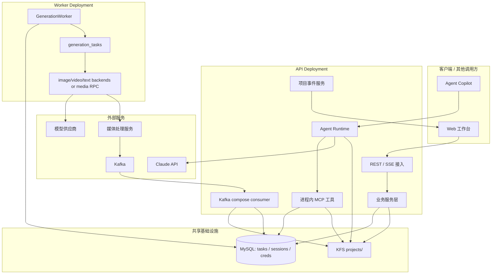
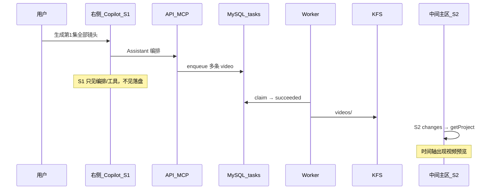
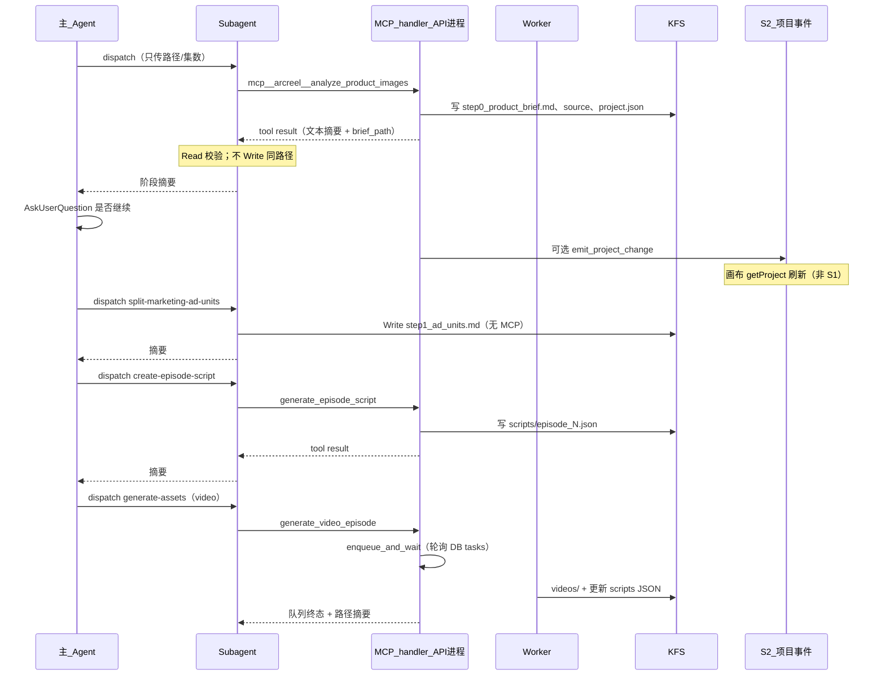
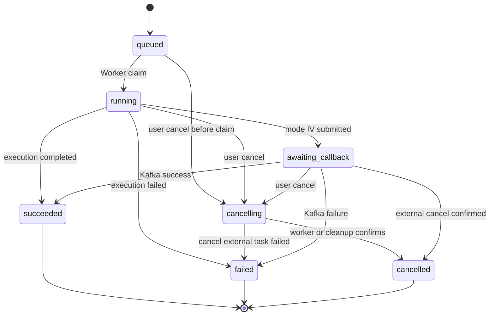
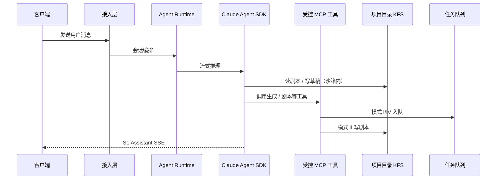
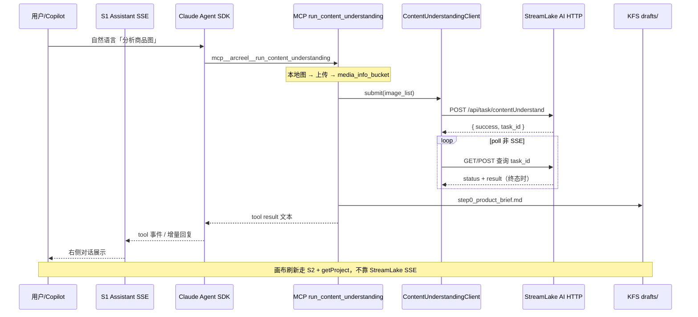
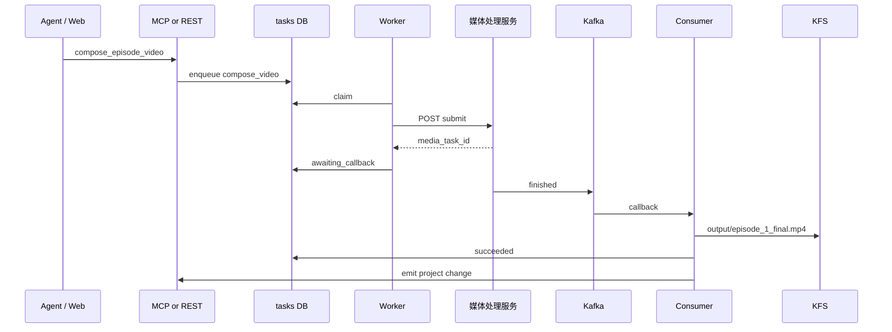

# Cybercut Agentic 技术方案

作者：wanghaobo

本文面向 **后端、平台工程、Agent 工程、调度执行、前端与联调同学**，描述 **Cybercut** Agentic 平台首版目标架构与边界（**概念与契约为主**，不绑定某一参考实现的目录或源码路径）。核心范围包括：FastAPI 接入层、Claude Agent SDK Runtime、MySQL 任务队列、GenerationWorker 执行层、KFS 项目存储、Project Events、媒体合成模式与 Agent Runtime Evals。

**建议先读 §0.1–§0.4**：从工作台三栏与「固定模式 vs Chat 模式」各要接几根数据通道入手，建立复杂度直觉；再读 §0.5 起的产品与 Agent/工程边界。

全文关键心智：**营销视频 - 爆款复刻**用固定表单 + 固定流程也能做完；Copilot 解决的是目标模糊、半成品项目、边做边改等编排问题——**不是**生成视频本身更难，而是**右侧聊天 + 会话协议**更重（§0.3、§0.10）。

**建议阅读顺序**（未参与过 Agent 开发的同学可按此顺序通读）：

| 顺序 | 章节 | 目的 |
|------|------|------|
| 1 | **§0.1–§0.4** | **前端交互**：固定 vs Chat 各接几根线、三条铁律 |
| 2 | §0.5–§0.12 | Agent/工程边界、校验、**`pending_questions`** |
| 3 | §1 | 建立整体架构与主链路 |
| 4 | §2–§4 | 关键决策、范围、原则 |
| 5 | §5 | 模块分工（前端细表 §5.3） |
| 6 | §6–§11 | 数据契约、队列、Agent Runtime、API/SSE、部署 |
| 7 | §12–§15 | 分期验收、团队分工、风险、Evals |

---

## 目录

- [0. 开篇](#0-开篇前端交互与认知拉齐)（**[0.1–0.4 前端交互](#01-工作台三栏一眼看懂)** → [0.11 校验](#011-参数校验) → [0.12 pending_questions](#012-结构化补全pending_questions-是什么)）
- [1. 整体架构](#1-整体架构)
- [2. 关键决策摘要](#2-关键决策摘要)
- [3. 背景、范围与非目标](#3-背景范围与非目标)
- [4. 架构原则](#4-架构原则)
- [5. 模块边界与职责](#5-模块边界与职责)（含 [5.3 前端工作台](#53-前端工作台区域通道与模块分工)、[5.4 端到端举例](#54-端到端举例营销短视频爆款复刻)、[**5.5 爆款复刻 MCP 与 KFS 写入职责**](#55-营销爆款复刻mcp-全量清单与-kfs-写入职责划分)）
- [6. 数据与存储契约](#6-数据与存储契约)（含 [**6.6 MySQL 表结构与 ER 图**](#66-mysql-物理模型arcreel-参考实现)）
- [7–11. 队列、Agent、API、部署](#7-任务队列与-worker-契约)
- [12. 分期交付与验收](#12-分期交付与验收)
- [13–16. 分工、风险、Evals、术语](#13-团队分工)

---

## 0. 开篇：前端交互与认知拉齐

本章前半（§0.1–§0.4）给**所有人**看：打开项目页后，固定向导和 Chat 模式在 UI 上要维护几套互不相同的实时数据。后半（§0.5 起）再解释 Agent 与工程分工、后端为何要多做沙箱/MCP/补全协议。

### 0.1 工作台三栏：一眼看懂

进入某个项目后，工作台是**顶栏 + 左资产 + 中间主区 + 右 Copilot**（右栏可收起）。难点不在布局本身，而在于：**不同区域消费不同语义的数据**——混用就会出「聊天里说好了，时间轴没视频」类 bug。

```text
┌─────────────────────────────────────────────────────────────────────────────┐
│ 顶栏：任务轮询（约 3s）→ 任务雷达 / 失败 Toast                              │
│       含义：队列里还有多少 generating（语义 A）                              │
├──────────────┬────────────────────────────────────────────┬─────────────────┤
│ 左侧资产栏   │ 中间主区：时间轴 / 镜头表 / 剧本 / 画布 / 向导步骤            │
│              │ 含义：项目真值——剧本与镜头媒体（语义 B）                      │
├──────────────┴────────────────────────────────────────────┴─────────────────┤
│ 右侧 Copilot │ 含义：助手会话——流式回复、工具块、结构化追问（语义 C）         │
├──────────────────────────────────────────────────────────────────────────────┤
│ 项目页壳层：订阅 S2 → changes → getProject → 刷新「中间 + 左侧」             │
│ （与右侧 Copilot 无关；两种产品模式通常都需要，只要画布要显示生成结果）         │
└─────────────────────────────────────────────────────────────────────────────┘
```

三类语义（后文 §9.2 会展开字段，此处只记含义）：

| 语义 | 用户关心的问题 | 典型通道 |
|------|----------------|----------|
| **A. 任务队列** | 后台还在跑吗、失败了吗 | `GET /tasks` 轮询（顶栏） |
| **B. 项目真值** | 时间轴上有没有新分镜/视频 | **S2** Project Events → **getProject**（中间+左） |
| **C. 助手会话** | 助手说了什么、还要我选什么 | **S1** Assistant SSE（右侧） |

### 0.2 固定工作流模式：前端复杂度（相对低）

用户走**向导 / 表单 / 按钮**，不打开 Copilot 也能完成爆款复刻主线。前端重点是 **请求—响应** 与 **表单校验**，而不是长连接会话。

| 维度 | 固定模式通常怎么做 |
|------|-------------------|
| 收参 | 每步表单；缺字段 **下一步置灰** 或提交后 `422` + 错误码 |
| 触发生成 | `POST /generate/*`、`POST /compose/*` 等 REST |
| 看进度 | 当前步骤的 loading / 可选轮询**单个** `task_id`；顶栏全局队列**可选** |
| 看结果 | 中间画布：**S2 + getProject**（Worker 写盘后刷新） |
| 失败 | `4xx` + `error_code`；**不需要** `pending_questions`、不需要 S1 |
| 实时连接 | **无** Assistant SSE；实现成本低 |

```text
固定模式（画布要更新的常见接法）

  向导步骤 ──► REST（校验失败即 4xx，改表单重试）
       │
       ├──► 顶栏 tasks 轮询（可选，看全局队列）
       │
       └──► S2 + getProject（中间/左侧：镜头、资产、进度）
```

**固定模式仍然需要 S2**：生成结果在 KFS，不在 HTTP 响应体里。只是**不需要**为聊天再建 S1 和会话状态机。

### 0.3 Chat 模式：在固定模式上多出来的前端复杂度

打开右侧 Copilot 后，在 §0.2 基础上**至少多维护一整条会话通道**；且必须与画布、顶栏**解耦**（§0.4）。

| 维度 | 相对固定模式的增量 |
|------|-------------------|
| **S1 Assistant SSE** | 长连接；`snapshot` / `patch` / `delta` / `status` / `question`；流式半截消息、刷新页要对齐 snapshot |
| **`pending_questions`** | 缺参时不一定 `422`，而是**挂起会话**等用户点选（§0.12）；右侧要展示追问卡片 + answer API |
| **顶栏 tasks 轮询** | 往往**更需要**：一句用户话可能连续入队多镜 |
| **S2 + getProject** | **与固定模式相同**；聊天里「生成好了」**不能**代替 |
| **失败呈现** | HTTP 错误 + 工具失败块 + 会话终态 + 队列 failed；不能只看助手一句话 |

```text
Chat 模式 = 固定模式（REST + S2 + 可选 tasks 轮询）
            + S1 整条（右侧 Copilot）
            + 会话元数据（含 pending_questions，§0.12）

  用户话 ──► S1（右侧：编排、工具、追问）
                │
                ├──► MCP 入队 ──► 与按钮共用 tasks + Worker
                │
  顶栏 ◄────────┴──► tasks 轮询（队列语义 A）
  中间/左侧 ◄──────► S2 + getProject（项目真值 B，与 S1 无关）
```

后端还会因 Chat 增加沙箱、MCP、Profile 等（§0.10），那是**服务端**复杂度；§0.3 强调的是：**即便后端共用同一 Worker，前端也多一根 S1 和一套会话 UI 状态**。

### 0.4 三条前端铁律（联调必背）

1. **右侧 Copilot ≠ 项目刷新**。Worker 写完视频不会在聊天里自动变成「可预览」；时间轴更新只认 **S2 → getProject**。
2. **不要 parse 助手正文**。「已经生成完成」类话术不可靠；镜头 URL 只来自项目快照。
3. **顶栏 TaskHud 全绿 ≠ 画布已有片**。队列 `succeeded` 只表示任务结束；文件可见仍等 S2（拆分部署时可能多约 0.5s 扫盘，§9.7）。

模块级职责细表见 **§5.3**；S1/S2 事件字段见 **§9**。

---

### 0.5 固定工作流也能完成什么（产品与后端）

以“营销视频 - 爆款复刻”为例，传统软件开发可以这样做：

```text
表单收集参数
→ 提交固定任务
→ 内容理解
→ 剧本生成
→ 分镜图生成
→ 单镜视频生成
→ 成片合成
→ 展示结果
```

这个路径适合：

- 输入字段明确：商品图、参考视频、目标风格、时长、卖点等。
- 阶段顺序稳定：先理解，再写剧本，再生成媒体。
- 用户只需要提交一次，然后等待系统执行。
- 失败处理可以预先枚举：缺参数、供应商失败、视频生成失败、合成失败。
- **交互模型简单**：一步 REST（或内部 job）对应一步结果；成功返回业务数据，失败返回 **HTTP 状态码 + 业务错误码 + 可读文案**。不需要聊天沙箱、工具协议、流式会话元数据，也不需要在 UI 上区分「助手在说」和「镜头已落盘」。

因此，**Agent 不是为了替代这个确定性流程**。固定流程仍然是平台的工程骨架，也是 Web 按钮、任务队列、Worker 和媒体服务必须承载的基础能力。**Copilot 多出来的复杂度，主要在「聊天编排层」**（前端 §0.3、后端 §0.10），不是 Worker 生成视频本身。

### 0.6 Agent 真正解决什么

Agentic 层解决的是固定流程之外的“编排判断”：

| 场景 | 固定工作流的困难 | Agent 的职责 |
|------|------------------|--------------|
| 用户目标不完整 | 表单缺字段只能报错或给默认值 | 追问、解释选项、把模糊目标转成结构化输入 |
| 项目已有半成品 | 固定流程容易整集重跑 | 读取项目状态，判断从哪一步继续 |
| 用户边做边改 | 固定流程需要大量分支按钮 | 理解“重做第 3 个镜头”“保留产品图但换风格”等意图 |
| 内容策略需要判断 | 固定规则难以评估爆款结构 | 结合参考素材、商品卖点、平台风格生成方案 |
| 多工具组合 | 用户不关心该点哪个按钮 | 决定调用剧本工具、资产工具、分镜工具还是成片工具 |
| 中途需要确认 | 固定任务通常一次性提交 | 通过 AskUserQuestion → **`pending_questions` 挂起**（§0.12）再执行 |

Agent 的产出不是“直接生成所有东西”，而是：

```text
理解用户目标
→ 读取项目上下文
→ 判断下一步
→ 调用受控 MCP / REST 能力
→ 把结果解释给用户
→ 必要时追问
```

### 0.7 Agent 边界与工程边界

| 边界 | Agent / MCP 负责 | 工程系统负责 |
|------|------------------|--------------|
| 意图理解 | 把自然语言转成可执行动作；信息不足时走补全协议（§0.11） | 提供明确的 API、schema、**与入口无关的统一错误码** |
| 编排 | 决定先做哪一步、是否继续、是否追问 | 保证每个动作可重复、可取消、可观测 |
| 项目读取 | 读 `project.json`、`scripts/`、草稿、资产状态 | 维护项目目录、读时状态、路径安全 |
| 剧本/草稿 | 生成或修改 `drafts/`、`scripts/*.json` | 校验 schema、持久化、版本和引用 |
| 重计算 | 发起生成请求、等待任务结果 | Worker 调供应商、媒体服务、写 KFS |
| 实时反馈 | 通过 Assistant SSE 告诉用户“我在做什么” | 通过 Project Events + getProject 刷新工作台真值 |
| 安全 | 不越权访问其他项目，不绕开工具 | 鉴权、沙箱、路径隔离、凭证脱敏 |
| 可靠性 | 避免臆造完成状态 | DB 状态机、幂等、重试、取消、监控 |

一句话：**Agent 是会判断的编排层；工程系统是可验证、可恢复、可运维的执行层。**

### 0.8 本方案的设计目标

本方案不是把整个产品变成“让 Agent 随便操作文件和供应商”的自由系统，而是让 Agent 被包在清晰工程边界里：

```text
用户自然语言
→ Agent 判断和追问
→ MCP / REST 受控能力
→ tasks 队列
→ Worker / 媒体服务执行
→ KFS 项目真值
→ Project Events 通知工作台刷新
```

这样可以同时保留两种入口：

- **传统入口**：表单 / 按钮直接提交任务，适合明确操作。
- **Agent 入口**：自然语言编排任务，适合模糊目标、半成品项目、迭代修改和跨步骤操作。

### 0.9 同框对照：爆款复刻用固定流程 vs 用 Agent

下面用**同一条业务能力**说明：工程上要建的能力几乎一样，差别主要在**谁决定下一步、谁收集参数**。

| 阶段 | 工程在做什么（两种入口共用） | 固定工作流（表单 / 向导 / 按钮） | Agent Copilot |
|------|------------------------------|--------------------------------|---------------|
| 建项 | `POST /projects`，写 KFS 骨架 + 同步 profile | 创建页填标题、模式、参考素材 URL | 用户说「按这个参考视频做一条广告」→ Agent 调建项或补字段 |
| 内容理解 | 模式 II：读商品图/简报 → 结构化卖点 | 上传商品图 + 填卖点表单 → 一次提交 | 缺图时 **AskUserQuestion**；可追问风格、受众 |
| 剧本 | 模式 II：写 `drafts/`、`scripts/episode_1.json` | 点「生成剧本」或向导下一步 | Skill 编排 subagent；用户说「第三段改成促销话术」→ 改剧本文件 |
| 资产图 | 模式 I：入队 → Worker → `characters/` 等 | 资产页勾选 → `POST /generate/assets` | 「先出产品场景图」→ MCP 入队 |
| 分镜 / 单镜视频 | 模式 I：入队 → Worker → `storyboards/`、`videos/` | 时间轴上每镜「生成」按钮 | 「生成第 1 集全部镜头」→ 批量 enqueue |
| 成片 | 模式 IV：submit → Kafka → `output/` | 点「合成第 1 集」 | MCP `compose_episode_video` 或 REST |
| 用户看到结果 | Worker 写 KFS → **S2** `changes` → **getProject** | 中间主区 / 左侧栏刷新 | **同左**；Copilot 右侧只显示对话，**不代替**画布刷新 |
| 任务是否在跑 | MySQL `tasks` | 顶栏 **TaskHud 轮询** | **同左**；Assistant 流式文案 ≠ 镜头已落盘 |

```text
                    ┌─────────────────────────────────────┐
                    │     工程执行层（首版必须建设）          │
                    │  tasks + Worker + KFS + 供应商/媒体  │
                    └──────────────────▲──────────────────┘
                                       │
              ┌────────────────────────┴────────────────────────┐
              │                                                 │
    ┌─────────┴─────────┐                           ┌───────────┴──────────┐
    │ 固定工作流入口      │                           │ Agent 编排入口          │
    │ 表单 / 向导 / 按钮  │                           │ Copilot + Skill + MCP   │
    │ 步骤预定义          │                           │ 步骤由模型判断 + 追问    │
    └───────────────────┘                           └────────────────────────┘
```

**何时仍用固定流程（甚至更简单）**：参数一次收齐、阶段顺序不变、失败分支可枚举、不需要边做边改自然语言意图。

**何时上 Agent**：目标模糊、项目半成品、要跨阶段编排、要解释与追问、要「只重做第 N 镜」类意图——此时仍应落在同一套 MCP/REST/队列/KFS 上，而不是另起一套生成管道。

### 0.10 Copilot 为什么复杂：固定工作流通常没有这些（后端与协议）

很多同学第一次做 Agent 项目，会把「聊天难」和「生成视频难」混在一起。实际上：**分镜/视频/合成** 在两种入口下都是 `tasks + Worker + KFS`；**多出来的工程与前端复杂度，集中在右侧 Copilot 及其背后的 Runtime**。固定向导若设计得当，往往是「输入 → 输出」，错了就 **错误码**，不必建设下面整张表。

| 面向 | 固定工作流里通常怎么做 | Copilot / Agent 路径为什么多一层 |
|------|------------------------|----------------------------------|
| **调用形态** | 一次请求一个明确 API：`POST /generate/...`、向导下一步 | 多轮自然语言；一步用户话可能触发 0～N 次工具调用，顺序不固定 |
| **失败语义** | `4xx/5xx` + `error_code` + `message`；前端按码展示 | 除 HTTP 外，还有工具失败块、会话终态、队列 `failed`、供应商超时——**不能**只靠聊天里一句「失败了」 |
| **缺参 / 不合规** | **同步拒绝**：校验不通过不入队、不写盘（§0.11） | **可能先补全再执行**：会话内追问或结构化问答，再调 MCP（§0.11） |
| **沙箱** | 无；后端服务直接执行业务 | Agent 侧 Read/Write/Bash 必须在**项目目录沙箱**内，防路径穿越、防直连外网/供应商；与 MCP「受控能力」分工 |
| **MCP（受控工具）** | 无；路由 handler 即能力边界 | 模型不能随意调 HTTP：须通过 **白名单工具** 入队、写剧本、合成；要定义参数 schema、权限、超时、与 `enqueue_and_wait` 语义 |
| **元数据** | 请求体 + 可选 `job_id` 查进度 | **会话**：`session_id`、transcript、运行态；**补全挂起**：`pending_questions`（§0.12）；**能力包**：Profile；**工具轨迹**：调用了什么、是否已写盘 |
| **S1 Assistant SSE 协议** | 无长连接；最多进度条轮询单一 job | 须约定 `snapshot` / `patch` / `delta` / `status` / `question` 等事件；客户端要处理 **流式半截 turn**、压缩边界、刷新页后 snapshot 与 SSE 对齐 |
| **任务轮询（顶栏）** | 可选：只轮询当前向导步骤的 job | Agent 可能连续入队多镜；顶栏要看 **全局队列**（`GET /tasks`），且 **succeeded ≠ 镜头文件已可见** |
| **项目真值刷新（S2）** | 仍可能需要（画布要看新视频） | 与 Copilot **强制解耦**：Worker 写盘后靠 **Project Events + getProject** 更新时间轴；**不能**用 S1 聊天流代替（§0.4） |

**客户端要接几根线**的示意图见 **§0.2、§0.3**；本节侧重**后端**为何还要多沙箱、MCP、元数据与 S1 事件类型。

**对团队分工的含义**：

- 做**向导 / 固定步骤**的同学：主攻 REST 契约、错误码表、任务状态机；Copilot 可不开。
- 做 **Copilot** 的同学：主攻 **§0.1–§0.4**（前端）+ **§0.10–§0.12** + §8 + §9 S1；并接受 **画布刷新仍走 S2**（§0.4）。
- 做**生成 / Worker** 的同学：两种入口共用同一队列与 KFS，**不必**为 Copilot 单独写一套生成逻辑。

若产品阶段目标只是「爆款复刻一条龙、参数一次收齐」，应优先把**固定工作流 + 错误码 + S2 刷新画布**做稳，再叠 Copilot；否则容易在 SSE/MCP/沙箱上投入过大，而业务上表单就能满足。

### 0.11 参数校验：固定流程「拒绝」vs Copilot「补全协议」

两种入口在**执行层**应共用同一套硬规则（schema、权限、资源是否存在）；差别在**缺参或不合规时，是否允许「先问清楚再执行」**。

#### 固定流程：不符合规则就直接拒绝

后端在 **REST 边界**做完整校验，不通过则**立即返回错误**，不创建任务、不写 KFS、不消耗供应商配额：

| 情况 | 典型响应 | 前端行为 |
|------|----------|----------|
| 必填字段缺失 | `400` / `422` + `error_code=MISSING_FIELD` | 标红表单项，禁止点「下一步」 |
| 类型/枚举不合法 | `422` + `VALIDATION_ERROR` + 字段路径 | 展示字段级错误 |
| 业务规则不满足（如镜头不存在、集数越界） | `409` / `400` + 业务码 | Toast 或步骤内说明 |
| 未登录 / 无项目权限 | `401` / `403` | 跳转登录或拒绝访问 |
| Worker 离线、队列不可用 | `503` + `WORKER_OFFLINE` 等 | 禁用提交按钮 |

语义是 **fail-fast、可枚举**：用户改完参数**重新提交同一 API** 即可，不需要会话状态机。

```text
POST /generate/video/...
  → 校验 body + 项目状态 + 权限
  → 不通过：4xx + { error_code, message, details? }
  → 通过：入队，返回 task_id
```

#### Copilot：除了「拒绝」，还需要「补全协议」

用户一句话里常**说不清**或**漏信息**（没上传商品图、没说集数、没说要不要保留参考视频节奏）。若一律像固定流程那样在第一次 MCP 调用时 `422` 打回，体验会变成「助手报错但用户不知道填什么」。因此聊天路径在硬校验之外，要增加一层 **人机补全协议**——让编排层先把缺口变成**结构化输入**，再调与固定流程**相同**的 MCP/REST。

| 机制 | 作用 | 与固定流程的关系 |
|------|------|------------------|
| **自然语言追问** | Agent 在回复里说明缺什么、请用户补充 | 无对应 HTTP 字段；靠多轮对话 |
| **AskUserQuestion → `pending_questions`** | 结构化选项 + answer API 闭环（§0.12） | 等价于向导里「这一步填完才能下一步」，但状态在会话里而非表单 |
| **MCP 入参校验失败** | 工具返回明确错误（缺 `scene_id`、文件不存在） | **应与 REST 同严**：Agent 读错误后决定追问或放弃，**不应**静默重试瞎猜 |
| **Skill / 编排策略** | 规定「缺商品图必须先 question，禁止空参调生成」 | 产品规则，写在 Profile 而非放宽后端校验 |

补全闭环（需要 **S1 协议 + 元数据**，固定向导不需要）：

```text
用户：帮我生成视频
  → Agent 判断：缺 episode / 缺商品素材
  → 方案 A：回复文字请用户补充
  → 方案 B：发 S1 event: question（选项清晰）
  → 用户 answer API 或下一条消息
  → 参数齐备后 MCP 入队（此时走与 REST 相同的硬校验）
  → 仍失败：工具错误块 + error_code 语义，由 Agent 转述
```

#### 三层校验（两种入口都应遵守）

```text
┌─────────────────────────────────────────────────────────────┐
│ L1 接入层（REST / MCP handler）                              │
│     权限、必填、类型、枚举、资源 ID 是否存在 → 不通过即拒绝    │
├─────────────────────────────────────────────────────────────┤
│ L2 领域层（入队前 / 写剧本后）                                │
│     scripts schema、镜头引用、容量约束 → 拒绝或任务 failed      │
├─────────────────────────────────────────────────────────────┤
│ L3 编排层（ mainly Copilot）                                 │
│     信息不足时不强行 L1：先 question / 追问，再调 L1           │
│     固定向导没有 L3：表单负责收齐，后端只做 L1+L2              │
└─────────────────────────────────────────────────────────────┘
```

**重要边界**：

- **补全协议不是放宽规则**。MCP 一旦带上完整参数，校验标准应与 `POST /generate/*` **一致**；缺 `scene_id` 仍应拒绝入队，而不是 Worker 跑到一半才失败。
- **不要只靠模型「记得问」**。关键必填项（商品图、目标集数、合成 episode）应在 Skill 中写清；能结构化的用 **AskUserQuestion**，避免用户自由文本仍缺字段。
- **固定流程不要抄 Copilot 的 pending question**。向导用表单校验 + 错误码即可；若在 REST 上返回「请补充」却不给 `error_code` 和字段路径，前后端会对不齐。

#### 对照小结

| 维度 | 固定工作流 | Chat / Copilot |
|------|------------|----------------|
| 缺必填项 | **直接拒绝**（4xx + 业务码） | **先补全**（追问 / `question`），再调工具 |
| 不合规值 | **直接拒绝** | 同左；Agent 可解释如何改 |
| 协议增量 | 无（HTTP 即可） | **§0.12** `pending_questions` + S1 `question` + answer API |
| 执行层校验 | L1 + L2 | L1 + L2 **相同**；多 L3 编排 |

结构化补全的**含义与闭环**见 **§0.12**；S1 字段级 payload 见 **§9.5**。

### 0.12 结构化补全：`pending_questions` 是什么（认知对齐）

固定向导里，「缺参数」体现在**表单红框 + 不能点下一步**——状态在页面上，一次提交要么全过要么全拒。

Copilot 里，用户可能**已经发出一条指令**，但 Agent 发现还缺关键信息，不能立刻调 MCP 入队。这时需要一种**会话内的挂起状态**，告诉客户端：「助手在等用户答一道结构化题，答完再继续编排」。这就是 **`pending_questions`** 要解决的问题；载体是 **AskUserQuestion** 工具 + **S1 补全协议**，不是 REST 错误码能替代的。

#### 和固定流程对照

| | 固定流程 | Copilot + `pending_questions` |
|---|----------|-------------------------------|
| 缺参表现 | `422` + 字段错误，请求**未接受** | 会话**仍在进行**；工具链可挂起 |
| 状态存在哪 | 前端表单 state | 服务端会话：`pending_questions[]` + SSE `snapshot` |
| 用户怎么补 | 改表单再 POST | 点选项 / 填 answer API，或下一条消息（产品可约束） |
| 补全后 | 重新调同一 REST | Agent 继续调 MCP（走 L1 硬校验） |

**固定流程不应实现 `pending_questions`**。若在 REST 里返回「请补充」却没有 `error_code` 和字段路径，会和 Copilot 会话语义混在一起。

#### 生命周期（心智模型）

```text
1. 用户发话 → Assistant 编排中
2. Agent 调 AskUserQuestion（或等价策略）→ 需要用户确认/选择
3. S1 推送 event: question，同时 snapshot.pending_questions 非空
4. 客户端：右侧 Copilot 展示选项卡片；可禁用「继续瞎发」或提示先作答
5. 用户 POST .../questions/{question_id}/answer（或产品规定的等价交互）
6. 服务端清空对应 pending，Agent 继续（可能再 question，或调 MCP 入队）
7. 会话 snapshot 中 pending_questions 为空，工具/流式回复继续
```

要点：

- **`pending_questions` 是会话元数据**，属于 **S1 / 助手语义 C**，与 **S2 项目真值**、**顶栏任务轮询** 无关；答完题**不会**自动刷新时间轴。
- **刷新页 / 重连 SSE** 时，应靠 `GET .../snapshot` 或 S1 `snapshot` 事件恢复未答问题，避免用户以为会话丢了。
- **有 pending 时**，不应把助手流式正文当成「任务已完成」；也不要用 TaskHud 全绿代替作答。
- **答完后** 仍须走 MCP/REST 的 L1 校验；补全只解决「信息不够」，不解决「参数非法」。

#### `question` 事件 vs `pending_questions` 数组

| 载体 | 作用 |
|------|------|
| S1 `event: question` | **增量**：刚产生的一道新追问，驱动 UI 弹卡片 |
| `snapshot.pending_questions[]` | **全量挂起列表**：重连、刷新、与 answer API 对齐的权威来源 |
| answer API | 用户提交结构化答案，服务端消项并恢复编排 |

客户端实现原则：**以 `pending_questions` 为准做持久展示，以 `question` 事件做实时提示**；二者应一致，不一致时以 snapshot 为准。

#### 典型用在什么时候（产品层）

- 缺商品图 / 参考视频，但用户已经让「开始写剧本」。
- 多义意图：「生成视频」但未指明集数、镜头范围。
- **高风险确认**：即将批量入队 20 镜、即将覆盖已有剧本。
- 枚举选择：平台风格、成片比例、是否保留参考片节奏。

能做成表单下拉就不要全靠自由文本；**AskUserQuestion 的价值是选项清晰、答案可解析**，便于 MCP 拿到确定参数。

#### 与 §0.3、§0.10、§0.11 的关系

- §0.3 / §0.10：Copilot 比固定流程多 S1 协议——**`pending_questions` 是其中专门承载「补全」的一块**。
- §0.11：L3 编排「先问再执行」——**`pending_questions` 是 L3 在工程上的落点**；L1/L2 仍在 MCP 调用时拒绝非法请求。

字段与 JSON 示例见 **§9.5**。

---

## 1. 整体架构



### 1.1 主链路

```text
用户自然语言或 Web 按钮
→ Assistant / REST
→ MCP 或业务服务入队
→ MySQL tasks
→ Worker claim
→ 供应商 / 媒体服务
→ 写 KFS 项目树
→ Project Events changes
→ 客户端 getProject
```

### 1.2 两种入口共用同一执行底座

| 入口 | 适合场景 | 后端路径 | 最终执行 |
|------|----------|----------|----------|
| Web 表单 / 按钮 | 用户已经知道要做什么 | REST `POST /generate/*`、`POST /compose/*` | `tasks` + Worker |
| Agent Copilot | 用户目标模糊、需要判断、继续已有项目、跨步骤操作 | Assistant SSE + MCP | `tasks` + Worker 或模式 II 直接写剧本 |

关键点：**Agent 入口和 Web 入口不是两套生成系统**。Agent 只是多了“理解、判断、追问和工具选择”，真正生成仍落在同一套任务队列、Worker、KFS 和 Project Events 上。

---

## 2. 关键决策摘要

### 2.1 已确定决策

| 主题 | 决策 |
|------|------|
| 双入口 | Web REST 直触生成与 Agent MCP 统一写同一张 `tasks` 表 |
| 执行边界 | Agent 只编排；Worker 执行重计算、调供应商、写媒体 |
| 生产部署 | API Deployment 与 Worker Deployment 分离；通过 MySQL + KFS 解耦 |
| 首版存储 | KFS POSIX 项目树作为剧本与媒体真相源；大媒体 Blob 化放到后续阶段 |
| 项目刷新 | Worker 写盘后，以 Project Events SSE + `GET /projects/{name}` 刷新工作台 |
| 任务状态 | 顶栏任务状态来自 `GET /tasks` 轮询；不以 Tasks SSE 作为首版客户端通道 |
| Agent 会话 | Assistant SSE 只承载 Copilot 对话、工具流、AskUserQuestion，不代表项目真值；其复杂度来自沙箱/MCP/元数据/S1 协议（§0.10），固定向导可不建 S1 |
| 成片合成 | 首版按模式 IV：入队 → Worker submit 媒体服务 → Kafka callback → 写 KFS → 更新 task |
| 能力包 | **Profile 发版源**同步到项目 `.claude/`；SDK 只读项目内副本 |
| 回归保障 | Profile / MCP / Agent Runtime 变更必须配套 smoke eval |

### 2.2 首版不做

- 不做多 `content_mode`，首版只支持 `content_mode=marketing`。
- 不做整棵项目树对象存储化，首版仍要求 POSIX KFS 项目根。
- 不让 Agent 沙箱 Bash 直连供应商、媒体服务或自行跑 ffmpeg 成片。
- 不让客户端新接 `GET /api/v1/tasks/stream`，任务顶栏用 REST 轮询。
- 不把供应商 API Key 注入 API 父进程环境变量。

### 2.3 仍需实现时确认

| 问题 | 推荐默认 |
|------|----------|
| Kafka consumer 部署形态 | 首版挂 API lifespan；规模期可拆独立 consumer Deployment |
| 重复生成同一镜头 | 默认创建新版本或覆盖引用，但必须有 idempotency key 与版本策略 |
| `worker_lease` 表结构 | 单独 migration，包含 `worker_id`、`name`、`lease_until`、`capabilities`、`updated_at` |
| `tasks` 幂等字段 | 增加 `idempotency_key`、`external_task_id`、`submitted_at`、`callback_payload` |
| MediaStore 引入时机 | 阶段 B，先统一 API/Worker 访问路径，再切 Blob |
| 多租户权限 | 项目级 owner/member 校验必须贯穿 REST、SSE、MCP closure 与文件路径 |

---

## 3. 背景、范围与非目标

### 3.1 背景

Cybercut 面向营销短视频工作流：

```text
商品/简报理解 → 广告剧本 → 资产与分镜 → 单镜视频 → 成片合成 → 预览导出
```

用户侧有两类入口：

- **Assistant**：用户通过 Copilot 自然语言编排。
- **REST 直触生成**：用户在工作台按钮触发资产、分镜、视频、成片等生成。

两类入口必须进入同一后端任务体系，避免 Web 按钮与 Agent 工具出现两套行为。

### 3.2 首版范围

| 维度 | 首版范围 |
|------|----------|
| API | FastAPI `/api/v1` |
| Agent | `claude-agent-sdk` + 进程内 MCP |
| 队列 | MySQL `tasks` + `worker_lease` |
| Worker | `GenerationWorker` 独立进程，开发态可内嵌 |
| 存储 | 阶段 A 全 KFS：`{CYBERCUT_DATA_DIR}/projects/{name}` |
| 业务模式 | `content_mode=marketing`，`generation_mode=storyboard` |
| 实时通道 | S1 Assistant SSE、S2 Project Events SSE、Tasks REST 轮询 |
| 成片 | 模式 IV：媒体服务 + Kafka callback |
| 测试 | pytest L1/L2 + Agent Eval smoke |

### 3.3 非目标

- 多内容模式：`drama` / `narration` 等。
- 完整自定义供应商能力。
- 大媒体 Blob 全量切换。
- 前端视觉稿、动效、组件样式规范（但 **§0.1–§0.4、§5.3** 通道与模块分工属于联调契约，在范围内）。
- 将 Agent Runtime 变成通用视频制作平台之外的万能代理。

---

## 4. 架构原则

| 原则 | 说明 |
|------|------|
| 双入口、单队列 | REST `POST /generate/*`、`POST /compose/*` 与 Agent MCP 均写 `tasks` |
| Agent 只编排 | Agent MCP 可以入队、读项目、写剧本草稿；不直接执行重计算 |
| Worker 执行 | 供应商调用、媒体处理、分镜图、单镜视频、成片合成都由 Worker 或外部服务执行 |
| FS 是项目真相源 | 剧本、媒体引用、资产、读时状态以 KFS 项目树为准 |
| DB 管任务与会话 | DB 记录任务状态、lease、会话元数据、transcript、凭证配置 |
| 状态读时计算 | `status`、`progress`、完成数不写入 `project.json`，由 `StatusCalculator` 读盘计算 |
| Project Events 只通知刷新 | S2 不承载完整项目，也不替代 `GET /projects/{name}` |
| Profile 即能力包 | 镜像 profile 同步到项目 `.claude/`，SDK 只读项目副本 |
| 变更要可评测 | Profile、Skill、MCP、SSE 协议变化必须进 eval 或契约测试 |

一句话主链路：

```text
REST 或 MCP 入队 → Worker 认领执行 → 写 KFS → Project Events 通知 → 客户端 getProject
```

---

## 5. 模块边界与职责

### 5.1 后端与平台分层职责

| 层 | 职责 | 对外提供的能力 |
|----|------|----------------|
| 接入层 | REST、鉴权、校验、SSE 端点 | HTTP API、长连接推送 |
| 业务服务层 | 生成编排、成片、项目事件、费用、导出 | 领域服务入口 |
| Agent 层 | 会话、Assistant SSE、MCP、Profile 能力包 | Copilot 对话与受控工具 |
| 调度层 | 入队、认领、租约、幂等、取消 | 任务队列与 Worker 在线探测 |
| 执行层 | 按任务类型调供应商/媒体服务、写项目树 | 分镜、视频、资产、成片 submit |
| 项目领域层 | 项目目录、剧本 schema、读时进度、媒体引用解析 | 项目真值与校验 |
| 平台层 | 持久化、凭证、系统配置、迁移 | DB、密钥、环境配置 |

### 5.2 前端在整体中的位置

**开篇 §0.1–§0.4** 已说明三栏布局、固定 vs Chat 各接几根通道、三条铁律。本节与 **§5.3** 供实现分工时查阅区域—通道对照与模块边界细表；S1/S2 事件字段见 **§9**。

### 5.3 前端工作台：区域、通道与模块分工（细表）

与 **§0.1–§0.4** 同一套模型，此处用表格展开，便于前后端联调对照。

#### 5.3.1 三栏与通道（同 §0.1 示意图）

见 **§0.1** ASCII 图；语义 A/B/C 见 **§9.2**。

#### 5.3.2 页面区域 ↔ 通道 ↔ 刷新内容

| 页面区域 | 逻辑模块（含义） | 通道 | 刷新什么 |
|----------|------------------|------|----------|
| **右侧 Copilot** | 助手面板 + 会话状态管理 | **S1** `GET .../assistant/sessions/{id}/stream` | 消息流、工具块、追问（`question`） |
| **中间主区** | 时间轴 / 剧本 / 画布等业务页 | **S2** `.../events/stream` → **getProject** | 镜头媒体、剧本、读时进度 |
| **左侧资产栏** | 角色 / 场景 / 道具列表 | 与中间主区共用 S2 + 同一项目快照 | 资产列表与指纹 |
| **顶栏** | 任务雷达 | REST `GET /tasks`、`/tasks/stats` 轮询 | 队列 queued / running / failed |
| **顶栏** | 任务失败提示 | 同上轮询结果 | 失败 Toast |
| **全局** | 项目事件订阅（壳层） | S2 的 `changes[].focus` | 可选：滚动定位到某集 / 某镜 |

#### 5.3.3 前端模块功能分工（职责边界）

| 逻辑模块 | 主要职责 | 不应该承担 |
|----------|----------|------------|
| **项目页壳层** | 挂载 S2；协调左 / 中 / 右三栏数据刷新 | 根据助手正文判断「视频已生成」 |
| **助手面板** | 展示对话、工具流、结构化追问与回答 | 维护时间轴媒体真相源 |
| **助手会话客户端** | 维护 session、消费 S1 事件、调用 answer API | 订阅 S2；用聊天内容代替 getProject |
| **项目事件客户端** | 消费 S2，触发拉取项目快照，处理 focus | 渲染聊天；替代任务雷达 |
| **资产侧栏** | 展示项目快照中的资产列表 | 单独维护与 getProject 不一致的数据源 |
| **中间业务页** | 时间轴、剧本、画布、向导等 | 见 TaskHud 全绿就认为镜头已有视频 |
| **任务雷达** | 展示队列状态 | 判断某镜头文件是否已落盘 |
| **任务失败提示** | 失败 Toast | 代替 S2 刷新项目真值 |

#### 5.3.4 三条前端铁律

与 **§0.4** 相同；拆分部署扫盘延迟见 **§9.7**。

### 5.4 端到端举例：营销短视频（爆款复刻）

默认：`content_mode=marketing`，`generation_mode=storyboard`。下表是**业务能力阶段**；实现模式见 §8.3（模式 I / II / IV）。

| 阶段 | 业务 | 工程落点（KFS / DB） | 固定入口示例 | Agent 入口示例 |
|------|------|----------------------|--------------|----------------|
| 1 建项 | 创建营销项目 | 骨架 + `.claude/` | 创建项目表单 | 「按参考视频做复刻」 |
| 2 进项目 | 打开工作台 | 订阅 S2；TaskHud 轮询 | 进入 `/projects/{name}` | 同左；另开 Copilot |
| 3 理解 + 剧本 | 商品/简报 → 广告结构 | `drafts/`、`scripts/episode_1.json` | 向导步骤 1–2 提交 | Skill → 模式 II MCP |
| 4 资产 | 产品/场景/道具图 | `characters/` 等 | 资产页批量生成 | 「先出场景和产品图」 |
| 5 分镜/单镜 | 分镜图、镜头视频 | `storyboards/`、`videos/` | 时间轴按钮 | 「生成第 1 集所有镜头」 |
| 6 刷新 UI | 画布看到新媒体 | S2 `changes` → getProject | 中间主区 + 左侧栏 | **同左**（非 S1） |
| 7 成片 | 合成第 N 集 | `output/*.mp4` | 「合成」按钮 | `compose_episode_video` |

**路径 A：固定工作流（更简单时优先）**

```text
向导/表单收参 → 各步 REST 或内部 job 链 → tasks + Worker → KFS
→ S2 changes → getProject → 时间轴/资产栏更新
（Copilot 可不打开）
```

**路径 B：Agent Copilot**

```text
用户自然语言 → POST .../assistant/sessions/send
→ S1 流式（右侧）：编排说明、工具块、question
→ MCP 入队或模式 II 写剧本 → 同一张 tasks 表 + 同一 Worker
→ KFS 写盘 → S2（中间+左侧）刷新；TaskHud（顶栏）看队列
```

拆分部署时 Worker 进程内的「变更通知」到不了 API Pod，**路径 A/B 在画布刷新上相同**：靠 API 侧**项目事件服务**周期性扫描 KFS 指纹（§9.7）。



爆款复刻在 Copilot 侧的**阶段顺序、全部 MCP、以及「工具返回后谁写本地文件」**见 **[§5.5](#55-营销爆款复刻mcp-全量清单与-kfs-写入职责划分)**。

### 5.5 营销爆款复刻：MCP 全量清单与 KFS 写入职责划分

本节以 **`content_mode=marketing` + `generation_mode=storyboard` + 用户上传商品图与爆款参考视频** 为主线，把 **§8.3 四种 MCP 模式** 落成一张可联调的对照表，并明确：**MCP 只向 SDK 返回工具结果文本；真正改项目目录的是 MCP/Worker 进程内的写盘逻辑，或少数由 Subagent 在沙箱内执行的 Write / 脚本**——主 Agent 不做「代写文件」。

#### 5.5.1 爆款复刻主链路（与 Skill 阶段对齐）

| 顺序 | Skill 阶段 | 触发条件（简） | Copilot 编排 | 固定向导（可选） |
|------|------------|----------------|--------------|------------------|
| 0 | 建项 | Web 创建项目 | 提示用户已在 Web 建项；**不**在会话里 `mkdir` | `POST /api/v1/projects` |
| 0+ | 素材入库 | 用户上传 | 提示放入 `product_images/`、`reference_videos/` | 文件上传 API → KFS |
| 0+ | 项目概述 | 上传后 | 可选 `POST .../generate-overview` | 同左 |
| 2.3 | 商品图理解 | 有商品图、无 `step0_product_brief.md` | dispatch `analyze-product-images` | REST 调同一 client（§8.4.2） |
| 1 | 资产定义 | characters/scenes/props 任一为空 | dispatch `analyze-assets` | 表单向导写 `project.json` |
| 2 | 分集源文 | 无 `source/episode_{N}.txt` 且非 2.3 已写 | 主 Agent + `split_episode.py` | 向导切分 API |
| 2.5 | 爆款结构理解 | 有参考视频、无 `step0_viral_analysis.md` | dispatch `analyze-viral-reference` | REST 同能力 |
| 3 | 广告镜头表 | 无 `step1_ad_units.md` | dispatch `split-marketing-ad-units` | 向导提交拆分 |
| 4 | JSON 剧本 | 无 `scripts/episode_{N}.json` | dispatch `create-episode-script` | REST 生成剧本 |
| 5 | 产品/场景/道具图 | 缺 `*_sheet` | dispatch `generate-assets` × 至多 3 类 | 资产页批量生成 |
| 6 | 分镜图 | 缺 `storyboard_image` | dispatch `generate-assets` + `generate_storyboards` | 时间轴按钮 |
| 7 | 单镜视频 | 缺 `video_clip` | dispatch `generate-assets` + `generate_video_episode` | 时间轴按钮 |
| 8 | 成片（扩展） | 用户要整集 MP4 | `compose_episode_video`（模式 IV，§8.4.5） | 「合成」按钮 |

```text
product_images/ + reference_videos/     （用户 / 上传 API）
        │
        ▼
  step0_product_brief.md  ──►  step0_viral_analysis.md     （MCP 模式 II）
        │                              │
        └──────────┬───────────────────┘
                   ▼
         step1_ad_units.md                                  （Subagent Write，无 MCP）
                   ▼
         scripts/episode_N.json                             （MCP 模式 II）
                   ▼
    project.json + */*_sheet + storyboards/ + videos/       （模式 I：MCP 入队 → Worker 写）
```

#### 5.5.2 核心原则：MCP 返回之后谁操作本地文件？

三层写盘角色（**按优先级，避免重复写同一路径**）：

| 角色 | 运行位置 | 职责 | 爆款复刻典型动作 |
|------|----------|------|------------------|
| **① MCP / Worker 进程** | API 或 Worker Pod，**非沙箱** | 可信写 KFS；调 DB/供应商/StreamLake | `analyze_*` 写 `drafts/step0_*`；`generate_episode_script` 写 `scripts/`；`generate_*` 入队后 **Worker** 写 `storyboards/`、`videos/`、`generated_assets` |
| **② Subagent** | Agent SDK 沙箱（`cwd`=项目根） | 无对应 MCP 时的结构化草稿；或调脚本改 `project.json` | `split-marketing-ad-units` 用 **Write** 写 `step1_ad_units.md`；`analyze-assets` 用 **Bash** 调 `add_assets.py` |
| **③ 主 Agent** | 同沙箱 | **只编排**：Glob/Read 判态、dispatch、AskUserQuestion、展示摘要 | **禁止**用 Write 覆盖 ① 已写的 `step0_*` / `scripts/`；**禁止**把 MCP 返回的长文本再贴进文件 |

**MCP 返回给 SDK 的内容**（`content[].text` + 可选 `brief_path` 等）仅供对话与 Subagent 摘要，**不是**「交给主 Agent 去落盘」的信号——落盘已在 ① 的 handler 内完成。



**固定向导**不走 Subagent：REST / 内部 job 直接调 **同一套 `lib/` client 或 MCP 等价服务**，写路径与上表一致；前端靠 **REST 轮询或步骤内同步响应**，画布仍靠 **S2 + getProject**。

#### 5.5.3 MCP 工具总表（marketing 爆款复刻）

工具 ID 为短名；SDK 侧全名为 `mcp__arcreel__{id}`。实现模式见 §8.3。

| MCP 工具 ID | 模式 | 工作流阶段 | 谁发起调用 | 进程内写 KFS（成功时） | 只读 |
|-------------|------|------------|------------|------------------------|------|
| `get_video_capabilities` | — | 3（拆分前） | `split-marketing-ad-units` 等 | — | ✅ |
| `analyze_product_images` | **II** | 2.3 | `analyze-product-images` subagent | `drafts/episode_{N}/step0_product_brief.md`；`source/episode_{N}.txt`（合并）；`project.json` → `characters.*.reference_image` | |
| `run_content_understanding` | **II 变体** | 2.3（备选） | 同上 | 与上相同路径（StreamLake submit+poll，§8.4.2） | |
| `analyze_viral_reference` | **II** | 2.5 | `analyze-viral-reference` subagent | `drafts/episode_{N}/step0_viral_analysis.md`；`drafts/episode_{N}/viral_frames/` | |
| `generate_episode_script` | **II** | 4 | `create-episode-script` subagent | `scripts/episode_{N}.json` | |
| `list_pending_assets` | — | 5 前 | `generate-assets` subagent | — | ✅ |
| `generate_assets` | **I** | 5 | `generate-assets` subagent | **Worker**：`characters/`、`scenes/`、`props/` 下 sheet 图；回写 `project.json` 对应 `*_sheet` | |
| `generate_storyboards` | **I** | 6 | `generate-assets` subagent | **Worker**：`storyboards/`；更新 `scripts/*.json` 的 `generated_assets.storyboard_image` | |
| `generate_grid` | **I** | 6（grid 模式） | 同上 | **Worker**：`grids/` + 拆帧逻辑 | |
| `generate_video_episode` | **I** | 7 | `generate-assets` subagent | **Worker**：`videos/`；更新 `generated_assets.video_clip` | |
| `generate_video_scene` | **I** | 7 单镜 | 用户指定镜头时 | 同上（单 resource） | |
| `generate_video_selected` | **I** | 7 多选 | 同上 | 同上 | |
| `generate_video_all` | **I** | 7 全项目 | 少用 | 同上 | |

**本路径不使用的 MCP**（其它 `content_mode`）：

| 工具 ID | 原因 |
|---------|------|
| `normalize_drama_script` | 仅 `content_mode=drama` |

**无 MCP、由 Subagent / 主 Agent 写盘**：

| 阶段 | 写入路径 | 写入方式 |
|------|----------|----------|
| 1 资产定义 | `project.json`（characters/scenes/props） | Subagent **Bash** → `add_assets.py`（合并，不覆盖已有 `reference_image`） |
| 2 分集 | `source/episode_{N}.txt`、`_remaining.txt` | 主 Agent **Bash** → `split_episode.py`（商品图路径常由 2.3 MCP 已写 `source/`） |
| 3 镜头表 | `drafts/episode_{N}/step1_ad_units.md` | Subagent **Write**（读 step0_* + `project.json` + `get_video_capabilities`） |

**仅 API / 用户、不经 MCP**：

| 动作 | 路径 |
|------|------|
| 建项 | `project.json` 骨架、`.claude/`、`CLAUDE.md`、空目录 |
| 上传 | `product_images/*`、`reference_videos/*` |
| 概述 | `project.json` → `overview`（`generate-overview`） |
| 导出剪映等 | `output/`（REST 服务） |

#### 5.5.4 `drafts/` 与关键路径：写入方一览

| 路径 | 真相写入方 | 读取方（下游） |
|------|------------|----------------|
| `drafts/episode_{N}/step0_product_brief.md` | **MCP** `analyze_product_images` 或 `run_content_understanding` | `split-marketing-ad-units`、可选人工 |
| `drafts/episode_{N}/step0_viral_analysis.md` | **MCP** `analyze_viral_reference` | `split-marketing-ad-units` |
| `drafts/episode_{N}/viral_frames/*` | **MCP** `analyze_viral_reference`（抽帧） | 爆款分析 prompt / 排查 |
| `drafts/episode_{N}/step1_ad_units.md` | **Subagent Write** | **MCP** `generate_episode_script` |
| `source/episode_{N}.txt` | 用户上传 / **MCP** 商品理解 / **Bash** 分集 | 阶段 2、2.3 |
| `scripts/episode_{N}.json` | **MCP** `generate_episode_script` | 阶段 5–7 MCP 入参、`getProject` |
| `project.json` 资产桶 | **MCP** 商品图绑定 / **Bash** `add_assets` / **Worker** 回写 sheet 路径 | 全链路 |
| `characters/`、`scenes/`、`props/` 媒体文件 | **Worker**（模式 I） | 分镜/视频生成 |
| `storyboards/`、`videos/` | **Worker** | 时间轴（语义 B） |

**禁止**：

- 主 Agent 在 MCP 已成功写入后，再用 Write **覆盖** 同集 `step0_*` 或 `scripts/*.json`。
- Subagent 在调用 `generate_episode_script` **之后** 手改 `scripts/*.json` 里的 `ad_units` 结构（纠错应重做阶段 3/4 或调工具 `dry_run`）。
- 任何角色写 `status` / `progress` / `scenes_count` 进 `project.json`（§6.3）。

#### 5.5.5 分阶段 MCP 调用示例（Subagent 视角）

下列为 **Subagent 内** 应执行的调用；主 Agent 只 dispatch，不代替调用。

**阶段 2.3 — 商品图（MCP 模式 II）**

```text
mcp__arcreel__analyze_product_images({
  "episode": 1,
  "image_paths": ["product_images/hero.png", "product_images/detail.jpg"]
})
```

成功后可读 `drafts/episode_1/step0_product_brief.md` 做摘要；**不要**再把模型输出 Write 一遍。

**阶段 2.3 备选 — StreamLake 内容理解（§8.4.2）**

```text
mcp__arcreel__run_content_understanding({ "episode": 1 })
```

与上表写入路径相同；`image_list` 由进程内 mapper 上传 `product_images/` 后组装。

**阶段 2.5 — 爆款参考视频（MCP 模式 II）**

```text
mcp__arcreel__analyze_viral_reference({
  "episode": 1,
  "video_path": "reference_videos/viral_ref.mp4"
})
```

**阶段 3 — 广告镜头表（无 MCP）**

```text
mcp__arcreel__get_video_capabilities({})
```

然后 Subagent **Read** `step0_product_brief.md`、`step0_viral_analysis.md`（若存在）、`project.json`，**Write** `drafts/episode_1/step1_ad_units.md`。

**阶段 4 — JSON 剧本（MCP 模式 II）**

```text
mcp__arcreel__generate_episode_script({ "episode": 1 })
```

**阶段 5 — 产品三视图（模式 I，示例：产品）**

```text
mcp__arcreel__list_pending_assets({ "type": "character" })
mcp__arcreel__generate_assets({ "type": "character" })
```

场景、道具同理，`type` 为 `scene` / `prop`。Worker 完成后 `project.json` 出现 `character_sheet` 等字段。

**阶段 6 — 分镜（模式 I）**

```text
mcp__arcreel__generate_storyboards({ "script": "scripts/episode_1.json" })
```

**阶段 7 — 单镜视频（模式 I）**

```text
mcp__arcreel__generate_video_episode({ "script": "scripts/episode_1.json" })
```

或单镜：`generate_video_scene` / `generate_video_selected`。

#### 5.5.6 固定向导与 Copilot 的能力对齐

| 业务能力 | Copilot（§5.5） | 固定向导（§5.4 路径 A） |
|----------|-----------------|-------------------------|
| 商品/爆款理解 | MCP 模式 II | 同 `lib/*` client，REST 同步或 `task_id` + 前端轮询 |
| 镜头表 | Subagent Write（或未来 `split_ad_units` MCP） | 向导一步提交 → 服务端写 `step1_ad_units.md` |
| JSON 剧本 | `generate_episode_script` | 同工具等价 REST |
| 分镜/视频 | `generate_*` 入队 | 时间轴按钮 → 同一 `tasks` 表 |
| 画布刷新 | S2 + getProject | **相同** |

首版若固定向导未实现某步，可仅 Copilot；**仍应共用写路径**，避免两套 `drafts/` 格式。

#### 5.5.7 与 §6、§8 的交叉引用

| 主题 | 章节 |
|------|------|
| DB vs KFS 真相源 | §6.1 |
| `project.json` / `ad_units[]` 字段 | §6.3–§6.4 |
| MySQL 全表与 ER 图 | §6.6 |
| MCP 四种实现模式 | §8.3 |
| StreamLake `contentUnderstand` 示例 | §8.4.2 |
| 模式 I `enqueue_and_wait` | §8.4.4 |
| 模式 IV 成片合成 | §8.4.5 |

---

## 6. 数据与存储契约

### 6.1 真相源分工

| 关心的问题 | 真相源 |
|------------|--------|
| 任务是否排队、执行、失败 | DB `tasks` |
| Worker 是否在线 | DB `worker_lease` |
| 某镜头是否有分镜图/视频 | KFS 文件 + `scripts/*.json` 中的 `generated_assets` |
| 项目进度条百分比 | `GET /projects/{name}` 时由 `StatusCalculator` 读盘计算 |
| Assistant 会话历史 | DB `agent_sessions` + `agent_session_entries` / `agent_session_summaries`（transcript 镜像，§6.6） |
| 供应商凭证 | `provider_config`、`provider_credential`；Agent 用 `agent_anthropic_credentials` |
| 全局资产库（跨项目） | DB `assets`（与 KFS `project.json` 项目级资产并存） |

**DB 管“活干没干完”；KFS 管“片子里有什么”。**

### 6.2 KFS 项目根

| 环境变量 | 含义 |
|----------|------|
| `CYBERCUT_DATA_DIR` | KFS 挂载根，如 `/mnt/kfs/cybercut` |
| 未设置 | 开发机默认 `{repo}/projects` |

项目目录：

```text
{CYBERCUT_DATA_DIR}/projects/{project_name}/
├── project.json
├── CLAUDE.md
├── .claude/
├── .cybercut_profile_manifest.json
├── source/
├── scripts/
├── drafts/
├── product_images/
├── characters/
├── scenes/
├── props/
├── storyboards/
├── videos/
├── thumbnails/
├── output/
└── grids/
```

所有 API Pod 与 Worker Pod 必须挂载同一份 `CYBERCUT_DATA_DIR`。如果 Worker 写到 Pod 本地盘，API 的 `getProject` 将看不到生成结果。

### 6.3 `project.json` 契约

首版 `project.json` 用于项目级元数据与资产注册表，不存运行时统计。

最小字段：

```json
{
  "schema_version": 1,
  "title": "示例营销项目",
  "content_mode": "marketing",
  "generation_mode": "storyboard",
  "aspect_ratio": "9:16",
  "style": "commercial",
  "episodes": [
    {
      "episode": 1,
      "title": "第 1 集",
      "script_file": "scripts/episode_1.json"
    }
  ],
  "characters": {},
  "scenes": {},
  "props": {},
  "model_settings": {}
}
```

不可持久化字段：

- `status`
- `progress`
- `scenes_count`
- 每集分镜完成数、视频完成数
- 队列运行态

这些字段只能由 `GET /projects/{name}` 读时注入。

### 6.4 `scripts/episode_1.json` 契约

Marketing 剧本首版使用 `ad_units[]`：

```json
{
  "schema_version": 1,
  "episode": 1,
  "title": "第 1 集",
  "ad_units": [
    {
      "id": "E1A01",
      "hook": "开场钩子",
      "voiceover": "旁白文案",
      "cta": "行动号召",
      "duration_seconds": 4,
      "products_in_unit": [],
      "scenes": [],
      "props": [],
      "image_prompt": "",
      "video_prompt": {
        "action": "",
        "camera_motion": "",
        "prompt": ""
      },
      "generated_assets": {
        "storyboard_image": null,
        "video_clip": null,
        "status": "pending"
      }
    }
  ]
}
```

常见状态：

```text
pending → storyboard_ready → completed
```

写入边界（营销爆款复刻逐路径见 **[§5.5.4](#554-drafts-与关键路径写入方一览)**）：

| 写入方 | 可写内容 | 禁止 |
|--------|----------|------|
| **MCP（API 进程）** | 模式 II：`drafts/step0_*`、`source/`、`scripts/*.json`、部分 `project.json` 字段 | 写 `storyboards/`、`videos/`（交给 Worker） |
| **Subagent（沙箱）** | 无 MCP 的 `drafts/step1_*.md`；`add_assets.py` 合并 `project.json` | 覆盖 MCP 已写的 `step0_*` / `scripts/` |
| **主 Agent** | 不直接写业务真值文件；仅编排与 Bash 分集脚本 | 代写 MCP 负责路径；改运行时统计 |
| **Worker** | `storyboards/`、`videos/`、`output/`、`generated_assets`、sheet 媒体与 `project.json` 回写 | 写 Copilot 会话；改用户消息 |
| **API（REST）** | 建项骨架、上传、`overview`、入队、取消、配置 | 在 API 进程中跑长耗时生成（应入队或调 MCP 等价 lib） |

### 6.5 阶段 C Blob 引用形态

首版所有媒体在 KFS。阶段 C 只把大媒体外置，剧本、配置、profile 仍留在 KFS。

```json
{
  "generated_assets": {
    "video_clip": {
      "storage": "blob",
      "bucket": "cybercut-media",
      "object_key": "projects/my_ad/videos/scene_E1A01/v3.mp4",
      "url": "https://cdn.example/...",
      "sha256": "..."
    }
  }
}
```

引入 Blob 前必须先完成阶段 B：

- `MediaStore` / `ProjectMediaResolver` 抽象。
- Worker 生成后统一经 resolver 写入。
- `getProject` 统一经 resolver 填充 URL。
- S2 fingerprint 纳入引用集，而不是只扫本地媒体文件。

### 6.6 MySQL 物理模型（ArcReel 参考实现）

本节描述 **当前 ArcReel 代码库** 经 Alembic 迁移落地的关系型 schema（`lib/db/models/` + `lib/agent_session_store/models.py`），供 Cybercut 首版对齐或裁剪。**项目业务真值仍在 KFS**（`project_name` 仅为字符串外键，**无 `projects` 表**）。

#### 6.6.1 运行与迁移

| 项 | 说明 |
|----|------|
| ORM | SQLAlchemy 2.x Async（`lib/db/engine.py`） |
| 迁移 | `alembic upgrade head`（`alembic/versions/`，当前约 26 个 revision） |
| 开发默认 | `DATABASE_URL=sqlite+aiosqlite:///.../projects/.arcreel.db` |
| 生产推荐 | `postgresql+asyncpg://...` |
| 模型入口 | `lib/db/models/__init__.py`；SessionStore 表在 `lib/agent_session_store/models.py` |

**域划分**（16 张业务表）：

| 域 | 表 | 职责 |
|----|-----|------|
| 身份 | `users`、`api_keys` | 多用户与 OpenAPI 密钥 |
| 任务队列 | `tasks`、`task_events`、`worker_lease` | 生成任务、审计事件、Worker 租约 |
| 用量 | `api_calls` | 供应商调用计费/排障 |
| Agent 会话 | `agent_sessions`、`agent_session_entries`、`agent_session_summaries` | Copilot 元数据 + SDK transcript DB 镜像 |
| 预置供应商配置 | `provider_config`、`system_setting`、`provider_credential` | KV 配置、系统开关、多凭证切换 |
| 自定义供应商 | `custom_provider`、`custom_provider_model` | 用户自建 OpenAI/Google 兼容端点与模型价目 |
| Agent LLM 凭证 | `agent_anthropic_credentials` | Copilot 使用的 Anthropic 兼容端点（按 user 切换 active） |
| 全局资产库 | `assets` | 跨项目复用的 character/scene/prop 条目 |

#### 6.6.2 ER 图（逻辑关系）

实线 FK 为数据库外键；虚线为**逻辑关联**（应用层字符串，无 DB 约束）。

```mermaid
erDiagram
  users ||--o{ tasks : "user_id"
  users ||--o{ api_calls : "user_id"
  users ||--o{ api_keys : "user_id"
  users ||--o{ agent_sessions : "user_id"
  users ||--o{ agent_session_entries : "user_id"
  users ||--o{ agent_session_summaries : "user_id"

  tasks ||--o{ task_events : "task_id CASCADE"
  tasks }o..o| tasks : "dependency_task_id 逻辑"

  custom_provider ||--o{ custom_provider_model : "provider_id CASCADE"

  users {
    string id PK
    string username UK
    string role
    boolean is_active
    timestamptz created_at
    timestamptz updated_at
  }

  tasks {
    string task_id PK
    string user_id FK
    string project_name
    string task_type
    string media_type
    string resource_id
    string script_file
    text payload_json
    string status
    text result_json
    text error_message
    string source
    string dependency_task_id
    string dependency_group
    int dependency_index
    string cancelled_by
    string provider_id
    string provider_job_id
    timestamptz queued_at
    timestamptz started_at
    timestamptz finished_at
    timestamptz updated_at
  }

  task_events {
    int id PK
    string task_id FK
    string project_name
    string event_type
    string status
    text data_json
    timestamptz created_at
  }

  worker_lease {
    string name PK
    string owner_id
    float lease_until
    timestamptz updated_at
  }

  api_calls {
    int id PK
    string user_id FK
    string project_name
    string call_type
    string model
    text prompt
    string status
    float cost_amount
    string currency
    string provider
    int usage_tokens
    timestamptz started_at
    timestamptz finished_at
    timestamptz created_at
    timestamptz updated_at
  }

  api_keys {
    int id PK
    string user_id FK
    string name UK
    string key_hash UK
    string key_prefix
    timestamptz expires_at
    timestamptz last_used_at
    timestamptz created_at
    timestamptz updated_at
  }

  agent_sessions {
    string id PK
    string user_id FK
    string sdk_session_id UK
    string project_name
    string title
    string status
    timestamptz created_at
    timestamptz updated_at
  }

  agent_session_entries {
    string project_key PK
    string session_id PK
    string subpath PK
    bigint seq PK
    string user_id FK
    string uuid
    string entry_type
    json payload
    bigint mtime_ms
    timestamptz created_at
    timestamptz updated_at
  }

  agent_session_summaries {
    string project_key PK
    string session_id PK
    string user_id FK
    bigint mtime_ms
    json data
    timestamptz created_at
    timestamptz updated_at
  }

  provider_config {
    int id PK
    string provider
    string key
    text value
    boolean is_secret
    timestamptz updated_at
  }

  system_setting {
    int id PK
    string key UK
    text value
    timestamptz updated_at
  }

  provider_credential {
    int id PK
    string provider
    string name
    text api_key
    text credentials_path
    text base_url
    boolean is_active
    timestamptz created_at
    timestamptz updated_at
  }

  custom_provider {
    int id PK
    string display_name
    string discovery_format
    text base_url
    text api_key
    timestamptz created_at
    timestamptz updated_at
  }

  custom_provider_model {
    int id PK
    int provider_id FK
    string model_id
    string display_name
    string endpoint
    boolean is_default
    boolean is_enabled
    text supported_durations
    timestamptz created_at
    timestamptz updated_at
  }

  agent_anthropic_credentials {
    int id PK
    string user_id
    string preset_id
    string display_name
    text base_url
    text api_key
    string model
    boolean is_active
    timestamptz created_at
    timestamptz updated_at
  }

  assets {
    string id PK
    string type
    string name
    text description
    text voice_style
    string image_path
    string source_project
    timestamptz created_at
    timestamptz updated_at
  }
```



**逻辑关联（无 FK）**：

| 自 | 至 | 关联键 | 说明 |
|----|-----|--------|------|
| `agent_sessions` | `agent_session_entries` | `project_name` ≈ `project_key`，`sdk_session_id` ≈ `session_id` | transcript 镜像按项目+会话写入 |
| `tasks` | KFS | `project_name` + `resource_id` + `script_file` | 执行结果在 `result_json` / 磁盘 |
| `api_calls` | KFS | `project_name`、`output_path` | 单次供应商调用记录 |
| `assets` | KFS | `source_project` 可选 | 全局库与 `project.json` 资产桶独立 |
| `agent_anthropic_credentials` | `users` | `user_id` | 无 DB FK，应用层按 user 切换 active |

#### 6.6.3 表结构明细

##### `users`

| 列 | 类型 | 约束 | 说明 |
|----|------|------|------|
| `id` | `VARCHAR` | PK | 用户 ID（含内置 `default`） |
| `username` | `VARCHAR` | UNIQUE, NOT NULL | 登录名 |
| `role` | `VARCHAR` | NOT NULL, default `user` | `admin` / `user` 等 |
| `is_active` | `BOOLEAN` | default true | 停用后拒绝鉴权 |
| `created_at` / `updated_at` | `TIMESTAMPTZ` | NOT NULL | `TimestampMixin` |

##### `tasks`

| 列 | 类型 | 约束 | 说明 |
|----|------|------|------|
| `task_id` | `VARCHAR` | PK | UUID 等 |
| `user_id` | `VARCHAR` | FK → `users.id` ON DELETE CASCADE | 多租户 |
| `project_name` | `VARCHAR` | NOT NULL | KFS 项目目录名 |
| `task_type` | `VARCHAR` | NOT NULL | 如 `storyboard`、`video`、`character` |
| `media_type` | `VARCHAR` | NOT NULL | `image` / `video` 等 Worker 通道 |
| `resource_id` | `VARCHAR` | NOT NULL | 镜头/资产 ID；模式 IV 可改为外部 `media_task_id` |
| `script_file` | `VARCHAR` | NULL | 如 `scripts/episode_1.json` |
| `payload_json` | `TEXT` | NULL | 入队参数 JSON |
| `status` | `VARCHAR` | NOT NULL | `queued` / `running` / `succeeded` / `failed` / `cancelling` / `cancelled`；目标态含 `awaiting_callback`（§7.2） |
| `result_json` | `TEXT` | NULL | 成功结果（常含 `file_path`） |
| `error_message` | `TEXT` | NULL | 失败原因 |
| `source` | `VARCHAR` | NOT NULL, default `webui` | `webui` / `agent` / `skill` |
| `dependency_task_id` | `VARCHAR` | NULL | 批量任务依赖（无 FK） |
| `dependency_group` / `dependency_index` | `VARCHAR` / `INT` | NULL | 同批排序 |
| `cancelled_by` | `VARCHAR` | NULL | 取消来源 |
| `provider_id` | `VARCHAR` | NULL | 执行时供应商 |
| `provider_job_id` | `VARCHAR` | NULL | 供应商侧 job id（恢复/取消用） |
| `queued_at` / `started_at` / `finished_at` / `updated_at` | `TIMESTAMPTZ` | | 生命周期 |

**索引与约束**：

- `idx_tasks_status_queued_at` (`status`, `queued_at`)
- `idx_tasks_project_updated_at` (`project_name`, `updated_at`)
- `idx_tasks_dependency_task_id` (`dependency_task_id`)
- `idx_tasks_status_provider_queued` (`status`, `provider_id`, `queued_at`)
- `idx_tasks_dedupe_active`：UNIQUE (`project_name`, `task_type`, `resource_id`, `COALESCE(script_file,'')`) WHERE `status IN ('queued','running','cancelling')` — 防重复入队

**Cybercut 目标扩展**（§7.4，迁移未落地）：`idempotency_key`、`external_task_id`、`submitted_at`、`callback_payload`、`attempt_count`。

##### `task_events`

| 列 | 类型 | 说明 |
|----|------|------|
| `id` | `INT` PK AI | |
| `task_id` | `VARCHAR` FK → `tasks.task_id` CASCADE | |
| `project_name` | `VARCHAR` | 冗余，便于按项目扫事件 |
| `event_type` / `status` | `VARCHAR` | 状态变迁类型 |
| `data_json` | `TEXT` | 附加载荷 |
| `created_at` | `TIMESTAMPTZ` | |

索引：`idx_task_events_project_id` (`project_name`, `id`)。

##### `worker_lease`

| 列 | 类型 | 说明 |
|----|------|------|
| `name` | `VARCHAR` PK | 逻辑队列名，如 `default` |
| `owner_id` | `VARCHAR` | 当前持有租约的 `worker_id` |
| `lease_until` | `FLOAT` | Unix 时间戳，过期后可被抢占 |
| `updated_at` | `TIMESTAMPTZ` | 心跳 |

无 `user_id`；全实例共享。

##### `api_calls`

记录每次媒体/文本供应商调用（费用与排障）。含 `segment_id`、`resolution`、`duration_seconds`、`input_tokens` / `output_tokens` / `image_*_tokens` / `text_*_tokens` 等列（见 `lib/db/models/api_call.py`）。

索引：`project_name`、`call_type`、`status`、`started_at`。

##### `api_keys`

OpenAPI 访问密钥：`key_hash` + `key_prefix` 存储，明文不落库。

##### `agent_sessions`

Copilot 会话元数据（与 SDK `sdk_session_id` 一一对应）。

| 列 | 说明 |
|----|------|
| `id` | ArcReel 会话 ID（API 路径参数） |
| `sdk_session_id` | UNIQUE，Claude SDK 会话 |
| `project_name` | 绑定项目 |
| `status` | 如 `idle` / `running` |

索引：`idx_agent_sessions_project` (`project_name`, `updated_at`)；`idx_agent_sessions_status`。

##### `agent_session_entries` / `agent_session_summaries`

SDK SessionStore 的 DB 镜像（`ARCREEL_SDK_SESSION_STORE=db` 时启用）。

| 表 | 主键 | 要点 |
|----|------|------|
| `agent_session_entries` | (`project_key`, `session_id`, `subpath`, `seq`) | 按序 append transcript 行；`payload` JSON；可选 `uuid` UNIQUE（非空时） |
| `agent_session_summaries` | (`project_key`, `session_id`) | 折叠摘要 `data` JSON |

`project_key` 通常等于 KFS 项目名；`session_id` 与 `agent_sessions.sdk_session_id` 对齐（应用层约定，无 FK）。

##### `provider_config`

预置供应商 KV：`UNIQUE(provider, key)`；`is_secret` 标记脱敏字段。

##### `system_setting`

全局开关：`key` UNIQUE，如默认 image/video/text backend。

##### `provider_credential`

每 `provider` 多条凭证，**至多一条 `is_active=true`**（partial unique index）。

##### `custom_provider` / `custom_provider_model`

自定义 OpenAI/Google 兼容供应商；模型行 `UNIQUE(provider_id, model_id)`，FK `ON DELETE CASCADE`。

##### `agent_anthropic_credentials`

每 `user_id` 多套 Anthropic 兼容配置，**至多一条 `is_active=true`**（partial unique）。`user_id` 在 ORM 中为字符串，**无 FK**（与 `users` 逻辑关联）。

##### `assets`

全局资产库：`UNIQUE(type, name)`；`type` ∈ `character` / `scene` / `prop`。

#### 6.6.4 与 KFS 的分工（再强调）

```text
                    ┌─────────────────────────────────────┐
                    │           MySQL                    │
                    │  tasks / api_calls / sessions /   │
                    │  config / credentials / assets      │
                    └──────────────┬──────────────────────┘
                                   │ project_name（字符串）
                                   ▼
                    ┌─────────────────────────────────────┐
                    │  KFS: projects/{project_name}/        │
                    │  project.json, scripts/, drafts/,     │
                    │  storyboards/, videos/, output/       │
                    └─────────────────────────────────────┘
```

| 数据 | 存 MySQL | 存 KFS |
|------|----------|--------|
| 任务是否在跑、失败原因 | ✅ `tasks` | |
| 镜头是否有视频文件 | | ✅ `videos/` + `scripts` 内引用 |
| 产品简报 / 广告镜头表草稿 | | ✅ `drafts/` |
| Copilot 聊天记录（镜像） | ✅ `agent_session_*` | 可选 SDK jsonl |
| 供应商 API Key | ✅ `provider_*` / `agent_anthropic_*` | |
| 跨项目资产模板 | ✅ `assets` | 项目内仍用 `project.json` 桶 |

#### 6.6.5 ORM 与代码锚点（维护用）

| 表 | Python 模型位置 |
|----|-----------------|
| `tasks`, `task_events`, `worker_lease` | `lib/db/models/task.py` |
| `users` | `lib/db/models/user.py` |
| `api_calls` | `lib/db/models/api_call.py` |
| `api_keys` | `lib/db/models/api_key.py` |
| `agent_sessions` | `lib/db/models/session.py` |
| `agent_session_entries`, `agent_session_summaries` | `lib/agent_session_store/models.py` |
| `provider_config`, `system_setting` | `lib/db/models/config.py` |
| `provider_credential` | `lib/db/models/credential.py` |
| `custom_provider`, `custom_provider_model` | `lib/db/models/custom_provider.py` |
| `agent_anthropic_credentials` | `lib/db/models/agent_credential.py` |
| `assets` | `lib/db/models/asset.py` |

新增表或列：**先改 ORM → `alembic revision --autogenerate` → 评审迁移 → `upgrade head`**；Cybercut 文档与本节同步更新。

---

## 7. 任务队列与 Worker 契约

### 7.1 队列交接

| 角色 | 允许 | 不允许 |
|------|------|--------|
| API / MCP | 插入 `tasks`、查询任务、取消任务、`enqueue_and_wait` | 调 ffmpeg、直连供应商、写 `videos/` |
| Worker | claim 任务、执行、写 KFS、更新任务状态 | 替用户发 Copilot 消息、改 `agent_sessions` |
| Kafka consumer | 处理外部完成消息、写 KFS、mark task 终态 | 创建新的用户会话消息 |

### 7.2 状态机

建议统一任务状态：



状态说明：

| 状态 | 含义 |
|------|------|
| `queued` | 已入队，等待 Worker claim |
| `running` | Worker 已认领并执行 |
| `awaiting_callback` | 模式 IV 已提交外部媒体服务，等待 Kafka callback |
| `cancelling` | 用户已请求取消，等待 Worker 或外部服务确认 |
| `cancelled` | 取消完成 |
| `succeeded` | 任务终态成功 |
| `failed` | 任务终态失败 |

### 7.3 Worker lease

Worker 启动后续租 `worker_lease`：

| 字段 | 含义 |
|------|------|
| `worker_id` | Worker 实例唯一 ID |
| `name` | 逻辑队列名，如 `default` |
| `capabilities` | 支持 `image`、`video`、`compose` 等能力 |
| `lease_until` | 租约到期时间 |
| `updated_at` | 最近心跳时间 |

推荐节奏：

- Worker 每约 3s 续租。
- `lease_until = now + 10s`。
- API/MCP 入队前检查同能力 Worker 是否在线。
- Worker 全挂时返回 `WorkerOfflineError`，不要把任务堆进库里无人处理。

### 7.4 幂等与重复处理

建议 `tasks` 增加以下字段：

| 字段 | 用途 |
|------|------|
| `idempotency_key` | 防止相同入口重复入队 |
| `source` | `agent` / `webui` / `system` |
| `external_task_id` | 媒体服务 `task_id` |
| `submitted_at` | 模式 IV submit 时间 |
| `callback_payload` | 最近一次 callback 摘要 |
| `attempt_count` | 重试次数 |

`idempotency_key` 推荐格式：

```text
{project_name}:{task_type}:{resource_id}:{payload_hash}
```

默认策略：

- 同一 `idempotency_key` 已有非终态任务：返回现有任务。
- 同一 `idempotency_key` 已成功：按业务决定返回成功结果或创建新版本。
- Kafka callback 重复到达：按 `external_task_id` 查任务，若已终态则忽略并记录日志。
- Worker submit 成功但 DB 更新失败：下次恢复时通过 `external_task_id` 或 payload 标记判断是否已提交，避免重复 submit。

### 7.5 取消语义

取消是两段式：

```text
user cancel → tasks.status = cancelling → Worker / consumer 确认 → cancelled
```

| 模式 | 取消动作 |
|------|----------|
| 模式 I | Worker 停止本地轮询与供应商调用；无法取消的供应商调用等待失败或完成后丢弃结果 |
| 模式 III | Worker 调 RPC 服务取消接口 |
| 模式 IV | API/Worker 调媒体服务取消 API；Kafka 后续 callback 必须按任务状态幂等处理 |

Worker 重启时必须扫描 `running`、`cancelling`、`awaiting_callback` 孤儿任务。

---

## 8. Agent Runtime 与 Profile

### 8.1 Runtime 链路



关键配置（语义）：

| 配置 | 含义 |
|------|------|
| 工作目录 `cwd` | 固定为当前项目根 `{CYBERCUT_DATA_DIR}/projects/{name}` |
| 能力来源 | 只读项目内 `.claude/` 与 `CLAUDE.md` |
| 工具白名单 | **受控 MCP 工具集** + 沙箱内 Read/Write/Bash；禁止直连供应商 |
| MCP 进程 | 与 API 同进程，共享 DB/KFS 访问 |
| 会话持久化 | 推荐 transcript 入库（`CYBERCUT_SDK_SESSION_STORE=db`） |

### 8.2 Profile 同步

| 位置 | 作用 |
|------|------|
| Profile 发版源（环境变量 `CYBERCUT_PROFILE_DIR` 可覆盖） | Skills、Subagent、按内容模式的系统 prompt |
| 项目内 `.claude/` + `CLAUDE.md` | Agent SDK **实际读取**的能力包副本 |

同步规则：

1. **建项时**将发版源中声明过的文件复制到该项目（manifest + 内容校验，避免脏文件进项目）。
2. **服务启动时**可批量升级「未被人为改过」的项目副本（多 API 副本时需文件锁或单独同步 Job）。
3. 用户已在项目内改过的 Skill/配置**不覆盖**。
4. 会话**无需粘滞**某一 API Pod；任意 Pod 只要能访问同一 DB 与 KFS 即可续聊。

### 8.3 MCP 实现模式

| 模式 | 说明 | 首版能力 |
|------|------|----------|
| I. 入队 + Worker + 后端 | MCP/REST 入队，Worker 执行到底 | 分镜、单镜视频、资产图 |
| II. MCP 直连后端服务 | 秒级逻辑，不入队，直接写 drafts/scripts | 商品理解、剧本生成 |
| III. 入队 + Worker 内 RPC | Worker 调媒体微服务并等待完成 | 单镜服务化规划 |
| IV. 入队 + submit + Kafka | Worker submit 外部任务，consumer 处理回调 | 成片合成 |

反模式：

- Agent Bash 直连供应商或媒体 API。
- MCP 长时间阻塞且不入队。
- 只用 Assistant 文本说“好了”，但不触发 Project Events + `getProject`。
- Agent 直接改 `project.json` 运行时统计字段。

### 8.4 MCP 封装示例（四种模式怎么落工具）

下面用「内容理解」类能力举例：**外部 HTTP 只返回 `task_id`、要靠轮询拿结果**时，应封在哪一层、对应上表哪一行。本仓库（ArcReel 参考实现）里已有 **模式 II 同步**与 **模式 I 入队等待** 的 MCP，可直接对照。

#### 8.4.1 选型对照

| 你的能力特征 | 推荐模式 | MCP 工具里做什么 |
|--------------|----------|------------------|
| 秒级～十几秒，API 一次返回结果 | **II. 同步直连** | 校验参数 → 调 lib/HTTP → 写 `drafts/` / `source/` → 返回文本给 Agent |
| 分钟级，平台已有 `tasks` + Worker | **I. 入队 + `enqueue_and_wait`** | 校验 → 入队 → **轮询 DB `tasks`**（不是轮询外部 HTTP）→ 读 KFS 结果 |
| 分钟级，外部服务 `submit` + `task_id`，无 Kafka | **II 变体：MCP 内轮询外部 HTTP** | 校验 → `POST submit` → `poll GET` 直到终态 → 写 KFS → 返回（见 8.4.2） |
| 小时级，外部服务 + 消息回调 | **IV. 入队 + submit + Kafka** | MCP 只入队；Worker submit；MCP **不**阻塞轮询（见 8.4.4） |

注意：**外部 HTTP 轮询**与**平台 `tasks` 轮询**是两回事。前者在 MCP handler 或 Worker 里对第三方 URL 打 `GET`；后者用 `wait_for_task(task_id)` 读 MySQL，Worker 在背后调供应商。

#### 8.4.2 示例 A：StreamLake `contentUnderstand`（submit + 轮询，非 SSE）

本示例以 **快手 StreamLake 平台（内网）** 的「内容理解」任务为准：**同步响应只有 `task_id`**，结果要靠 **普通 HTTP 轮询** 拉取。与 **S1 Assistant SSE** 无关——SSE 只用于 Copilot 对话流；对 StreamLake 的调用全程是 `POST` / `GET`（或 `POST query`）。

**与同域其它任务 API 的关系**：高光切片等能力走 `POST /api/task/submitSmartSlice`（模式 IV + Kafka）；内容理解走 `POST /api/task/contentUnderstand`（本示例为 **模式 II 变体**：在 MCP 或 REST handler 内 poll 到终态）。

##### 8.4.2.1 端到端数据流



##### 8.4.2.2 平台 HTTP 契约（已确认 submit；query 联调补齐）

| 项 | 值 |
|----|-----|
| 基址（示例） | `https://streamlake-platform.corp.kuaishou.com/ai` |
| 提交 | `POST /api/task/contentUnderstand` |
| 请求头 | `accept: application/json`、`Content-Type: application/json` |
| 同步响应 | `{ "success": true, "task_id": "cb1326a2227905b51116571e5d7cc5b8" }` — **无理解正文** |
| 查询 | **与同域任务服务一致**，联调时以平台 Swagger 为准；实现侧在配置中暴露 `query_path`（见下） |

**提交请求体**（`image_list` / `video_list` 至少一项非空；每项引用对象存储，不是本地路径）：

```json
{
  "biz_key": "cybercut",
  "image_list": [
    {
      "media_info_bucket": {
        "db": "your_db",
        "table": "your_table",
        "key": "object_key_for_image_1"
      },
      "source_type": "IMAGE"
    }
  ],
  "video_list": []
}
```

| 字段 | 说明 |
|------|------|
| `biz_key` | 平台登记的业务标识；放 **系统配置 / Credential**，禁止写进 Skill 或让 Agent 自填 |
| `media_info_bucket` | 对象存储三元组 `db` / `table` / `key`；由 **上传适配层** 在 submit 前写好 |
| `source_type` | 媒体类型枚举，以平台文档为准（示例写 `IMAGE` / `VIDEO`，联调替换为真实枚举值） |
| `video_list` | 纯商品图场景可 `[]`；带参考视频时结构与 `image_list` 相同 |

**提交 curl（与联调一致）**：

```bash
curl -X POST "https://streamlake-platform.corp.kuaishou.com/ai/api/task/contentUnderstand" \
  -H "accept: application/json" \
  -H "Content-Type: application/json" \
  -d '{
    "biz_key": "cybercut",
    "image_list": [{
      "media_info_bucket": { "db": "string", "table": "string", "key": "string" },
      "source_type": "IMAGE"
    }],
    "video_list": []
  }'
```

**查询（实现约定，路径以 Swagger 为准）**：

平台未在本文固化 query URL 时，在 `ContentUnderstandingClient` 中支持可配置：

| 配置项 | 示例 | 说明 |
|--------|------|------|
| `STREAMLAKE_AI_BASE_URL` | `https://streamlake-platform.corp.kuaishou.com/ai` | 与 submit 同域 |
| `STREAMLAKE_CONTENT_UNDERSTAND_QUERY_METHOD` | `GET` 或 `POST` | 联调确定 |
| `STREAMLAKE_CONTENT_UNDERSTAND_QUERY_PATH` | `/api/task/query` 或 `/api/task/{task_id}` | 占位；上线前替换为真实路径 |

**查询响应（示意结构，字段名联调时对齐）**：

```json
{
  "success": true,
  "task_id": "cb1326a2227905b51116571e5d7cc5b8",
  "status": "RUNNING",
  "result": null,
  "message": null
}
```

终态示例：

```json
{
  "success": true,
  "task_id": "cb1326a2227905b51116571e5d7cc5b8",
  "status": "SUCCESS",
  "result": {
    "products": [],
    "summary": "……",
    "raw_text": "……可映射为 step0_product_brief.md 的 Markdown……"
  }
}
```

`poll_until_done` 判定：`status ∈ { SUCCESS, SUCCEEDED, DONE }` 视为成功；`FAILED / ERROR / CANCELED` 抛 `ContentUnderstandingError`；其余状态 `sleep(interval)` 直至 `timeout_sec`。

##### 8.4.2.3 推荐分层（不要把 URL 暴露给 Agent Bash）

```text
lib/content_understanding/
  schemas.py       # MediaInfoBucket、ContentUnderstandSubmitRequest/Response、TaskQueryResponse
  exceptions.py    # ContentUnderstandingError(code, detail)
  mapper.py        # 本地 Path → 上传 → image_list[] / video_list[]
  client.py        # submit()、query()、poll_until_done()；from_config() 读 Credential

server/agent_runtime/sdk_tools/
  run_content_understanding.py   # @tool：L1 校验、mapper、client、写 KFS、tool_error

server/routers/（可选）
  content_understanding.py       # 固定向导 REST：与 MCP 共用 client.py
```

**配置与网络**：

- API 进程需能访问 `*.corp.kuaishou.com`（内网 / SSO 网关策略由运维配置）。
- `biz_key`、基址、query 路径、超时、轮询间隔写入 **系统配置表**，与 ArcReel 其它供应商凭证同一套 `ConfigService` 模式。
- **禁止**在 Agent Skill 里写 curl 或裸 URL；**禁止**用 Bash 工具直连 StreamLake。

##### 8.4.2.4 `schemas.py`（与平台 JSON 对齐）

```python
# lib/content_understanding/schemas.py
from pydantic import BaseModel, Field

class MediaInfoBucket(BaseModel):
    db: str
    table: str
    key: str

class MediaInputItem(BaseModel):
    media_info_bucket: MediaInfoBucket
    source_type: str

class ContentUnderstandSubmitRequest(BaseModel):
    biz_key: str
    image_list: list[MediaInputItem] = Field(default_factory=list)
    video_list: list[MediaInputItem] = Field(default_factory=list)

class ContentUnderstandSubmitResponse(BaseModel):
    success: bool
    task_id: str | None = None

class ContentUnderstandTaskView(BaseModel):
    """查询接口反序列化；字段名联调后与平台对齐。"""
    success: bool
    task_id: str
    status: str
    result: dict | None = None
    message: str | None = None
```

##### 8.4.2.5 `client.py`（submit + 可配置 query + poll）

```python
# lib/content_understanding/client.py
from __future__ import annotations

import asyncio
from typing import Any

import httpx

from lib.content_understanding.exceptions import ContentUnderstandingError
from lib.content_understanding.schemas import (
    ContentUnderstandSubmitRequest,
    ContentUnderstandSubmitResponse,
    ContentUnderstandTaskView,
)

_TERMINAL_OK = frozenset({"SUCCESS", "SUCCEEDED", "DONE"})
_TERMINAL_FAIL = frozenset({"FAILED", "ERROR", "CANCELED", "CANCELLED"})


class ContentUnderstandingClient:
  def __init__(
      self,
      base_url: str,
      *,
      biz_key: str,
      query_path_template: str = "/api/task/query",
      query_method: str = "POST",
      timeout: float = 30.0,
  ):
      self._base = base_url.rstrip("/")
      self._biz_key = biz_key
      self._query_path = query_path_template
      self._query_method = query_method.upper()
      self._timeout = timeout

  @classmethod
  async def from_config(cls, project_name: str | None = None) -> ContentUnderstandingClient:
      # 从 ConfigService / Credential 读取 base_url、biz_key、query_path（示意）
      ...

  async def submit(
      self,
      *,
      image_list: list[dict[str, Any]],
      video_list: list[dict[str, Any]] | None = None,
  ) -> str:
      body = ContentUnderstandSubmitRequest(
          biz_key=self._biz_key,
          image_list=image_list,
          video_list=video_list or [],
      )
      async with httpx.AsyncClient(timeout=self._timeout) as client:
          resp = await client.post(
              f"{self._base}/api/task/contentUnderstand",
              json=body.model_dump(),
              headers={"accept": "application/json", "Content-Type": "application/json"},
          )
      resp.raise_for_status()
      parsed = ContentUnderstandSubmitResponse.model_validate(resp.json())
      if not parsed.success or not parsed.task_id:
          raise ContentUnderstandingError("submit_failed", detail=resp.json())
      return parsed.task_id

  async def query(self, task_id: str) -> ContentUnderstandTaskView:
      async with httpx.AsyncClient(timeout=self._timeout) as client:
          if self._query_method == "GET":
              path = self._query_path.replace("{task_id}", task_id)
              resp = await client.get(
                  f"{self._base}{path}",
                  headers={"accept": "application/json"},
              )
          else:
              resp = await client.post(
                  f"{self._base}{self._query_path}",
                  json={"task_id": task_id},
                  headers={"accept": "application/json", "Content-Type": "application/json"},
              )
      resp.raise_for_status()
      return ContentUnderstandTaskView.model_validate(resp.json())

  async def poll_until_done(
      self,
      task_id: str,
      *,
      interval_sec: float = 2.0,
      timeout_sec: float = 600,
  ) -> ContentUnderstandTaskView:
      loop = asyncio.get_running_loop()
      deadline = loop.time() + timeout_sec
      while loop.time() < deadline:
          view = await self.query(task_id)
          status = (view.status or "").upper()
          if status in _TERMINAL_OK:
              return view
          if status in _TERMINAL_FAIL:
              raise ContentUnderstandingError("task_failed", detail=view.model_dump())
          await asyncio.sleep(interval_sec)
      raise ContentUnderstandingError("timeout", detail={"task_id": task_id})
```

##### 8.4.2.6 `mapper.py`（本地商品图 → `image_list`）

```python
# lib/content_understanding/mapper.py
async def paths_to_image_list(local_paths: list[Path]) -> list[dict]:
    """
    1. 将 KFS 下 product_images/*.jpg 上传到 StreamLake 可读的 bucket（或复用已有上传服务）
    2. 返回 contentUnderstand 所需的 image_list 元素
    """
    items: list[dict] = []
    for path in local_paths:
        bucket = await upload_project_media(path)  # 返回 MediaInfoBucket 三元组
        items.append({
            "media_info_bucket": {"db": bucket.db, "table": bucket.table, "key": bucket.key},
            "source_type": "IMAGE",  # 联调改为平台枚举
        })
    return items
```

未指定 `image_paths` 时，与商品图 MCP 一致：默认扫描 `product_images/` 下 `.png/.jpg/.jpeg/.webp`（最多 8 张），路径必须在项目目录内（L1 防越界）。

##### 8.4.2.7 MCP 工具（Claude Agent SDK 接入点）

模式 **II 变体**：工具在返回前阻塞到 StreamLake 终态（适合约 30s～数分钟）。注册到进程内 MCP Server 后，SDK 侧工具名为 `mcp__arcreel__run_content_understanding`（`create_sdk_mcp_server(name="arcreel")` + `mcp_servers={"arcreel": ...}`）。

```python
# server/agent_runtime/sdk_tools/run_content_understanding.py
from claude_agent_sdk import tool
from lib.content_understanding.client import ContentUnderstandingClient
from lib.content_understanding.mapper import paths_to_image_list
from server.agent_runtime.sdk_tools._context import ToolContext, tool_error

def run_content_understanding_tool(ctx: ToolContext):
    @tool(
        "run_content_understanding",
        "调用 StreamLake 内容理解：商品图/视频 → 产品简报 Markdown，写入 drafts/step0_product_brief.md",
        {
            "type": "object",
            "properties": {
                "episode": {"type": "integer", "description": "剧集序号，从 1 开始"},
                "image_paths": {
                    "type": "array",
                    "items": {"type": "string"},
                    "description": "可选；项目内相对路径。缺省则使用 product_images/",
                },
            },
            "required": ["episode"],
        },
    )
    async def _handler(args: dict) -> dict:
        try:
            episode = int(args["episode"])
            paths = _resolve_image_paths(ctx.project_path, args.get("image_paths"))
            image_list = await paths_to_image_list(paths)

            client = await ContentUnderstandingClient.from_config(ctx.project_name)
            ext_id = await client.submit(image_list=image_list)
            view = await client.poll_until_done(ext_id, interval_sec=2.0, timeout_sec=600)

            markdown = _result_to_brief_markdown(view.result or {})
            rel = f"drafts/episode_{episode}/step0_product_brief.md"
            out = ctx.project_path / rel
            out.parent.mkdir(parents=True, exist_ok=True)
            out.write_text(markdown, encoding="utf-8")
            # 可选：合并写 source/episode_{N}.txt、更新 project.json characters.reference_image

            return {
                "content": [{
                    "type": "text",
                    "text": f"✅ StreamLake 内容理解完成 task_id={ext_id}，已写入 {rel}",
                }],
            }
        except Exception as exc:
            return tool_error("run_content_understanding", exc)

    return _handler
```

`_result_to_brief_markdown`：将平台 `result`（JSON 或 `raw_text`）规范为 `step0_product_brief.md` 固定章节（产品列表、卖点、受众等），与固定流程 / Skill 下游 `split-marketing-ad-units` 可读格式一致。

##### 8.4.2.8 固定向导 REST（可选，仍非 SSE）

| 策略 | 行为 | 前端 |
|------|------|------|
| A. 同步 REST | handler 内 `submit + poll_until_done`，一次返回 `{ "brief_path": "..." }` | 步骤 loading，无需轮询 |
| B. 异步 REST | `POST` 只 submit，返回 `{ "external_task_id": "cb1326..." }`；`GET .../content-understand/{id}` 查状态 | 向导步骤内轮询 **REST**（不是 S1 SSE） |

两种策略 **必须共用** `ContentUnderstandingClient`，禁止 MCP 与 REST 各写一套 poll。

##### 8.4.2.9 与示例 B（`analyze_product_images`）的选型

| 维度 | 本示例 A（StreamLake contentUnderstand） | 示例 B（文本模型同步 MCP） |
|------|------------------------------------------|----------------------------|
| 上游 | StreamLake 任务服务 + 对象存储 | 已配置的 Text/Image 供应商 |
| 模式 | II 变体（外部 HTTP poll） | II 同步（一次 generate） |
| 适用 | 公司已封装的多模态内容理解管线 | 快速迭代、无 StreamLake 依赖的环境 |
| 产物路径 | 相同：`drafts/episode_{N}/step0_product_brief.md` | 相同 |

首版若 StreamLake 未就绪，可先用示例 B；接口联调通过后切换 MCP 实现为示例 A，**不改** Skill 下游契约与 KFS 路径。

##### 8.4.2.10 何时不要放在 MCP 里长时间 poll

超过约 **5～10 分钟**、或查询 QPS / 连接数吃紧时，改为 **模式 I**：

1. MCP / REST 只 `submit`，`external_task_id` 写入本平台 `tasks`；
2. **Worker** 内 `poll_until_done` 轮询 StreamLake；
3. Copilot 需要同步等待时，MCP 使用 `enqueue_and_wait` 轮询 **MySQL `tasks`**，而不是在会话 actor 里对外 HTTP 死循环。

有 Kafka 回调时改 **模式 IV**（与 `submitSmartSlice` 同骨架），MCP **不** poll 外部 HTTP。

#### 8.4.3 示例 B：模式 II 同步 MCP（仓库已有）

**商品图内容理解** `analyze_product_images`：不入队，一次（或少量）文本模型调用，写完 `drafts/`、`source/`、`project.json` 引用。

```207:257:server/agent_runtime/sdk_tools/analyze_product_images.py
            generator = await TextGenerator.create(TextTaskType.STYLE_ANALYSIS, project_name=ctx.project_name)
            result = await generator.generate(
                TextGenerationRequest(
                    prompt=prompt,
                    images=[ImageInput(path=p) for p in images],
                    response_schema=_ProductBrief,
                    max_output_tokens=8000,
                ),
                project_name=ctx.project_name,
            )
            brief = _ProductBrief.model_validate_json(_strip_code_fence(result.text))
            # ... 写 drafts/step0_product_brief.md、source/episode_N.txt、characters.reference_image ...
            return {"content": [{"type": "text", "text": text}], ...}
```

同类还有：

- `analyze_viral_reference` — 抽帧 + 文本模型，写 `step0_viral_analysis.md`
- `normalize_drama_script` / `generate_episode_script` — `TextGenerator` / `ScriptGenerator`，写 `drafts/`、`scripts/`
- `get_video_capabilities` — 只读配置，无写盘

共同点：`@tool` → 校验 → **进程内 lib** → 写 KFS → `{"content": [{"type":"text", ...}]}`；失败走 `tool_error` 或 `is_error: True`。

#### 8.4.4 示例 C：模式 I「平台 tasks」轮询（仓库已有）

**单镜视频**等重计算：MCP **不**轮询外部 HTTP，只轮询**本平台** `tasks` 表（Worker 在背后调供应商）。

```511:523:server/agent_runtime/sdk_tools/enqueue_videos.py
            queued = await enqueue_and_wait(
                project_name=ctx.project_name,
                task_type=spec.task_type,
                media_type=spec.media_type,
                resource_id=spec.resource_id,
                payload=spec.payload,
                script_file=spec.script_file,
                source="skill",
            )
            result = queued.get("result") or {}
            rel = result.get("file_path") or f"videos/scene_{item_id}.mp4"
```

`enqueue_and_wait` 内部：`enqueue_task_only` → `wait_for_task` 循环读队列状态（`succeeded` / `failed` / `cancelled`）：

```109:156:lib/generation_queue_client.py
async def enqueue_and_wait(...):
    enqueue_result = await enqueue_task_only(...)
    task = await wait_for_task(enqueue_result["task_id"], ...)
    if task.get("status") == "failed":
        raise TaskFailedError(message)
    ...
    return {"enqueue": enqueue_result, "task": task, "result": task.get("result") or {}}
```

批量分镜/资产可用 `batch_enqueue_and_wait`（`enqueue_storyboards`、`enqueue_assets`）。

#### 8.4.5 示例 D：模式 IV（外部任务 + 回调，MCP 不 poll HTTP）

成片合成：MCP/REST **只入队** `compose_video`；Worker `submit` 媒体服务拿 `media_task_id`；任务进 `awaiting_callback`；**Kafka consumer** 收完成后写 `output/`、更新 `tasks`、触发项目变更通知。Agent 侧若需同步等待，可用 `enqueue_and_wait` 轮询的是 **DB 任务**，不是外部 HTTP。

**不要**在 MCP 里对媒体服务做 `while pending: sleep`，与 IV 设计重复且占住会话 actor。

#### 8.4.6 工具返回与「说好了」

无论哪种模式，MCP 成功返回只表示**编排动作完成**（写盘或入队且等待结束）。时间轴/视频预览仍靠 **S2 + getProject**（§0.4）；不要在返回文案里暗示「镜头已可播放」除非 `result` 里确有路径且已落 KFS。

---

## 9. API、SSE 与前端工作台合同

### 9.1 通道总表

| 通道 | 方法 / 路径 | 用途 | 客户端区域 |
|------|-------------|------|------------|
| Assistant send | `POST /api/v1/projects/{name}/assistant/sessions/send` | 发送用户消息 | 右侧 Copilot |
| S1 Assistant SSE | `GET /api/v1/projects/{name}/assistant/sessions/{id}/stream` | 会话快照、增量、工具流、问题 | 右侧 Copilot |
| Assistant snapshot | `GET /api/v1/projects/{name}/assistant/sessions/{id}/snapshot` | 刷新页或终态会话首屏 | 右侧 Copilot |
| AskUserQuestion answer | `POST /api/v1/projects/{name}/assistant/sessions/{id}/questions/{qid}/answer` | 回答结构化问题 | 右侧 Copilot |
| Tasks REST | `GET /api/v1/tasks`、`GET /api/v1/tasks/stats` | 队列状态 | 顶栏 TaskHud |
| S2 Project Events SSE | `GET /api/v1/projects/{name}/events/stream` | 项目真值变更通知 | 中间主区 + 左侧资产栏 |
| getProject | `GET /api/v1/projects/{name}` | 拉完整项目快照 | 工作台各区域 |
| 直触生成 | `POST /api/v1/projects/{name}/generate/*` | Web 按钮入队 | 工作台 |
| 成片 | `POST /api/v1/projects/{name}/compose/episode/{n}` | Web 按钮合成 | 工作台 |
| S3 Tasks SSE | `GET /api/v1/tasks/stream` | 遗留任务 SSE | 首版不新接 |

### 9.2 三类状态语义

| 语义 | 数据源 | 客户端理解 |
|------|--------|------------|
| A. 任务队列 | DB `tasks` | `GET /tasks` 只知道 queued/running/failed，不保证媒体文件已可见 |
| B. 项目真值 | KFS + 读时计算 | 以 `GET /projects/{name}` 为准，驱动时间轴、画布、资产栏 |
| C. 助手会话 | DB transcript + S1 | 只反映 Copilot 对话与编排，不代替项目真值 |

联调铁律：

```text
Worker 写盘完成 → Project Events changes → 客户端 getProject → UI 显示新媒体
```

不要从 Assistant 正文解析“生成好了”来更新时间轴。

### 9.3 前端工作台（交互见 §0，细表见 §5.3）

三栏与固定/Chat 复杂度见 **§0.1–§0.4**；区域—通道—模块细表见 **§5.3**。本节只约定 **API 侧事件名与 payload**。

### 9.4 S1 Assistant SSE

路由：

```http
GET /api/v1/projects/{project_name}/assistant/sessions/{session_id}/stream
```

事件：

| event | 含义 |
|-------|------|
| `snapshot` | 会话全量：`turns`、`draft_turn`、`pending_questions` |
| `patch` | turn 增量：`append`、`replace_last`、`reset` |
| `delta` | 流式 token 或 `draft_turn` 增量 |
| `status` | 会话运行态或终态 |
| `question` | AskUserQuestion 结构化问题 |
| `compact` | 上下文压缩边界，可选消费 |

`snapshot` 示例：

```json
{
  "session_id": "...",
  "status": "running",
  "turns": [],
  "draft_turn": null,
  "pending_questions": []
}
```

客户端在 `status` 属于终态时关闭 SSE，并清空 `draft_turn` 与 pending question。

### 9.5 AskUserQuestion（字段约定）

**含义、生命周期、与固定流程差异**见 **§0.12**。本节仅列联调用的 payload 与接口。

`question` 事件 / `pending_questions[]` 元素：

```json
{
  "type": "ask_user_question",
  "question_id": "aq_xxx",
  "tool_name": "AskUserQuestion",
  "questions": [
    {
      "header": "输出",
      "question": "输出格式是什么？",
      "multiSelect": false,
      "options": [
        { "label": "摘要", "description": "简洁输出" },
        { "label": "详细", "description": "完整说明" }
      ]
    }
  ],
  "timestamp": "2026-06-01T12:00:00.000Z"
}
```

回答接口：

```http
POST /api/v1/projects/{project_name}/assistant/sessions/{session_id}/questions/{question_id}/answer
Content-Type: application/json

{
  "answers": {
    "输出格式是什么？": "摘要"
  }
}
```

注意：`answers` 的 key 是 `questions[].question` 原文，不是 `header`。

### 9.6 S2 Project Events SSE

路由：

```http
GET /api/v1/projects/{project_name}/events/stream
```

事件：

| event | 含义 |
|-------|------|
| `snapshot` | 订阅初始 fingerprint |
| `changes` | 项目磁盘真值变化，客户端应触发 `getProject` |

`changes` 示例：

```json
{
  "project_name": "my_ad",
  "fingerprint": "abc123",
  "source": "filesystem",
  "changes": [
    {
      "entity_type": "episode",
      "action": "updated",
      "entity_id": "episode_1",
      "label": "第 1 集",
      "focus": { "pane": "timeline", "episode": 1 },
      "important": true
    }
  ]
}
```

S2 不携带完整项目，不代表任务成功，不驱动 Copilot 聊天气泡。

### 9.7 跨 Pod Project Events

单体部署：

```text
Worker 写完 KFS
  → 同进程项目事件服务立即推 S2 changes
  → 客户端 getProject
```

生产拆分：

```text
Worker Pod 写 KFS
  → Worker 内「变更回调」无法触达 API Pod 上的 SSE 连接
  → API Pod 的项目事件服务对「已有订阅」的项目扫 KFS 指纹
  → 发现变化后推 S2 changes
  → 客户端 getProject
```

最小可行要求：

- 项目事件服务随 **API 进程**启动。
- 仅对**当前有浏览器订阅**的项目做指纹监视（避免全库扫盘）。
- 扫盘间隔由环境变量控制，默认约 **0.5s**（`PROJECT_EVENTS_POLL_SECONDS`）。
- Worker 侧进程内通知可保留（单体调试更即时），**跨 Pod 以 API 扫盘为准**。
- 二期：Worker 写盘后发轻量消息（Redis/NATS），API **立即补扫一次**，降低延迟。

---

## 10. 成片合成：模式 IV

### 10.1 场景

当各镜 `videos/scene_*.mp4` 就绪后，用户说“合成第 1 集”或点击“一键成片”。



### 10.2 远端契约

| 步骤 | 契约 |
|------|------|
| submit | episode、镜头路径或 signed URL、输出规格 |
| 同步响应 | `{ "task_id": "media-xxx" }`，无文件 |
| Kafka | `media_task_id`、`status`、`output_url` 或内网路径 |
| 落盘 | `projects/{name}/output/episode_{n}_final.mp4` |
| 任务映射 | `task_type=compose_video`，`external_task_id=media_task_id` |

逻辑组件（实现时可按团队目录拆分，本文不规定路径）：

| 组件 | 职责 |
|------|------|
| 成片 MCP 工具 | Agent 侧触发合成入队 |
| 成片 REST | Web 按钮触发合成入队 |
| 合成任务服务 | submit、状态机、`awaiting_callback`、与外部 `media_task_id` 映射 |
| 媒体服务客户端 | 调用远端合成 API |
| Kafka 消费者 | 收 callback、落盘 `output/`、更新任务、触发项目变更通知 |

---

## 11. 部署、配置与运维

### 11.1 部署形态

| 维度 | 开发态 | 生产态 |
|------|--------|--------|
| API | `uvicorn` 单进程 | `cybercut-api` N 副本 |
| Worker | 可内嵌 API | `cybercut-worker` M 副本 |
| Project Events | 同进程 emit 即时 | API Pod 扫 KFS fingerprint |
| 队列 | MySQL / 本地兼容 | MySQL 集群 |
| 存储 | 本地 `projects` 或 KFS | KFS PVC |
| Compose consumer | 可选启动 | API lifespan 或独立 Deployment |

启动顺序：

```text
初始化 DB
→ 同步 agent profile
→ 可选启动内嵌 Worker
→ 启动 ProjectEventService
→ 注册路由
→ 可选启动 Kafka compose consumer
```

### 11.2 环境变量

| 变量 | 阶段 | 含义 |
|------|------|------|
| `CYBERCUT_DATA_DIR` | A+ | KFS 项目树根 |
| `CYBERCUT_PROFILE_DIR` | A+ | Profile 发版源覆盖路径 |
| `CYBERCUT_SDK_SESSION_STORE` | A+ | `db` / `off` |
| `CYBERCUT_RUN_EMBEDDED_WORKER` | A+ | 开发态内嵌 Worker |
| `PROJECT_EVENTS_POLL_SECONDS` | A+ | S2 扫盘间隔 |
| `CYBERCUT_MEDIA_BACKEND` | B/C | `kfs` / `blob` / `hybrid` |
| `CYBERCUT_BLOB_BUCKET` | C | Blob bucket |
| `CYBERCUT_BLOB_PREFIX` | C | Blob key 前缀 |

### 11.3 Health 与 readiness

| 组件 | 检查项 |
|------|--------|
| API | DB 可连、KFS 可读、profile 可访问、路由可用 |
| Worker | DB 可连、KFS 可写、lease 心跳正常、供应商配置可解析 |
| Project Events | 可建立 SSE、订阅项目 fingerprint 可计算 |
| Compose consumer | Kafka 可连、consumer group 正常、KFS 可写 |
| Media service | submit/cancel API 可达 |

### 11.4 指标与告警

建议指标：

| 指标 | 用途 |
|------|------|
| `task_queue_depth` | 队列积压 |
| `task_latency_seconds` | 任务排队 + 执行耗时 |
| `worker_lease_age_seconds` | Worker 是否掉线 |
| `project_event_scan_duration_seconds` | S2 扫盘成本 |
| `project_event_connections` | SSE 连接数量 |
| `compose_callback_lag_seconds` | 媒体服务 callback 延迟 |
| `agent_tokens_total` | Agent 成本 |
| `eval_pass_rate` | Profile / Skill 回归 |

建议日志字段贯穿：

```text
request_id, user_id, project_name, session_id, task_id, resource_id,
idempotency_key, worker_id, external_task_id, provider_id
```

关键告警：

- Worker 全挂或 lease 过期。
- KFS 不可写。
- `awaiting_callback` 超时。
- Project Events 扫描失败率升高。
- Eval smoke 失败。
- 供应商错误率或限流升高。

### 11.5 安全与权限

必须覆盖：

- REST、SSE、MCP handler 均校验用户是否有项目访问权。
- MCP closure 绑定 `project_name` 后仍要防路径穿越。
- Agent `cwd` 固定到项目根，工具不能访问其他项目目录。
- 供应商密钥只从 DB 读取，不注入 API 父进程环境变量。
- 日志与 transcript 不记录明文 API Key。
- SSE token/cookie 失效后应断开或拒绝重连。
- 多租户下 provider credential 需明确是用户级、项目级还是全局级。

---

## 12. 分期交付与验收

### 12.1 M1：项目、KFS、任务基础

范围：

- 建项与 profile 同步。
- `GET /projects/{name}`。
- `tasks` 与 `worker_lease` migration。
- Worker 独立入口。
- KFS 路径解析。

验收：

- 可创建 marketing 项目并生成项目骨架。
- `project.json` 与目录结构符合 §6。
- `GET /projects/{name}` 返回读时 `status/progress`。
- Worker 能续租，API 能识别 Worker 在线/离线。
- pytest 覆盖项目创建、路径防穿越、读时状态。

### 12.2 M2：Assistant + 剧本

范围：

- Assistant 会话 CRUD。
- S1 Assistant SSE。
- `manga-workflow` 或 `marketing-workflow` Skill。
- 模式 II MCP：商品理解、剧本生成。
- AskUserQuestion。

验收：

- 用户可通过 Copilot 从简报生成 `scripts/episode_1.json`。
- `ad_units[]` schema 校验通过。
- `question` 事件与 answer API 闭环。
- L1/L2 streaming 测试通过。
- marketing eval smoke 至少覆盖 brief-to-script。

### 12.3 M3：模式 I 双入口生成

范围：

- 资产、分镜、单镜视频入队。
- Web REST 与 MCP 双入口。
- Worker 执行并写 `storyboards/`、`videos/`。
- S2 Project Events。

验收：

- Web 按钮和 Agent 工具进入同一 `tasks` 队列。
- 单镜视频落盘后，S2 `changes` 触发 `getProject`，时间轴显示新视频。
- TaskHud 使用 `GET /tasks` 轮询。
- 跨 Pod 模拟下，API 扫盘能发现 Worker 写盘。

### 12.4 M4：模式 IV 成片

范围：

- Compose MCP 与 REST。
- 媒体服务客户端与 Kafka 消费者。
- Kafka consumer。
- `awaiting_callback` 状态与外部任务映射。
- 取消与重复 callback 幂等。

验收：

- `compose_video` 入队可见。
- Worker submit 后任务进入 `awaiting_callback`。
- Kafka success 后 `output/episode_n_final.mp4` 落盘。
- S2 changes 触发 `getProject`。
- 重复 callback 不重复写盘或误改终态。

### 12.5 M5：MediaStore 与 Blob 渐进

范围：

- `MediaStore` / `ProjectMediaResolver`。
- `CYBERCUT_MEDIA_BACKEND=hybrid`。
- Blob put/head/url 解析。
- `generated_assets` Blob 引用。

验收：

- KFS 与 Blob 两种引用均能被 `getProject` 解析。
- Evals 支持“引用合法 + 对象可 Head”断言。
- 阶段 A 项目不受影响。

---

## 13. 团队分工

| 组 | 负责领域 | 交付物 | 依赖 |
|----|----------|--------|------|
| A. API 与平台 | REST/SSE、DB、配置、Kafka 合成回调 | 接入契约、认证、迁移、compose consumer | D 的 schema |
| B. Agent | Runtime、Profile 能力包、Evals | Assistant、MCP、Skill、Subagent、评测套件 | A/C/D |
| C. 调度执行 | 队列、Worker、供应商与媒体后端 | 任务认领、模式 I/III/IV 执行 | A/D |
| D. 项目领域 | 项目树、校验、读时状态、MediaStore（阶段 B/C） | `project.json` / `scripts` 契约、进度计算 | A/C |
| E. 运维 | CI、K8s、KFS、监控 | Deployment、health、metrics、告警 | 全员 |
| 客户端团队 | Web 工作台 | 先 **§0.1–§0.4**；细表 **§5.3**；协议字段 §9 | A 提供 OpenAPI |

协作规则：

- B ↔ C 以 `task_type` + `payload` 为契约。
- D 拥有 `project.json` / `scripts` schema。
- A 拥有 REST/SSE 和 DB migration。
- 项目视图刷新只认 Project Events + `getProject`。
- `GET /tasks` 只代表队列，不代表媒体文件已可见。

---

## 14. 风险与缓解

| 风险 | 缓解 |
|------|------|
| KFS 路径不一致 | 所有 Pod 统一 `CYBERCUT_DATA_DIR`，health 检查可读写 |
| Worker 全挂仍入队 | 入队前查 `worker_lease`，离线时返回 `WorkerOfflineError` |
| 跨 Pod Events 不触达 | API 进程按订阅项目扫 KFS fingerprint |
| Tasks succeeded 但 UI 无媒体 | 客户端以 S2 + `getProject` 为准，不以任务状态更新项目 |
| 模式 IV 重复 callback | 按 `external_task_id` 幂等，终态任务忽略重复回调 |
| 模式 IV 重复 submit | 使用 `idempotency_key`、`submitted_at`、`external_task_id` 恢复 |
| Blob 双写不一致 | 阶段 B 先引入 MediaStore；Put 成功后再更新 JSON 引用 |
| Agent 越权读写 | 固定 `cwd`，路径规范化，REST/SSE/MCP 均做项目权限校验 |
| 密钥泄露 | 只从 DB 读取，日志脱敏，不注入父进程 env |
| Profile 多副本冲突 | manifest + sha256 + `.profile_sync.lock` 或 admin Job |
| Skill 回归靠人工 | §15 Evals 进 CI，profile/MCP 变更必须跑 smoke |
| 真模型 eval 成本高 | PR 跑 mock/smoke，nightly 抽样真调用 |

---

## 15. Agent Runtime Evals

### 15.1 分层

| 层级 | 测什么 | 手段 | 运行时机 |
|------|--------|------|----------|
| L1 | projector、turn_grouper、路径隔离、hook | pytest + fake message | 每次 PR |
| L2 | SSE payload、AskUserQuestion、MCP 参数、enqueue mock | pytest + mock Session/Worker | 每次 PR |
| L3 | prompt → Skill → MCP → KFS 产物 | Eval Runner + grader | PR smoke + nightly |

原则：

- L1/L2 每次 PR 跑。
- L3 smoke 在改 **Profile 能力包**或 **MCP 工具契约** 时必跑。
- L3 full nightly 或发版前跑。

### 15.2 评测套件应包含什么（结构示意）

不规定仓库目录名，但建议具备以下**逻辑分区**：

| 分区 | 用途 |
|------|------|
| 固定夹具项目 | 最小 marketing 项目树，供用例复用 |
| 用例定义 | prompt、期望产物、断言（schema / 文件存在 / 行为） |
| Skill 触发基准 | 给定 prompt 是否命中预期 Skill |
| 运行工作区 | 保留 transcript、KFS diff、评分结果，便于复盘 |
| smoke / full 运行器 | PR 跑 smoke，夜间跑全量 |

### 15.3 用例示例

```json
{
  "suite": "marketing_workflow",
  "profile": "marketing",
  "evals": [
    {
      "id": "mkt-01-brief-to-script",
      "prompt": "根据 source 里的商品简报，生成第 1 集广告剧本",
      "fixture_project": "marketing_minimal",
      "expected_output": "写出合法 scripts/episode_1.json，含 ad_units，不手改 project.json 结构",
      "target_skills": ["marketing-workflow"],
      "assertions": [
        { "name": "script_file_exists", "type": "filesystem", "path": "scripts/episode_1.json" },
        { "name": "ad_units_schema", "type": "schema", "validator": "marketing_episode_schema" },
        { "name": "no_direct_project_json_edit", "type": "behavior", "text": "不直接 Rewrite project.json 业务字段" }
      ]
    }
  ]
}
```

### 15.4 首版用例清单

| ID | 场景 | 关键断言 |
|----|------|----------|
| mkt-01 | 空项目 + 商品简报 → 剧本 | `scripts/episode_1.json` + `ad_units` schema |
| mkt-02 | “继续” → 状态检测 | 能从 `drafts/`、`scripts/` 判断当前阶段 |
| mkt-03 | 指定镜头重生分镜 | MCP payload 带 `scene_ids`，不整集重跑 |
| mkt-04 | AskUserQuestion | S1 `question` + answer API 后继续执行 |
| mkt-05 | 合成入口 | 调用 compose MCP/REST，生成 `task_type=compose_video` |
| mkt-06 | Project Events | Worker 写盘后 S2 `changes` 触发 `getProject` |

### 15.5 CI 与发版

```text
改 Profile 或 MCP 契约
  → L1/L2 契约测试（每次 PR）
  → Eval smoke（改 Agent 相关时必跑）
  → nightly 全量 Eval（发版前）
```

失败产物应保留：会话 transcript、项目树 diff、评分摘要、可选 SSE 轨迹，便于对照 KFS 真值排查。

---

## 16. 术语速查

| 术语 | 含义 |
|------|------|
| S1 | Assistant SSE，右侧 Copilot 对话通道 |
| S2 | Project Events SSE，项目真值变化通知通道 |
| S3 | Tasks SSE，遗留通道，首版客户端不新接 |
| getProject | `GET /api/v1/projects/{name}`，拉完整项目快照 |
| 项目真值 | KFS 项目树 + 读时计算结果 |
| 模式 I | 入队后 Worker 执行到底 |
| 模式 II | MCP 直连后端秒级能力（不入队） |
| 模式 III | Worker 内 RPC |
| 模式 IV | Worker submit 外部任务，Kafka callback 收尾 |
| Profile | Agent 能力包发版源与项目副本 |
| MediaStore | 阶段 B/C 媒体存储抽象 |

---

本文先以 **§0.1–§0.4** 建立前端交互与固定/Chat 复杂度对比，再以 **§0.5–§0.12** 拉齐 Agent 与工程边界（含 **§0.12 `pending_questions`**），以 **§1** 建立整体架构；契约与细则见 **§6–§11**；**§9** 为 API/SSE 字段；**§5.3** 为前端模块细表。全文以**概念与契约**为主，不绑定参考仓库路径。
