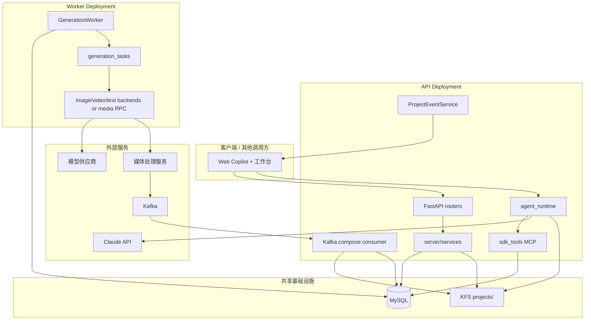
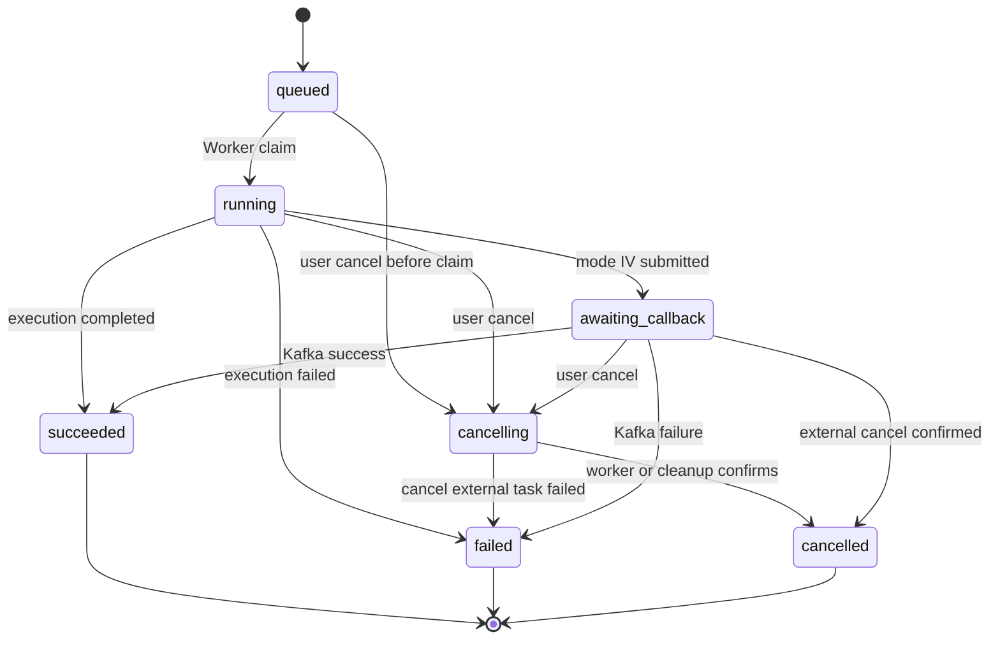
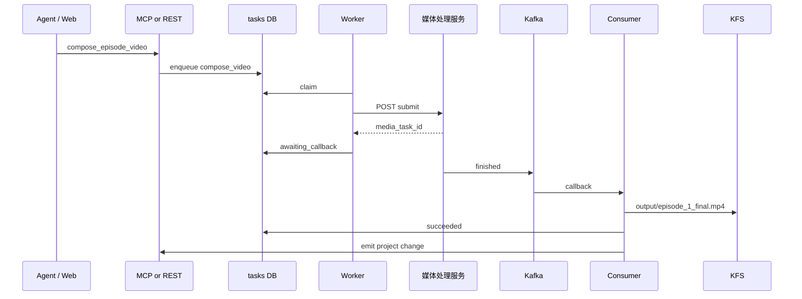

# Cybercut Agentic 技术方案

作者：wanghaobo

本文面向 **后端、平台工程、Agent 工程、调度执行与联调同学**，描述 Cybercut Agentic 平台首版目标架构。核心范围包括：FastAPI 接入层、Claude Agent SDK Runtime、MySQL 任务队列、GenerationWorker 执行层、KFS 项目存储、Project Events、媒体合成模式与 Agent Runtime Evals。

客户端只作为调用方出现。本文说明 REST/SSE 接口职责、状态语义与联调边界，不展开前端组件实现。

---

## 0. 一页结论

### 0.1 已确定决策

| 主题 | 决策 |
|------|------|
| 双入口 | Web REST 直触生成与 Agent MCP 统一写同一张 `tasks` 表 |
| 执行边界 | Agent 只编排；Worker 执行重计算、调供应商、写媒体 |
| 生产部署 | API Deployment 与 Worker Deployment 分离；通过 MySQL + KFS 解耦 |
| 首版存储 | KFS POSIX 项目树作为剧本与媒体真相源；大媒体 Blob 化放到后续阶段 |
| 项目刷新 | Worker 写盘后，以 Project Events SSE + `GET /projects/{name}` 刷新工作台 |
| 任务状态 | 顶栏任务状态来自 `GET /tasks` 轮询；不以 Tasks SSE 作为首版客户端通道 |
| Agent 会话 | Assistant SSE 只承载 Copilot 对话、工具流、AskUserQuestion，不代表项目真值 |
| 成片合成 | 首版按模式 IV：入队 → Worker submit 媒体服务 → Kafka callback → 写 KFS → 更新 task |
| 能力包 | `agent_runtime_profile/` 是发版源；项目 `.claude/` 是 SDK 实际读取副本 |
| 回归保障 | Profile / MCP / Agent Runtime 变更必须配套 smoke eval |

### 0.2 首版不做

- 不做多 `content_mode`，首版只支持 `content_mode=marketing`。
- 不做整棵项目树对象存储化，首版仍要求 POSIX KFS 项目根。
- 不让 Agent 沙箱 Bash 直连供应商、媒体服务或自行跑 ffmpeg 成片。
- 不让客户端新接 `GET /api/v1/tasks/stream`，任务顶栏用 REST 轮询。
- 不把供应商 API Key 注入 API 父进程环境变量。

### 0.3 仍需实现时确认

| 问题 | 推荐默认 |
|------|----------|
| Kafka consumer 部署形态 | 首版挂 API lifespan；规模期可拆独立 consumer Deployment |
| 重复生成同一镜头 | 默认创建新版本或覆盖引用，但必须有 idempotency key 与版本策略 |
| `worker_lease` 表结构 | 单独 migration，包含 `worker_id`、`name`、`lease_until`、`capabilities`、`updated_at` |
| `tasks` 幂等字段 | 增加 `idempotency_key`、`external_task_id`、`submitted_at`、`callback_payload` |
| MediaStore 引入时机 | 阶段 B，先统一 API/Worker 访问路径，再切 Blob |
| 多租户权限 | 项目级 owner/member 校验必须贯穿 REST、SSE、MCP closure 与文件路径 |

---

## 1. 背景、目标与非目标

### 1.1 背景

Cybercut 面向营销短视频工作流：

```text
商品/简报理解 → 广告剧本 → 资产与分镜 → 单镜视频 → 成片合成 → 预览导出
```

用户侧有两类入口：

- **Assistant**：用户通过 Copilot 自然语言编排。
- **REST 直触生成**：用户在工作台按钮触发资产、分镜、视频、成片等生成。

两类入口必须进入同一后端任务体系，避免 Web 按钮与 Agent 工具出现两套行为。

### 1.2 首版范围

| 维度 | 首版范围 |
|------|----------|
| API | FastAPI `/api/v1` |
| Agent | `claude-agent-sdk` + 进程内 MCP |
| 队列 | MySQL `tasks` + `worker_lease` |
| Worker | `GenerationWorker` 独立进程，开发态可内嵌 |
| 存储 | 阶段 A 全 KFS：`{CYBERCUT_DATA_DIR}/projects/{name}` |
| 业务模式 | `content_mode=marketing`，`generation_mode=storyboard` |
| 实时通道 | S1 Assistant SSE、S2 Project Events SSE、Tasks REST 轮询 |
| 成片 | 模式 IV：媒体服务 + Kafka callback |
| 测试 | pytest L1/L2 + Agent Eval smoke |

### 1.3 非目标

- 多内容模式：`drama` / `narration` 等。
- 完整自定义供应商能力。
- 大媒体 Blob 全量切换。
- 前端组件设计细节。
- 将 Agent Runtime 变成通用视频制作平台之外的万能代理。

---

## 2. 架构原则

| 原则 | 说明 |
|------|------|
| 双入口、单队列 | REST `POST /generate/*`、`POST /compose/*` 与 Agent MCP 均写 `tasks` |
| Agent 只编排 | Agent MCP 可以入队、读项目、写剧本草稿；不直接执行重计算 |
| Worker 执行 | 供应商调用、媒体处理、分镜图、单镜视频、成片合成都由 Worker 或外部服务执行 |
| FS 是项目真相源 | 剧本、媒体引用、资产、读时状态以 KFS 项目树为准 |
| DB 管任务与会话 | DB 记录任务状态、lease、会话元数据、transcript、凭证配置 |
| 状态读时计算 | `status`、`progress`、完成数不写入 `project.json`，由 `StatusCalculator` 读盘计算 |
| Project Events 只通知刷新 | S2 不承载完整项目，也不替代 `GET /projects/{name}` |
| Profile 即能力包 | 镜像 profile 同步到项目 `.claude/`，SDK 只读项目副本 |
| 变更要可评测 | Profile、Skill、MCP、SSE 协议变化必须进 eval 或契约测试 |

一句话主链路：

```text
REST 或 MCP 入队 → Worker 认领执行 → 写 KFS → Project Events 通知 → 客户端 getProject
```

---

## 3. 总体架构



### 3.1 分层职责

| 层 | 职责 | 建议路径 |
|----|------|----------|
| 接入层 | REST、鉴权、校验、SSE 端点 | `server/routers/` |
| 业务服务层 | 生成、合成、事件、费用、项目导出 | `server/services/` |
| Agent 层 | 会话、Assistant SSE、MCP、Profile | `server/agent_runtime/`、`agent_runtime_profile/` |
| 调度层 | 入队、认领、租约、幂等、取消 | `lib/generation_queue.py`、`lib/generation_worker.py` |
| 执行层 | 任务执行、供应商、媒体服务 | `server/services/generation_tasks.py`、`lib/*_backends/`、`lib/media_compose/` |
| 项目领域层 | 项目树、schema、读时状态、媒体引用 | `lib/project_manager.py`、`lib/status_calculator.py` |
| 平台层 | ORM、凭证、配置、迁移 | `lib/db/`、`lib/config/` |

---

## 4. 数据与存储契约

### 4.1 真相源分工

| 关心的问题 | 真相源 |
|------------|--------|
| 任务是否排队、执行、失败 | DB `tasks` |
| Worker 是否在线 | DB `worker_lease` |
| 某镜头是否有分镜图/视频 | KFS 文件 + `scripts/*.json` 中的 `generated_assets` |
| 项目进度条百分比 | `GET /projects/{name}` 时由 `StatusCalculator` 读盘计算 |
| Assistant 会话历史 | DB `agent_sessions` + transcript |
| 供应商凭证 | MySQL `provider_config` / `credentials` 等表 |

**DB 管“活干没干完”；KFS 管“片子里有什么”。**

### 4.2 KFS 项目根

| 环境变量 | 含义 |
|----------|------|
| `CYBERCUT_DATA_DIR` | KFS 挂载根，如 `/mnt/kfs/cybercut` |
| 未设置 | 开发机默认 `{repo}/projects` |

项目目录：

```text
{CYBERCUT_DATA_DIR}/projects/{project_name}/
├── project.json
├── CLAUDE.md
├── .claude/
├── .cybercut_profile_manifest.json
├── source/
├── scripts/
├── drafts/
├── product_images/
├── characters/
├── scenes/
├── props/
├── storyboards/
├── videos/
├── thumbnails/
├── output/
└── grids/
```

所有 API Pod 与 Worker Pod 必须挂载同一份 `CYBERCUT_DATA_DIR`。如果 Worker 写到 Pod 本地盘，API 的 `getProject` 将看不到生成结果。

### 4.3 `project.json` 契约

首版 `project.json` 用于项目级元数据与资产注册表，不存运行时统计。

最小字段：

```json
{
  "schema_version": 1,
  "title": "示例营销项目",
  "content_mode": "marketing",
  "generation_mode": "storyboard",
  "aspect_ratio": "9:16",
  "style": "commercial",
  "episodes": [
    {
      "episode": 1,
      "title": "第 1 集",
      "script_file": "scripts/episode_1.json"
    }
  ],
  "characters": {},
  "scenes": {},
  "props": {},
  "model_settings": {}
}
```

不可持久化字段：

- `status`
- `progress`
- `scenes_count`
- 每集分镜完成数、视频完成数
- 队列运行态

这些字段只能由 `GET /projects/{name}` 读时注入。

### 4.4 `scripts/episode_1.json` 契约

Marketing 剧本首版使用 `ad_units[]`：

```json
{
  "schema_version": 1,
  "episode": 1,
  "title": "第 1 集",
  "ad_units": [
    {
      "id": "E1A01",
      "hook": "开场钩子",
      "voiceover": "旁白文案",
      "cta": "行动号召",
      "duration_seconds": 4,
      "products_in_unit": [],
      "scenes": [],
      "props": [],
      "image_prompt": "",
      "video_prompt": {
        "action": "",
        "camera_motion": "",
        "prompt": ""
      },
      "generated_assets": {
        "storyboard_image": null,
        "video_clip": null,
        "status": "pending"
      }
    }
  ]
}
```

常见状态：

```text
pending → storyboard_ready → completed
```

写入边界：

| 写入方 | 可写内容 | 禁止 |
|--------|----------|------|
| Agent / Skill | `drafts/`、`scripts/*.json`、必要中间稿 | 手动改运行时统计；越权改其他项目 |
| Worker | `storyboards/`、`videos/`、`output/`、`generated_assets` 引用 | 写 Copilot 会话；改用户消息 |
| API | 建项骨架、入队、取消、配置、读时响应 | 在 API 进程中直接跑重计算 |

### 4.5 阶段 C Blob 引用形态

首版所有媒体在 KFS。阶段 C 只把大媒体外置，剧本、配置、profile 仍留在 KFS。

```json
{
  "generated_assets": {
    "video_clip": {
      "storage": "blob",
      "bucket": "cybercut-media",
      "object_key": "projects/my_ad/videos/scene_E1A01/v3.mp4",
      "url": "https://cdn.example/...",
      "sha256": "..."
    }
  }
}
```

引入 Blob 前必须先完成阶段 B：

- `MediaStore` / `ProjectMediaResolver` 抽象。
- Worker 生成后统一经 resolver 写入。
- `getProject` 统一经 resolver 填充 URL。
- S2 fingerprint 纳入引用集，而不是只扫本地媒体文件。

---

## 5. 任务队列与 Worker 契约

### 5.1 队列交接

| 角色 | 允许 | 不允许 |
|------|------|--------|
| API / MCP | 插入 `tasks`、查询任务、取消任务、`enqueue_and_wait` | 调 ffmpeg、直连供应商、写 `videos/` |
| Worker | claim 任务、执行、写 KFS、更新任务状态 | 替用户发 Copilot 消息、改 `agent_sessions` |
| Kafka consumer | 处理外部完成消息、写 KFS、mark task 终态 | 创建新的用户会话消息 |

### 5.2 状态机

建议统一任务状态：



状态说明：

| 状态 | 含义 |
|------|------|
| `queued` | 已入队，等待 Worker claim |
| `running` | Worker 已认领并执行 |
| `awaiting_callback` | 模式 IV 已提交外部媒体服务，等待 Kafka callback |
| `cancelling` | 用户已请求取消，等待 Worker 或外部服务确认 |
| `cancelled` | 取消完成 |
| `succeeded` | 任务终态成功 |
| `failed` | 任务终态失败 |

### 5.3 Worker lease

Worker 启动后续租 `worker_lease`：

| 字段 | 含义 |
|------|------|
| `worker_id` | Worker 实例唯一 ID |
| `name` | 逻辑队列名，如 `default` |
| `capabilities` | 支持 `image`、`video`、`compose` 等能力 |
| `lease_until` | 租约到期时间 |
| `updated_at` | 最近心跳时间 |

推荐节奏：

- Worker 每约 3s 续租。
- `lease_until = now + 10s`。
- API/MCP 入队前检查同能力 Worker 是否在线。
- Worker 全挂时返回 `WorkerOfflineError`，不要把任务堆进库里无人处理。

### 5.4 幂等与重复处理

建议 `tasks` 增加以下字段：

| 字段 | 用途 |
|------|------|
| `idempotency_key` | 防止相同入口重复入队 |
| `source` | `agent` / `webui` / `system` |
| `external_task_id` | 媒体服务 `task_id` |
| `submitted_at` | 模式 IV submit 时间 |
| `callback_payload` | 最近一次 callback 摘要 |
| `attempt_count` | 重试次数 |

`idempotency_key` 推荐格式：

```text
{project_name}:{task_type}:{resource_id}:{payload_hash}
```

默认策略：

- 同一 `idempotency_key` 已有非终态任务：返回现有任务。
- 同一 `idempotency_key` 已成功：按业务决定返回成功结果或创建新版本。
- Kafka callback 重复到达：按 `external_task_id` 查任务，若已终态则忽略并记录日志。
- Worker submit 成功但 DB 更新失败：下次恢复时通过 `external_task_id` 或 payload 标记判断是否已提交，避免重复 submit。

### 5.5 取消语义

取消是两段式：

```text
user cancel → tasks.status = cancelling → Worker / consumer 确认 → cancelled
```

| 模式 | 取消动作 |
|------|----------|
| 模式 I | Worker 停止本地轮询与供应商调用；无法取消的供应商调用等待失败或完成后丢弃结果 |
| 模式 III | Worker 调 RPC 服务取消接口 |
| 模式 IV | API/Worker 调媒体服务取消 API；Kafka 后续 callback 必须按任务状态幂等处理 |

Worker 重启时必须扫描 `running`、`cancelling`、`awaiting_callback` 孤儿任务。

---

## 6. Agent Runtime 与 Profile

### 6.1 Runtime 链路

```mermaid
sequenceDiagram
  participant FE as 客户端
  participant API as FastAPI assistant router
  participant SVC as AssistantService
  participant SM as SessionManager
  participant Actor as SessionActor
  participant SDK as ClaudeSDKClient
  participant MCP as cybercut MCP
  participant KFS as KFS project root

  FE->>API: POST sessions/send
  API->>SVC: send_message
  SVC->>SM: build ClaudeAgentOptions
  SM->>Actor: query
  Actor->>SDK: receive_response
  SDK->>KFS: Read / Write / Bash
  SDK->>MCP: mcp__cybercut__*
  MCP->>KFS: ProjectManager / ScriptGenerator
  MCP->>API: enqueue task or write script
  SDK-->>FE: Assistant SSE
```

关键配置：

| 配置 | 典型值 |
|------|--------|
| `cwd` | `{CYBERCUT_DATA_DIR}/projects/{name}` |
| `setting_sources` | `["project"]` |
| `mcp_servers` | `{"cybercut": ...}` |
| `allowed_tools` | `mcp__cybercut__*` + Read/Write/Bash |
| `sandbox` | Bash 沙箱；MCP 在 API 主进程 |
| `CYBERCUT_SDK_SESSION_STORE` | `db` |

### 6.2 Profile 同步

| 位置 | 作用 |
|------|------|
| `agent_runtime_profile/` 或 `CYBERCUT_PROFILE_DIR` | 发版源：Skills、Agents、`CLAUDE.marketing.md` |
| `projects/{name}/.claude/` + `CLAUDE.md` | SDK 实际读取；项目级副本 |

同步规则：

1. 建项时调用 `sync_agent_profile`。
2. 服务启动时可跑 `sync_all_agent_profiles()`，按 manifest + sha256 升级未改动文件。
3. 用户改过的项目副本保留。
4. 多 API 副本同步时使用 `.profile_sync.lock`，或由单独 admin Job 执行。

会话不需要粘滞到某个 API Pod；任意 API Pod 只要能访问同一 DB 与 KFS，就能恢复会话和项目上下文。

### 6.3 MCP 实现模式

| 模式 | 说明 | 首版能力 |
|------|------|----------|
| I. 入队 + Worker + 后端 | MCP/REST 入队，Worker 执行到底 | 分镜、单镜视频、资产图 |
| II. MCP 直连 lib | 秒级逻辑，不入队，直接写 drafts/scripts | 商品理解、剧本生成 |
| III. 入队 + Worker 内 RPC | Worker 调媒体微服务并等待完成 | 单镜服务化规划 |
| IV. 入队 + submit + Kafka | Worker submit 外部任务，consumer 处理回调 | 成片合成 |

反模式：

- Agent Bash 直连供应商或媒体 API。
- MCP 长时间阻塞且不入队。
- 只用 Assistant 文本说“好了”，但不触发 Project Events + `getProject`。
- Agent 直接改 `project.json` 运行时统计字段。

---

## 7. API 与 SSE 合同

### 7.1 通道总表

| 通道 | 方法 / 路径 | 用途 | 客户端区域 |
|------|-------------|------|------------|
| Assistant send | `POST /api/v1/projects/{name}/assistant/sessions/send` | 发送用户消息 | 右侧 Copilot |
| S1 Assistant SSE | `GET /api/v1/projects/{name}/assistant/sessions/{id}/stream` | 会话快照、增量、工具流、问题 | 右侧 Copilot |
| Assistant snapshot | `GET /api/v1/projects/{name}/assistant/sessions/{id}/snapshot` | 刷新页或终态会话首屏 | 右侧 Copilot |
| AskUserQuestion answer | `POST /api/v1/projects/{name}/assistant/sessions/{id}/questions/{qid}/answer` | 回答结构化问题 | 右侧 Copilot |
| Tasks REST | `GET /api/v1/tasks`、`GET /api/v1/tasks/stats` | 队列状态 | 顶栏 TaskHud |
| S2 Project Events SSE | `GET /api/v1/projects/{name}/events/stream` | 项目真值变更通知 | 中间主区 + 左侧资产栏 |
| getProject | `GET /api/v1/projects/{name}` | 拉完整项目快照 | 工作台各区域 |
| 直触生成 | `POST /api/v1/projects/{name}/generate/*` | Web 按钮入队 | 工作台 |
| 成片 | `POST /api/v1/projects/{name}/compose/episode/{n}` | Web 按钮合成 | 工作台 |
| S3 Tasks SSE | `GET /api/v1/tasks/stream` | 遗留任务 SSE | 首版不新接 |

### 7.2 三类状态语义

| 语义 | 数据源 | 客户端理解 |
|------|--------|------------|
| A. 任务队列 | DB `tasks` | `GET /tasks` 只知道 queued/running/failed，不保证媒体文件已可见 |
| B. 项目真值 | KFS + 读时计算 | 以 `GET /projects/{name}` 为准，驱动时间轴、画布、资产栏 |
| C. 助手会话 | DB transcript + S1 | 只反映 Copilot 对话与编排，不代替项目真值 |

联调铁律：

```text
Worker 写盘完成 → Project Events changes → 客户端 getProject → UI 显示新媒体
```

不要从 Assistant 正文解析“生成好了”来更新时间轴。

### 7.3 StudioLayout 消费关系

```text
GlobalHeader
  └─ GET /tasks 轮询 → TaskHud

StudioLayout
  ├─ useProjectEventsSSE(projectName)
  │    └─ S2 changes → refreshProject → 中间主区 + 左侧资产栏
  ├─ AssetSidebar
  ├─ main {children}
  └─ AgentCopilot
       └─ S1 Assistant SSE → turns / draft_turn / question
```

| 页面区域 | 通道 | 刷新内容 |
|----------|------|----------|
| 右侧 Copilot | S1 Assistant SSE | 消息流、工具块、`draft_turn`、`question` |
| 中间主区 | S2 Project Events → `getProject` | 时间轴、剧本页、画布预览 |
| 左侧资产栏 | S2 Project Events → `getProject` | 角色/场景/道具列表 |
| 顶栏 TaskHud | `GET /tasks` REST 轮询 | 队列统计、失败提示 |

### 7.4 S1 Assistant SSE

路由：

```http
GET /api/v1/projects/{project_name}/assistant/sessions/{session_id}/stream
```

事件：

| event | 含义 |
|-------|------|
| `snapshot` | 会话全量：`turns`、`draft_turn`、`pending_questions` |
| `patch` | turn 增量：`append`、`replace_last`、`reset` |
| `delta` | 流式 token 或 `draft_turn` 增量 |
| `status` | 会话运行态或终态 |
| `question` | AskUserQuestion 结构化问题 |
| `compact` | 上下文压缩边界，可选消费 |

`snapshot` 示例：

```json
{
  "session_id": "...",
  "status": "running",
  "turns": [],
  "draft_turn": null,
  "pending_questions": []
}
```

客户端在 `status` 属于终态时关闭 SSE，并清空 `draft_turn` 与 pending question。

### 7.5 AskUserQuestion

`question` 事件 / `pending_questions[]` 元素：

```json
{
  "type": "ask_user_question",
  "question_id": "aq_xxx",
  "tool_name": "AskUserQuestion",
  "questions": [
    {
      "header": "输出",
      "question": "输出格式是什么？",
      "multiSelect": false,
      "options": [
        { "label": "摘要", "description": "简洁输出" },
        { "label": "详细", "description": "完整说明" }
      ]
    }
  ],
  "timestamp": "2026-06-01T12:00:00.000Z"
}
```

回答接口：

```http
POST /api/v1/projects/{project_name}/assistant/sessions/{session_id}/questions/{question_id}/answer
Content-Type: application/json

{
  "answers": {
    "输出格式是什么？": "摘要"
  }
}
```

注意：`answers` 的 key 是 `questions[].question` 原文，不是 `header`。

### 7.6 S2 Project Events SSE

路由：

```http
GET /api/v1/projects/{project_name}/events/stream
```

事件：

| event | 含义 |
|-------|------|
| `snapshot` | 订阅初始 fingerprint |
| `changes` | 项目磁盘真值变化，客户端应触发 `getProject` |

`changes` 示例：

```json
{
  "project_name": "my_ad",
  "fingerprint": "abc123",
  "source": "filesystem",
  "changes": [
    {
      "entity_type": "episode",
      "action": "updated",
      "entity_id": "episode_1",
      "label": "第 1 集",
      "focus": { "pane": "timeline", "episode": 1 },
      "important": true
    }
  ]
}
```

S2 不携带完整项目，不代表任务成功，不驱动 Copilot 聊天气泡。

### 7.7 跨 Pod Project Events

单体部署：

```text
Worker 写完 KFS
  → emit_project_change_batch
  → 同进程 ProjectEventService 推 changes
  → 浏览器 getProject
```

生产拆分：

```text
Worker Pod 写 KFS
  → Worker 本进程 emit 不能触达 API Pod SSE
  → API Pod 的 ProjectEventService 扫订阅项目 fingerprint
  → 发现变化后推 changes
  → 浏览器 getProject
```

最小可行要求：

- `ProjectEventService` 在 API 进程启动。
- 对已有浏览器订阅的项目启动 `_watch_project`。
- `PROJECT_EVENTS_POLL_SECONDS` 默认约 0.5s。
- Worker 侧 emit 可保留用于单体调试，但跨 Pod 以 API 扫盘为准。

---

## 8. 成片合成：模式 IV

### 8.1 场景

当各镜 `videos/scene_*.mp4` 就绪后，用户说“合成第 1 集”或点击“一键成片”。



### 8.2 远端契约

| 步骤 | 契约 |
|------|------|
| submit | episode、镜头路径或 signed URL、输出规格 |
| 同步响应 | `{ "task_id": "media-xxx" }`，无文件 |
| Kafka | `media_task_id`、`status`、`output_url` 或内网路径 |
| 落盘 | `projects/{name}/output/episode_{n}_final.mp4` |
| 任务映射 | `task_type=compose_video`，`external_task_id=media_task_id` |

建议模块：

| 模块 | 路径 |
|------|------|
| MCP | `server/agent_runtime/sdk_tools/compose_video.py` |
| REST | `server/routers/compose.py` |
| 服务 | `server/services/compose_tasks.py` |
| 客户端 | `lib/media_compose/client.py` |
| Kafka | `lib/media_compose/kafka_consumer.py` |

---

## 9. 部署、配置与运维

### 9.1 部署形态

| 维度 | 开发态 | 生产态 |
|------|--------|--------|
| API | `uvicorn` 单进程 | `cybercut-api` N 副本 |
| Worker | 可内嵌 API | `cybercut-worker` M 副本 |
| Project Events | 同进程 emit 即时 | API Pod 扫 KFS fingerprint |
| 队列 | MySQL / 本地兼容 | MySQL 集群 |
| 存储 | 本地 `projects` 或 KFS | KFS PVC |
| Compose consumer | 可选启动 | API lifespan 或独立 Deployment |

启动顺序：

```text
初始化 DB
→ 同步 agent profile
→ 可选启动内嵌 Worker
→ 启动 ProjectEventService
→ 注册路由
→ 可选启动 Kafka compose consumer
```

### 9.2 环境变量

| 变量 | 阶段 | 含义 |
|------|------|------|
| `CYBERCUT_DATA_DIR` | A+ | KFS 项目树根 |
| `CYBERCUT_PROFILE_DIR` | A+ | Profile 发版源覆盖路径 |
| `CYBERCUT_SDK_SESSION_STORE` | A+ | `db` / `off` |
| `CYBERCUT_RUN_EMBEDDED_WORKER` | A+ | 开发态内嵌 Worker |
| `PROJECT_EVENTS_POLL_SECONDS` | A+ | S2 扫盘间隔 |
| `CYBERCUT_MEDIA_BACKEND` | B/C | `kfs` / `blob` / `hybrid` |
| `CYBERCUT_BLOB_BUCKET` | C | Blob bucket |
| `CYBERCUT_BLOB_PREFIX` | C | Blob key 前缀 |

### 9.3 Health 与 readiness

| 组件 | 检查项 |
|------|--------|
| API | DB 可连、KFS 可读、profile 可访问、路由可用 |
| Worker | DB 可连、KFS 可写、lease 心跳正常、供应商配置可解析 |
| Project Events | 可建立 SSE、订阅项目 fingerprint 可计算 |
| Compose consumer | Kafka 可连、consumer group 正常、KFS 可写 |
| Media service | submit/cancel API 可达 |

### 9.4 指标与告警

建议指标：

| 指标 | 用途 |
|------|------|
| `task_queue_depth` | 队列积压 |
| `task_latency_seconds` | 任务排队 + 执行耗时 |
| `worker_lease_age_seconds` | Worker 是否掉线 |
| `project_event_scan_duration_seconds` | S2 扫盘成本 |
| `project_event_connections` | SSE 连接数量 |
| `compose_callback_lag_seconds` | 媒体服务 callback 延迟 |
| `agent_tokens_total` | Agent 成本 |
| `eval_pass_rate` | Profile / Skill 回归 |

建议日志字段贯穿：

```text
request_id, user_id, project_name, session_id, task_id, resource_id,
idempotency_key, worker_id, external_task_id, provider_id
```

关键告警：

- Worker 全挂或 lease 过期。
- KFS 不可写。
- `awaiting_callback` 超时。
- Project Events 扫描失败率升高。
- Eval smoke 失败。
- 供应商错误率或限流升高。

### 9.5 安全与权限

必须覆盖：

- REST、SSE、MCP handler 均校验用户是否有项目访问权。
- MCP closure 绑定 `project_name` 后仍要防路径穿越。
- Agent `cwd` 固定到项目根，工具不能访问其他项目目录。
- 供应商密钥只从 DB 读取，不注入 API 父进程环境变量。
- 日志与 transcript 不记录明文 API Key。
- SSE token/cookie 失效后应断开或拒绝重连。
- 多租户下 provider credential 需明确是用户级、项目级还是全局级。

---

## 10. 分期交付与验收

### 10.1 M1：项目、KFS、任务基础

范围：

- 建项与 profile 同步。
- `GET /projects/{name}`。
- `tasks` 与 `worker_lease` migration。
- Worker 独立入口。
- KFS 路径解析。

验收：

- 可创建 marketing 项目并生成项目骨架。
- `project.json` 与目录结构符合 §4。
- `GET /projects/{name}` 返回读时 `status/progress`。
- Worker 能续租，API 能识别 Worker 在线/离线。
- pytest 覆盖项目创建、路径防穿越、读时状态。

### 10.2 M2：Assistant + 剧本

范围：

- Assistant 会话 CRUD。
- S1 Assistant SSE。
- `manga-workflow` 或 `marketing-workflow` Skill。
- 模式 II MCP：商品理解、剧本生成。
- AskUserQuestion。

验收：

- 用户可通过 Copilot 从简报生成 `scripts/episode_1.json`。
- `ad_units[]` schema 校验通过。
- `question` 事件与 answer API 闭环。
- L1/L2 streaming 测试通过。
- marketing eval smoke 至少覆盖 brief-to-script。

### 10.3 M3：模式 I 双入口生成

范围：

- 资产、分镜、单镜视频入队。
- Web REST 与 MCP 双入口。
- Worker 执行并写 `storyboards/`、`videos/`。
- S2 Project Events。

验收：

- Web 按钮和 Agent 工具进入同一 `tasks` 队列。
- 单镜视频落盘后，S2 `changes` 触发 `getProject`，时间轴显示新视频。
- TaskHud 使用 `GET /tasks` 轮询。
- 跨 Pod 模拟下，API 扫盘能发现 Worker 写盘。

### 10.4 M4：模式 IV 成片

范围：

- Compose MCP 与 REST。
- `lib/media_compose` client。
- Kafka consumer。
- `awaiting_callback` 状态与外部任务映射。
- 取消与重复 callback 幂等。

验收：

- `compose_video` 入队可见。
- Worker submit 后任务进入 `awaiting_callback`。
- Kafka success 后 `output/episode_n_final.mp4` 落盘。
- S2 changes 触发 `getProject`。
- 重复 callback 不重复写盘或误改终态。

### 10.5 M5：MediaStore 与 Blob 渐进

范围：

- `MediaStore` / `ProjectMediaResolver`。
- `CYBERCUT_MEDIA_BACKEND=hybrid`。
- Blob put/head/url 解析。
- `generated_assets` Blob 引用。

验收：

- KFS 与 Blob 两种引用均能被 `getProject` 解析。
- Evals 支持“引用合法 + 对象可 Head”断言。
- 阶段 A 项目不受影响。

---

## 11. 团队分工

| 组 | 模块 | 交付物 | 依赖 |
|----|------|--------|------|
| A. API 与平台 | `server/routers/`、`lib/db/`、`lib/config/`、Kafka consumer | REST/SSE、认证、DB migration、compose callback | D schema |
| B. Agent | `agent_runtime/`、`agent_runtime_profile/`、`cybercut_evals/` | Assistant、MCP、Skill、Subagent、Evals | A/C/D |
| C. 调度执行 | `generation_queue`、`generation_worker`、`generation_tasks`、backends | 队列、Worker、供应商、模式 I/III/IV 执行 | A/D |
| D. 项目领域 | `project_manager`、`status_calculator`、validators、MediaStore | 项目目录、schema、读时状态、媒体引用 | A/C |
| E. 运维 | CI、K8s、KFS、监控 | Deployment、health、metrics、告警 | 全员 |
| 客户端团队 | Web 工作台 | 按 §7 消费 API/SSE | A 提供 OpenAPI |

协作规则：

- B ↔ C 以 `task_type` + `payload` 为契约。
- D 拥有 `project.json` / `scripts` schema。
- A 拥有 REST/SSE 和 DB migration。
- 项目视图刷新只认 Project Events + `getProject`。
- `GET /tasks` 只代表队列，不代表媒体文件已可见。

---

## 12. 风险与缓解

| 风险 | 缓解 |
|------|------|
| KFS 路径不一致 | 所有 Pod 统一 `CYBERCUT_DATA_DIR`，health 检查可读写 |
| Worker 全挂仍入队 | 入队前查 `worker_lease`，离线时返回 `WorkerOfflineError` |
| 跨 Pod Events 不触达 | API 进程按订阅项目扫 KFS fingerprint |
| Tasks succeeded 但 UI 无媒体 | 客户端以 S2 + `getProject` 为准，不以任务状态更新项目 |
| 模式 IV 重复 callback | 按 `external_task_id` 幂等，终态任务忽略重复回调 |
| 模式 IV 重复 submit | 使用 `idempotency_key`、`submitted_at`、`external_task_id` 恢复 |
| Blob 双写不一致 | 阶段 B 先引入 MediaStore；Put 成功后再更新 JSON 引用 |
| Agent 越权读写 | 固定 `cwd`，路径规范化，REST/SSE/MCP 均做项目权限校验 |
| 密钥泄露 | 只从 DB 读取，日志脱敏，不注入父进程 env |
| Profile 多副本冲突 | manifest + sha256 + `.profile_sync.lock` 或 admin Job |
| Skill 回归靠人工 | §13 Evals 进 CI，profile/MCP 变更必须跑 smoke |
| 真模型 eval 成本高 | PR 跑 mock/smoke，nightly 抽样真调用 |

---

## 13. Agent Runtime Evals

### 13.1 分层

| 层级 | 测什么 | 手段 | 运行时机 |
|------|--------|------|----------|
| L1 | projector、turn_grouper、路径隔离、hook | pytest + fake message | 每次 PR |
| L2 | SSE payload、AskUserQuestion、MCP 参数、enqueue mock | pytest + mock Session/Worker | 每次 PR |
| L3 | prompt → Skill → MCP → KFS 产物 | Eval Runner + grader | PR smoke + nightly |

原则：

- L1/L2 每次 PR 跑。
- L3 smoke 在改 `agent_runtime_profile/*` 或 `sdk_tools/*` 时必跑。
- L3 full nightly 或发版前跑。

### 13.2 建议目录

```text
cybercut_evals/
├── fixtures/
│   └── projects/
│       └── marketing_minimal/
├── cases/
│   └── marketing_workflow/
│       ├── evals.json
│       └── assertions/
├── skill_trigger/
│   └── marketing-workflow-trigger.json
├── workspaces/
└── runners/
    ├── run_smoke.py
    └── run_case.py
```

### 13.3 用例示例

```json
{
  "suite": "marketing_workflow",
  "profile": "marketing",
  "evals": [
    {
      "id": "mkt-01-brief-to-script",
      "prompt": "根据 source 里的商品简报，生成第 1 集广告剧本",
      "fixture_project": "marketing_minimal",
      "expected_output": "写出合法 scripts/episode_1.json，含 ad_units，不手改 project.json 结构",
      "target_skills": ["marketing-workflow"],
      "assertions": [
        { "name": "script_file_exists", "type": "filesystem", "path": "scripts/episode_1.json" },
        { "name": "ad_units_schema", "type": "schema", "validator": "assertions/episode_marketing.py" },
        { "name": "no_direct_project_json_edit", "type": "behavior", "text": "不直接 Rewrite project.json 业务字段" }
      ]
    }
  ]
}
```

### 13.4 首版用例清单

| ID | 场景 | 关键断言 |
|----|------|----------|
| mkt-01 | 空项目 + 商品简报 → 剧本 | `scripts/episode_1.json` + `ad_units` schema |
| mkt-02 | “继续” → 状态检测 | 能从 `drafts/`、`scripts/` 判断当前阶段 |
| mkt-03 | 指定镜头重生分镜 | MCP payload 带 `scene_ids`，不整集重跑 |
| mkt-04 | AskUserQuestion | S1 `question` + answer API 后继续执行 |
| mkt-05 | 合成入口 | 调用 compose MCP/REST，生成 `task_type=compose_video` |
| mkt-06 | Project Events | Worker 写盘后 S2 `changes` 触发 `getProject` |

### 13.5 CI 与发版

```text
改 agent_runtime_profile/* 或 sdk_tools/*
  → pytest L1/L2
  → cybercut_evals smoke
  → nightly full eval
```

命令示例：

```bash
uv run pytest tests/agent_runtime tests/test_assistant_service_streaming.py
uv run python -m cybercut_evals.runners.run_smoke
```

失败产物保留在：

```text
cybercut_evals/workspaces/<iteration>/<eval_id>/
```

包含 transcript、KFS diff、`grading.json`、`sse_trace.jsonl`。

---

## 14. 附录：核心模块路径

| 主题 | 路径 |
|------|------|
| 应用启动 | `server/app.py` |
| S1 路由 | `server/routers/assistant.py` |
| S2 路由 | `server/routers/project_events.py` |
| Tasks 路由 | `server/routers/tasks.py` |
| Project Events 服务 | `server/services/project_events.py` |
| Assistant 服务 | `server/agent_runtime/service.py` |
| Session 管理 | `server/agent_runtime/session_manager.py` |
| SSE 投影 | `server/agent_runtime/stream_projector.py` |
| MCP 工具 | `server/agent_runtime/sdk_tools/` |
| 入队等待 | `lib/generation_queue_client.py` |
| 队列 | `lib/generation_queue.py` |
| Worker | `lib/generation_worker.py` |
| 执行任务 | `server/services/generation_tasks.py` |
| 项目管理 | `lib/project_manager.py` |
| 读时状态 | `lib/status_calculator.py` |
| Profile 同步 | `lib/profile_manifest.py` |
| 数据根解析 | `lib/app_data_dir.py` |
| 成片合成 | `lib/media_compose/`、`server/services/compose_tasks.py` |
| Agent headless 驱动 | `server/routers/agent_chat.py` |
| Eval 套件 | `cybercut_evals/` |

---

## 15. 术语速查

| 术语 | 含义 |
|------|------|
| S1 | Assistant SSE，右侧 Copilot 对话通道 |
| S2 | Project Events SSE，项目真值变化通知通道 |
| S3 | Tasks SSE，遗留通道，首版客户端不新接 |
| getProject | `GET /api/v1/projects/{name}`，拉完整项目快照 |
| 项目真值 | KFS 项目树 + 读时计算结果 |
| 模式 I | 入队后 Worker 执行到底 |
| 模式 II | MCP 直连 lib 的秒级能力 |
| 模式 III | Worker 内 RPC |
| 模式 IV | Worker submit 外部任务，Kafka callback 收尾 |
| Profile | Agent 能力包发版源与项目副本 |
| MediaStore | 阶段 B/C 媒体存储抽象 |

---

本文以 §0 决策摘要为准，以 §4 数据契约、§5 任务状态机、§7 API/SSE 合同作为实现与联调依据；分期验收以 §10 为准，Agent Runtime 回归以 §13 为准。
