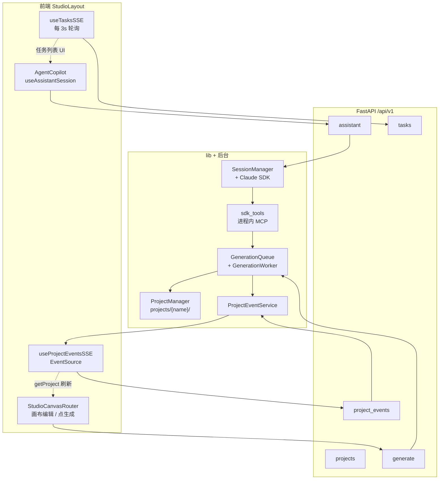
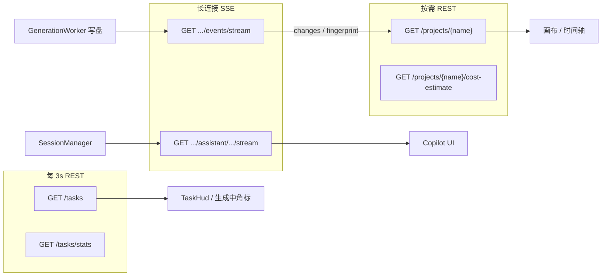
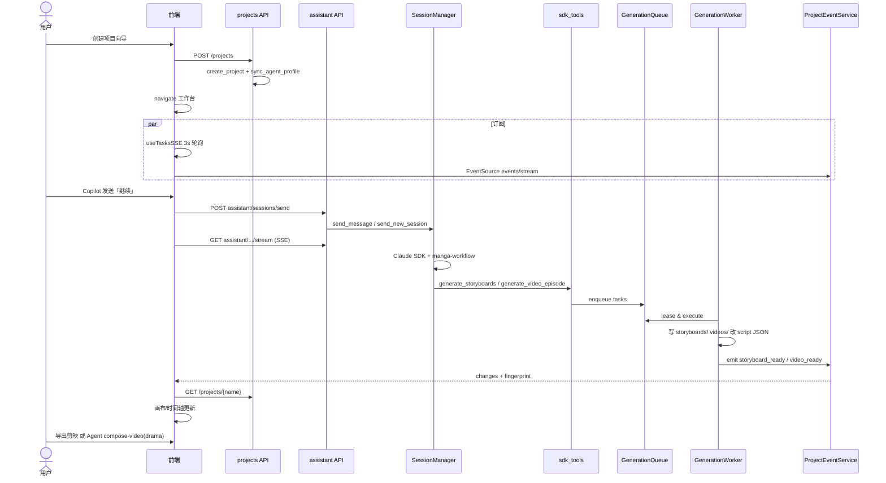

# 从创建项目到成片：完整交互链路

> 作者：wanghaobo  
> 说明：本文按**用户操作时间线**串联前后端模块，侧重「创建项目 → Copilot 对话 → 任务轮询 / 项目事件 → 成片导出」主路径。API 全表与数据目录细节见姊妹文档。

---

## 1. 范围与前提

| 维度 | 本文默认 |
|------|----------|
| 内容模式 | `marketing`（营销短视频）；编排逻辑见 `SKILL.marketing.md` |
| 生成模式 | `storyboard`（分镜图 → 图生视频） |
| 运行环境 | 前端 Vite `5173` 代理 → 后端 `uvicorn` `1241`（见 `scripts/dev/start.sh`） |

**不在此展开**：认证细节、自定义供应商 CRUD、参考生视频专用路径（逻辑同构，阶段 6 跳过分镜）。

---

## 2. 总览：四条并行通道

用户进入项目工作台后，四条通道同时工作，职责互不替代：

| 通道 | 传输方式 | 回答的问题 | 典型 UI |
|------|----------|------------|---------|
| **Assistant SSE** | **SSE** | Agent 正在说什么、会话是否还在跑 | Copilot 消息流 |
| **Tasks** | **REST 轮询**（3s，非 SSE） | 队列里图/视频任务 `queued/running/failed` | 顶栏 TaskHud、时间轴「生成中」 |
| **Project Events** | **SSE** | 磁盘真值何时变了（分镜/视频写盘完成） | 通知、`getProject` 刷新画布 |
| **getProject** | **REST**（进页 + 事件触发） | `project.json` + 各集 `scripts` + 读时 `progress` | 侧栏、时间轴、概览页 |

---

## 3. 阶段一：创建项目（WebUI）

### 3.1 前端

1. 项目大厅打开 `CreateProjectModal`（`frontend/src/components/pages/CreateProjectModal.tsx`）。
2. 三步向导收集：`content_mode`、`generation_mode`、画幅、模型供应商等。
3. `API.createProject()` → `POST /api/v1/projects`。
4. 可选：`uploadStyleImage`（非 marketing）、`uploadReferenceVideo` / 商品图（marketing 第三步）。
5. `navigate(/app/projects/{name})` 进入工作台。

状态：`useProjectsStore` 记录当前项目名；`StudioLayout` 挂载后开始 §4 的两类订阅。

### 3.2 后端

`server/routers/projects.py::create_project` 在线程池中同步执行：

1. `ProjectManager.generate_project_name(title)` 或用户指定 `name`。
2. **`create_project(name, content_mode)`**（`lib/project_manager.py`）  
   - 创建 `source/`、`scripts/`、`drafts/`、`storyboards/`、`videos/`、`output/` 等子目录。  
   - 写入初始 `project.json`（含 `content_mode`）。  
   - **`sync_agent_profile()`**：按 manifest 将 `agent_runtime_profile/` 复制到项目内 `.claude/`、`CLAUDE.md`（marketing 用 `CLAUDE.marketing.md`）。
3. **`create_project_metadata(...)`**（`project_change_source("webui")`）  
   - 补全 title、style、aspect_ratio、各 `*_backend`、`generation_mode` 等。  
4. 返回 `{ success, name, project }`；列表接口中的 `status` / `progress` 由 **`StatusCalculator`** 读时计算，不写入磁盘。

**要点**：项目目录与 Agent 配置在创建时即就绪；Copilot 会话**不会**再建目录。

---

## 4. 阶段二：进入工作台

路由：`/app/projects/:name/*` → `StudioLayout`（`frontend/src/components/layout/StudioLayout.tsx`）。

| Hook | 行为 |
|------|------|
| `useTasksSSE(projectName)` | 立即 `GET /tasks` + `GET /tasks/stats`，之后每 **3s** 轮询（曾用 SSE，现为轮询以释放浏览器连接槽） |
| `useProjectEventsSSE(projectName)` | `EventSource` → `GET /projects/{name}/events/stream` |
| `useAssistantSession(projectName)` | 在 `AgentCopilot` 内：列会话、拉 snapshot、按需连 Assistant SSE |

子路由由 `StudioCanvasRouter` 分发：源文件、角色/场景/道具、分集时间轴等；数据主要来自 `useProjectsStore.currentProject` 与 `API.getProject`。

---

## 5. 阶段三：与 Agent 对话

### 5.1 发送消息（前端）

`AgentCopilot` → `useAssistantSession.sendMessage`：

1. **乐观更新**：本地 `turns` 追加 user turn，`sessionStatus = running`。
2. `POST /api/v1/projects/{name}/assistant/sessions/send`  
   - body：`content`、`session_id?`、`images?`（base64，最多 5 张）。
3. 无 `session_id` 时后端创建新会话，返回 `session_id`。
4. `connectStream(sessionId)` → `EventSource` 订阅  
   `GET .../assistant/sessions/{id}/stream`。

`frontend/src/stores/assistant-store.ts` 保存 turns、draft_turn、pending_questions、会话列表。

### 5.2 接收流式回复（后端）

| 模块 | 职责 |
|------|------|
| `server/routers/assistant.py` | HTTP 入口、`SendRequest` 校验 |
| `AssistantService.send_or_create` | 校验项目存在；新建或续聊 |
| `SessionManager.send_message` / `send_new_session` | 每会话一个 `SessionActor`，串行调用 `ClaudeSDKClient` |
| `AssistantStreamProjector` | SDK 原始 message → `turns` / `patch` / `delta` |
| `AssistantService.stream_events` | SSE：`snapshot`、`patch`、`delta`、`question`、`status` |

**会话 cwd**：`_build_options` 将 SDK 工作目录设为 `projects/{project_name}/`（沙箱内可读写项目树）。主 Agent 读 `project.json`、写 `drafts/` 等均在此根下。

**持久化**：`SessionStore` / DB 镜像 transcript（受 `ARCREEL_SDK_SESSION_STORE` 控制）；前端历史以 snapshot + SSE 为准。

### 5.3 用户确认与 Skill

编排 Skill：`agent_runtime_profile/.claude/skills/manga-workflow/SKILL.marketing.md`（同步到项目 `.claude/skills/`）。

主 Agent 循环：

1. Read / Glob 检测阶段（§6 状态机）。
2. **dispatch subagent**（如 `analyze-assets`、`create-episode-script`）—— 大块文本不进主 Agent context，只传路径。
3. 阶段结束用 **`AskUserQuestion`**（SDK）→ SSE `question` 事件 → 前端 `PendingQuestionWizard` → `POST .../sessions/{id}/answer`。

Slash 命令与 Skill 列表：`GET .../assistant/skills`（启动时预加载到 store）。

---

## 6. 阶段四：编排触发的生成（Agent 路径）

### 6.1 进程内 MCP（不进沙箱）

`server/agent_runtime/sdk_tools/` 在**服务端主进程**注册，按会话绑定 `project_name`，避免 Agent 改路径越权：

| 工具 | 作用 |
|------|------|
| `generate_assets` | 角色/场景/道具 sheet 图 |
| `generate_storyboards` | 分镜图入队 |
| `generate_grid` | 宫格模式分镜 |
| `generate_video_*` | 按集/场景/选中镜头入队视频 |
| `generate_episode_script` | 文本侧剧本辅助 |
| `analyze_product_images` / `analyze_viral_reference` | 商品图 / 爆款视频理解 |

典型调用链（分镜为例，`enqueue_storyboards.py`）：

1. 读 `scripts/episode_N.json`，筛缺 `storyboard_image` 的镜头。
2. `batch_enqueue_and_wait` → **`GenerationQueue`**（SQLite，`projects/.arcreel.db`）。
3. Worker 完成后写 `storyboards/scene_*.png`，回写剧本 `generated_assets.storyboard_image`。

### 6.2 后台 Worker

`lib/generation_worker.py`（应用启动时挂到 `server/app.py` lifespan）：

- 按 **provider** 分池：`image_max` / `video_max` 并发。
- 租约抢占任务 → `server/services/generation_tasks.py` 中 `execute_*_task`。
- 调用 `MediaGenerator` + 各 `image_backends` / `video_backends`。
- 成功 → 写文件 + 更新剧本/资产 → **`_emit_generation_success_batch`**。

### 6.3 Marketing 阶段状态机（简表）

| 阶段 | 触发条件（缺什么） | 主要产出 |
|------|-------------------|----------|
| 0 | 用户 Web 建项 | `project.json`、目录树 |
| 2.3 | 有 `product_images/` 无 `step0_product_brief.md` | `source/episode_N.txt`、产品绑定 |
| 2.5 | 有参考视频无 `step0_viral_analysis.md` | 爆款分析 draft |
| 1 | 资产定义空 | `project.json` characters/scenes/props |
| 2 | 无 `source/episode_N.txt` | 分集源文本 |
| 3 | 无 `step1_ad_units.md` 等 | `drafts/episode_N/` 预处理 |
| 4 | 无 `scripts/episode_N.json` | 结构化剧本 |
| 5 | 缺 sheet 图 | `characters/` 等 PNG |
| 6 | 缺分镜（storyboard 模式） | `storyboards/` |
| 7 | 缺 `video_clip` | `videos/` |
| 结束 | 全部就绪 | 引导 Web **剪映草稿导出**（marketing 主路径） |

阶段 4 的 JSON 应由 **`create-episode-script` + ScriptGenerator** 产出，Agent 不直接手改 `project.json` 结构。

### 6.4 画布直触生成（WebUI 路径）

用户可在时间轴/资产页点击生成，不经 Copilot：

- `POST /api/v1/projects/{name}/generate/storyboards|videos|...`（`server/routers/generate.py`）
- 同样入队 `GenerationQueue`，payload 带 `script_file`、`resource_id` 等
- 写盘时用 `project_change_source("webui")`，事件 `source=webui` 时前端**不弹** Agent 侧通知

**双入口、单队列、单 Worker**：Agent 与画布不会有两套生成引擎。

---

## 7. 前端状态查询：REST 轮询 vs SSE

工作台内与「状态」相关的接口可分成 **三类语义**。不要混用：任务队列状态 ≠ 项目进度条 ≠ Copilot 是否在思考。

| 语义 | 用户看到什么 | 前端主要手段 |
|------|--------------|--------------|
| **A. 生成任务状态** | 「还有 3 个视频在排队」「某任务失败」 | `GET /tasks` + `GET /tasks/stats` **轮询** |
| **B. 项目/剧本真值** | 时间轴镜头是否已有分镜图 URL、集进度 % | `GET /projects/{name}` **拉取**（含 `scripts` 与读时统计） |
| **C. Agent 会话状态** | Copilot 流式回复、是否 completed | Assistant **REST 快照** + **`/stream` SSE** |

**B 的刷新触发器**：不是轮询，而是 **Project Events SSE** 在 Worker 写盘完成后推送 `changes`，前端再调 `getProject`。

---

### 7.1 当前前端实际使用的 SSE（2 条）

均通过 `EventSource` + `withAuthQuery`（token 走 query，因浏览器 SSE 不能自定义 Header）。挂载点：`StudioLayout`（项目事件）与 `useAssistantSession`（仅会话 `running` 或发消息后）。

| # | 方法 + 路径 | 封装 | Hook / 组件 | SSE 事件名 | 作用 |
|---|-------------|------|-------------|------------|------|
| 1 | `GET /api/v1/projects/{name}/events/stream` | `API.openProjectEventStream` | `useProjectEventsSSE` | `snapshot` | 连接时推送当前 `fingerprint`；与上次不同则 `getProject` |
| 1 | 同上 | 同上 | 同上 | `changes` | 批量变更（`storyboard_ready` / `video_ready` / `draft:created` 等）→ 通知 + **`getProject`** + 可选 `debouncedFetch` 费用 |
| 2 | `GET /api/v1/projects/{name}/assistant/sessions/{id}/stream` | `API.getAssistantStreamUrl` + `new EventSource` | `useAssistantSession` | `snapshot` | 全量 turns + `status` + `pending_questions` |
| 2 | 同上 | 同上 | 同上 | `patch` | 增量更新已落盘 turns |
| 2 | 同上 | 同上 | 同上 | `delta` | 流式 draft_turn（打字机） |
| 2 | 同上 | 同上 | 同上 | `status` | `idle` / `running` / `completed` / `error` / `interrupted`；终态时关流并 `listAssistantSessions` |
| 2 | 同上 | 同上 | 同上 | `question` | `AskUserQuestion` → `PendingQuestionWizard` |

断线重连：两条 SSE 均在 `onerror` 后约 **3s** 重连（项目事件、Assistant 各一套逻辑）。

**后端另有、前端未接线的 SSE**：

| 路径 | 说明 |
|------|------|
| `GET /api/v1/tasks/stream` | `API.openTaskStream` 仍存在于 `api.ts`，**无任何组件调用**；任务改由 §7.2 轮询（释放同域 6 连接槽）。 |

**前端未使用**：`agent_chat` 路由（同步短对话 API），主 Copilot 走 `assistant/*`。

---

### 7.2 REST 轮询（周期性查状态）

| 方法 + 路径 | 周期 | Hook | 写入 Store | 消费 UI |
|-------------|------|------|------------|---------|
| `GET /api/v1/tasks?project_name=&page_size=200` | **3s** | `useTasksSSE` | `useTasksStore.tasks` | `TaskHud`、`GlobalHeader` stats、`TimelineCanvas` / `GridImageToVideoCanvas` / `ReferenceVideoCanvas` 判断镜头是否 `queued/running` |
| `GET /api/v1/tasks/stats?project_name=` | **3s**（与上并行 `Promise.all`） | `useTasksSSE` | `useTasksStore.stats` | 顶栏排队/运行/失败计数 |

说明：

- 轮询只知道 **DB 任务行状态**，不知道 `scripts/*.json` 里 `generated_assets` 是否已写入；写盘完成后还要靠 §7.1 的 `changes` + `getProject`。
- `useTaskFailureNotifications` 订阅 `tasks` + `connected`：在**建立基线后的首次 `failed`** 弹 Toast（不是 SSE）。

---

### 7.3 REST 拉取（进页 / 事件驱动，非周期轮询）

#### 7.3.1 项目与剧本真值（语义 B）

| 方法 + 路径 | 触发时机 | 返回中与「状态」相关字段 |
|-------------|----------|-------------------------|
| `GET /api/v1/projects/{name}` | 进入 `/app/projects/:name`（`router.tsx`）；`useProjectEventsSSE` 的 `refreshProject`；画布 `StudioCanvasRouter` 手动刷新；设置页保存后 | `project`：经 **`StatusCalculator`** 注入 `status`、`progress`、`scenes_count`、分镜/视频完成数等（**读时计算，不落盘**）；`scripts`：各集剧本全文；`asset_fingerprints`：资源 mtime 指纹 |
| `GET /api/v1/projects/{name}/scripts/{file}` | 按需（部分编辑流） | 单集剧本；多数场景已包含在上面的 `getProject.scripts` |
| `GET /api/v1/projects/{name}/cost-estimate` | `OverviewCanvas` / `TimelineCanvas` / 侧栏挂载；**项目事件**含 `storyboard_ready`/`video_ready` 时 `debouncedFetch`（500ms） | 费用预估，非生成队列状态 |

#### 7.3.2 Assistant 会话（语义 C，非流式部分）

| 方法 + 路径 | 触发时机 | 作用 |
|-------------|----------|------|
| `GET .../assistant/sessions` | Copilot 挂载；SSE `status` 终态后刷新标题 | 会话列表 |
| `GET .../assistant/sessions/{id}` | 切换会话 | `session.status` 等元数据 |
| `GET .../assistant/sessions/{id}/snapshot` | 会话 `idle/completed` 且未连 SSE 时 | 历史 turns（与 SSE `snapshot` 同结构） |
| `GET .../assistant/skills` | Copilot 挂载 | Slash 命令列表 |
| `POST .../assistant/sessions/send` | 用户发送 | 仅 `accepted` + `session_id`，**不**带完整回复 |
| `POST .../sessions/{id}/interrupt` | 用户点停止 | |
| `POST .../sessions/{id}/questions/{qid}/answer` | 回答 AskUserQuestion | |

流式回复内容 **只** 走 §7.1 的 Assistant SSE，不靠轮询 `snapshot`。

#### 7.3.3 大厅与其它（非工作台主循环）

| 方法 + 路径 | 触发时机 |
|-------------|----------|
| `GET /api/v1/projects` | 项目列表页 `ProjectsPage` |
| `GET /api/v1/projects/{name}/grids` | 宫格画布进入 / `grid_ready` 后 `invalidateGrids` |
| `GET /api/v1/projects/{name}/grids/{id}` | `GridPreviewPanel` 选中某宫格 |

---

### 7.4 数据流关系（避免重复请求）

**典型一次「生成视频」的前端观测顺序**：

1. 用户或 Agent 触发入队 → 下一轮 **tasks 轮询** 出现 `status: queued/running` → 时间轴显示「生成中」。
2. Worker 写完 `videos/*.mp4` 并改剧本 → **project events** 推 `video_ready`。
3. `useProjectEventsSSE` → **`getProject`** → 时间轴读到 `generated_assets.video_clip`，进度条更新；tasks 轮询稍后变为 `succeeded`。

---

### 7.5 与 §2 通道的对应关系

| §2 通道 | §7 实现 |
|---------|---------|
| Tasks 轮询 | §7.2 两条 GET |
| Project Events SSE | §7.1 #1；真值刷新靠 §7.3.1 `getProject` |
| Assistant SSE | §7.1 #2 |
| REST getProject | §7.3.1；由进页或 SSE 触发，**自身不轮询** |

---

## 8. 阶段六：成片与导出

### 8.1 Marketing / storyboard（推荐）

工作流结束（`SKILL.marketing.md` 阶段 10）引导：

- **剪映草稿**：`POST /projects/{name}/export/jianying-draft`（`server/services/jianying_draft_service.py`）  
  打包 `videos/*.mp4` 与元数据为 ZIP，用户在剪映桌面继续剪辑。

`compose-video` Skill **仅支持 drama**（剧本顶层 `scenes[]`）；marketing 的 `ad_units[]` 会脚本报错并提示走 Web 导出。

### 8.2 Drama 模式（Agent 拼片）

用户说「拼成片」→ Skill `compose-video`：

- Agent 在项目 cwd 执行  
  `python .claude/skills/compose-video/scripts/compose_video.py scripts/episode_N.json`
- 读各场景 `generated_assets.video_clip`，ffmpeg 拼接 → **`output/{chapter}_final.mp4`**
- 可选 BGM、`transition_to_next`；**纯本地/ffmpeg**，不入 GenerationQueue

### 8.3 实例对齐

营销项目 `ysl-027cd262` 目录与字段说明见 [project-data-structure.md](./project-data-structure.md) §6；若存在 `output/episode_1_final.mp4`，多为 drama 式 compose 或手工拼接，**非** marketing 默认闭环。

---

## 9. 端到端时序（主路径）

---

## 10. 模块对照表

| 环节 | 前端 | 后端路由 | 核心库 / 服务 |
|------|------|----------|----------------|
| 创建项目 | `CreateProjectModal` | `POST /projects` | `project_manager.create_project` |
| 项目详情 | `projects-store`, 画布 | `GET /projects/{name}` | `StatusCalculator` |
| Copilot UI | `AgentCopilot`, `useAssistantSession` | `assistant/*` | `AssistantService`, `SessionManager` |
| 同步 Agent 对话 | （可选）`agent_chat` | `agent_chat` | 短轮次 API，非主 Copilot 流 |
| 上传源/图/视频 | `SourceFilesPage`, API | `files`, `projects` upload | `project_manager` |
| Agent 入队生成 | — | —（MCP 直连） | `sdk_tools/enqueue_*`, `generation_queue_client` |
| 画布入队生成 | 时间轴按钮 | `generate/*` | `generation_tasks` |
| 任务可见性 | `useTasksSSE`, `GlobalHeader` | `GET /tasks` | `GenerationQueue` |
| 资产变更推送 | `useProjectEventsSSE` | `GET .../events/stream` | `project_events`, `project_change_hints` |
| 剧本/资产 CRUD | 画布 PATCH | `characters/scenes/props`, `versions` | `ASSET_SPECS` 路由工厂 |
| 成片 drama | — | —（Skill 脚本） | `compose-video/scripts/compose_video.py` |
| 成片 marketing | 导出按钮 | `export/jianying-draft` | `jianying_draft_service` |

---

## 11. 延伸阅读

| 文档 | 内容 |
|------|------|
| [cybercut-agentic-technical-proposal.md](./cybercut-agentic-technical-proposal.md) | Cybercut 产品技术方案（架构分层、KFS、异步 MCP 成片） |
| [module-architecture.md](./module-architecture.md) | 各模块职责与「双入口、单队列」 |
| [project-data-structure.md](./project-data-structure.md) | `projects/{name}/` 目录、`project.json`、剧本字段、实例 ysl |
| [end-to-end-architecture.md](./end-to-end-architecture.md) | 115 API、按 Tag 数据流、四条 E2E 旅程 |
| [agent-runtime-migration-design.md](./agent-runtime-migration-design.md) | Session 存储、Events 设计、沙箱 |
| `agent_runtime_profile/.claude/references/generation-modes.md` | storyboard / grid / reference_video 分支 |
| 在线 API | `http://127.0.0.1:1241/docs` / `/redoc` |

---

## 12. 文档信息

- **作者**：wanghaobo  
- **维护**：与 `content_mode` / 生成入队协议变更时同步更新 §6–§8
