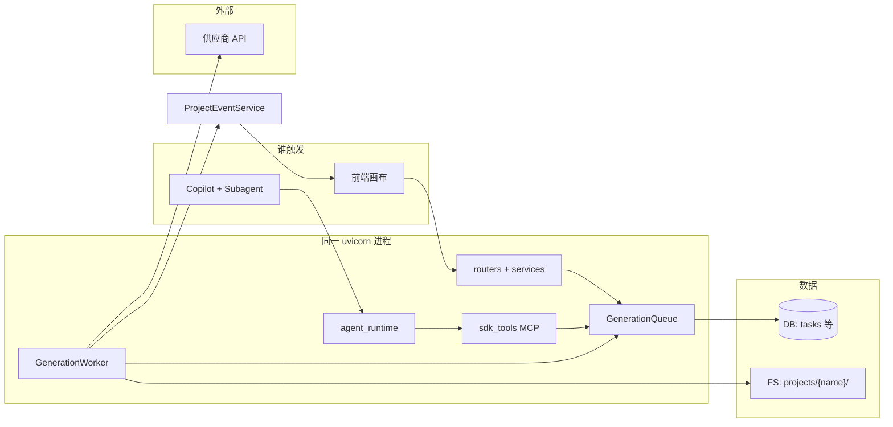

# ArcReel 模块架构（通俗版）

作者：wanghaobo

本文把系统拆成**具体模块**，说明各自干什么、和谁对接。不讲 115 个 API 细节；按时间线走读见 [full-interaction-flow.md](./full-interaction-flow.md)，接口全表见 [end-to-end-architecture.md](./end-to-end-architecture.md)。

---

## 1. 一句话

**前端或 Copilot 只负责「下单」；真正画图、出视频由后台 Worker 从数据库队列里领任务执行；结果写回项目文件夹，再通过事件通知前端刷新。**

---

## 2. 总览图



---

## 3. 核心机制：双入口、单队列

| 问题 | 答案 |
|------|------|
| 视频/分镜能从哪触发？ | **① 前端**点生成 → `POST .../generate/...`；**② Agent** 调 MCP → `mcp__arcreel__generate_video_*` 等 |
| 任务放哪？ | 都写入 **DB 的 `tasks` 表**（`GenerationQueue` → `TaskRepository`） |
| 谁执行？ | 同进程里的 **`GenerationWorker`** 认领（租约 + 心跳），不是 Agent 进程里跑 |
| 结果放哪？ | **项目目录** `projects/{name}/`（图、视频、剧本 JSON）；DB 只记任务状态 |
| 前端怎么知道做完了？ | **轮询** `GET /tasks` + **SSE** `project_events` 触发 `getProject` 刷新画布 |

Agent 侧 MCP 常用 **`enqueue_and_wait`**（入队后等 DB 里任务变 `succeeded`）；前端一般 **只入队**，不等。

---

## 4. 模块清单

### 4.1 前端 `frontend/`

| 职责 | 说明 |
|------|------|
| 页面与画布 | 项目大厅、工作台、时间轴、参考视频画布等 |
| 调 API | `api.ts` 封装 REST |
| 看状态 | `useTasksSSE`（约 3s 轮询任务）；`useProjectEventsSSE`（项目变更）；`useAssistantSession`（对话流） |

**记住**：画布刷新靠 **项目事件 + getProject**，不要只靠聊天里一句「生成好了」。

---

### 4.2 API 路由 `server/routers/`

HTTP 入口，校验参数、鉴权，转给服务层或 `lib`。

| 和生成相关的路由 | 典型用途 |
|------------------|----------|
| `generate.py` | 分镜 / 视频 / 角色场景道具 → **入队** |
| `reference_videos.py` | 参考生视频单元 → **入队** |
| `projects.py` | 项目 CRUD、`getProject`（含读时算好的进度） |
| `tasks.py` | 查队列任务列表 |
| `project_events.py` | SSE 推送项目变更 |
| `assistant.py` | Copilot 会话与流式回复 |

---

### 4.3 业务服务 `server/services/`

比路由更「厚」的编排逻辑，路由尽量薄。

| 模块 | 职责 |
|------|------|
| `generation_tasks.py` | Worker 真正调用的：**单任务怎么生成**（读剧本、调 MediaGenerator、写盘） |
| `reference_video_tasks.py` | 参考视频生成编排 |
| `project_events.py` | 变更后 **发 SSE**（`ProjectEventService`） |
| `resolution_resolver.py` | 按供应商能力解析分辨率 |
| `cost_estimation.py` | 费用预估 |
| `project_archive.py` / `project_cover.py` | 导出 ZIP、封面 |

---

### 4.4 Agent 运行时 `server/agent_runtime/`

Copilot 的大脑，和 **GenerationWorker 在同一进程**，但职责不同：Agent **对话 + 入队**，Worker **干活**。

| 组件 | 职责 |
|------|------|
| `AssistantService` / `SessionManager` | 会话生命周期、SSE 推流 |
| `SessionActor` | 单会话串行，避免并发调 SDK |
| `SessionStore` | 会话元数据、transcript 可镜像 DB |
| `sdk_tools/` | **进程内 MCP 工具**（入队分镜/视频/资产等） |

沙箱（bwrap）主要包住 Agent 的 **Bash**；MCP 工具在 **server 主进程** 里执行，能直接访问 `lib` 和 DB。

---

### 4.5 Agent 配置 `agent_runtime_profile/`

给人看的「说明书」，运行时同步到 `projects/{name}/.claude/`。

| 内容 | 职责 |
|------|------|
| `CLAUDE.*.md` | 按 `content_mode` 切换系统提示 |
| `.claude/skills/` | 工作流步骤（如 `manga-workflow`） |
| `.claude/agents/` | **Subagent**（如 `analyze-assets`、`generate-assets` 由主 Agent dispatch） |

Subagent 通过 Skill 指引去调 **MCP** 或（少数路径）**Bash 跑脚本**；分镜/视频批量生成以 MCP 为准。

---

### 4.6 MCP 入队工具 `server/agent_runtime/sdk_tools/`

| 工具族 | 文件 | 作用 |
|--------|------|------|
| 分镜 | `enqueue_storyboards.py` | `generate_storyboard_*` |
| 视频 | `enqueue_videos.py` | `generate_video_episode/scene/all/selected` |
| 资产 | `enqueue_assets.py` | 角色/场景/道具入队 |
| 其它 | `enqueue_grid.py`、`text_generation.py` 等 | 宫格、文本 |

底层统一走 `lib/generation_queue_client.py` 的 `enqueue_and_wait` / `batch_enqueue_and_wait`。

---

### 4.7 调度核心：队列 + Worker `lib/`

| 模块 | 职责 |
|------|------|
| `generation_queue.py` | 入队、认领、去重、取消；包装 `TaskRepository` |
| `generation_queue_client.py` | Skill/MCP 用的 **入队并等待** |
| `generation_worker.py` | 后台循环 **claim** 任务；image / video **两条并发池**；按 provider 限流 |
| `generation_tasks` 的调用方 | Worker 根据 `task_type` 调到 `server/services/generation_tasks.py` |

**部署注意**：Worker 在 `server/app.py` 的 **lifespan** 里启动，与 API **同进程**。多副本部署会多个 Worker 抢同一队列（需靠 DB 租约；未拆独立 worker 服务）。

---

### 4.8 生成执行平面 `lib/`（媒体与配置）

Worker 领任务后真正调供应商的部分。

| 模块 | 职责 |
|------|------|
| `image_backends/`、`video_backends/`、`text_backends/` | 多供应商实现（Registry + Factory） |
| `media_generator.py` | 组合后端 + 版本 + 用量 |
| `config/`（`ConfigService`、`registry`、`resolver`） | 读 DB 里预置/自定义供应商与模型 |
| `cost_calculator.py`、`usage_tracker.py` | 计费与用量 |

---

### 4.9 项目内容与状态 `lib/`

| 模块 | 职责 |
|------|------|
| `project_manager.py` | 读写 `projects/{name}/`、`project.json`、`scripts/` |
| `status_calculator.py` | **读时**算进度、状态（不写回 JSON） |
| `script_models.py`、`data_validator.py` | 剧本结构与校验 |
| `asset_types.py` | 角色/场景/道具统一抽象 |

**真相源是文件系统**；DB 不存剧本正文。

---

### 4.10 项目事件 `server/services/project_events.py` + `project_events` 路由

生成或改剧本落盘后，`emit_project_change_batch` → 前端 SSE → 刷新项目数据。  
与 **tasks 轮询** 分工：tasks 看「队列里还在不在跑」；events 看「磁盘上文件变了没有」。

---

### 4.11 数据库 `lib/db/`

| 存什么 | 不存什么 |
|--------|----------|
| `tasks`（生成队列） | 剧本全文、视频文件 |
| `credentials`、配置 | |
| `agent_sessions`、用量等 | |

开发默认 SQLite（`projects/.arcreel.db`），生产可用 PostgreSQL。

---

### 4.12 外部供应商

Ark、OpenAI 兼容、Atlas 等，由 `video_backends` / `image_backends` 发起 HTTP/SDK 调用。密钥在设置页写入，经 `ConfigService` 解析，**不进项目目录**。

---

## 5. 一次「生成视频」怎么走（简版）

```text
1. 触发
   前端 POST /generate/video/{segmentId}
   或 Agent MCP generate_video_*

2. 入队
   GenerationQueue.enqueue_task → tasks 表（status=queued）

3. 消费
   GenerationWorker.claim_next_task(media_type=video)
   → generation_tasks 执行 → video_backends → 供应商

4. 落盘
   写入 projects/{name}/videos/...，更新 scripts/*.json

5. 通知
   ProjectEventService → SSE
   前端 getProject + 任务列表更新
```

---

## 6. 前端四条通道（别混用）

| 通道 | 用途 |
|------|------|
| REST `api.ts` | 创建项目、保存、点生成、导出 |
| Assistant SSE | Copilot 打字效果、工具调用展示 |
| Tasks 轮询 | 队列里 pending/running/failed |
| Project Events SSE | 画布/媒体因文件变更而刷新 |

---

## 7. 模块依赖关系（记这个顺序）

```text
用户操作
  → 前端 或 Agent
  → routers / MCP
  → GenerationQueue（DB）
  → GenerationWorker
  → generation_tasks + backends
  → ProjectManager（FS）
  → ProjectEventService → 前端刷新
```

Agent **不参与** 第 4 步的实际推理/渲染；只可能在第 2 步批量入队并等待（MCP）。

---

## 8. 相关文档

| 文档 | 适合什么时候看 |
|------|----------------|
| [cybercut-agentic-technical-proposal.md](./cybercut-agentic-technical-proposal.md) | **Cybercut 独立产品** Agentic 技术方案（KFS、API/Worker 拆分、MCP 模式） |
| [full-interaction-flow.md](./full-interaction-flow.md) | 从建项到成片，按用户时间线 |
| [end-to-end-architecture.md](./end-to-end-architecture.md) | API 统计、按 Tag 数据流 |
| [project-data-structure.md](./project-data-structure.md) | 目录、`project.json`、episode/unit |
| [agent-runtime-migration-design.md](../agent-runtime-migration-design.md) | Session、Events、沙箱 |
| [docs/adr/](../adr/) | 细决策（如图片能力在执行层解析、孤儿任务不重入队） |

---

*与代码不一致时以 `server/app.py`、`lib/generation_queue.py`、`server/agent_runtime/sdk_tools/` 为准。*
