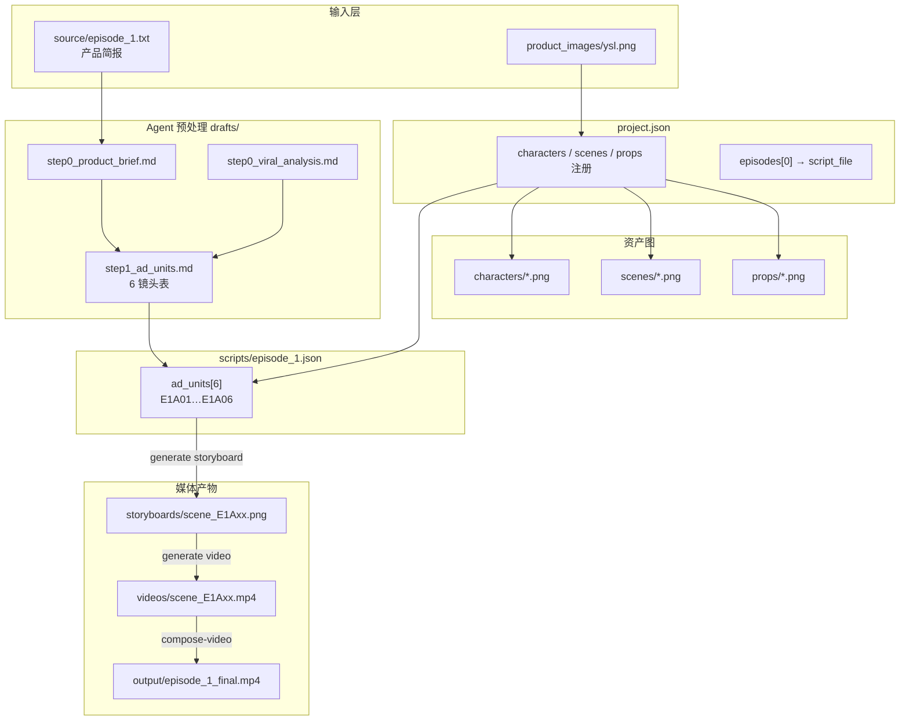

# ArcReel 项目数据结构与协同机制

作者：wanghaobo

本文以实际项目 `projects/ysl-027cd262`（YSL 金色圆管营销竖屏广告，`content_mode=marketing`，`generation_mode=storyboard`）为例，说明项目目录布局、各层数据含义、生成流水线，以及前后端如何协同读写。

---

## 1. 设计原则

| 原则 | 说明 |
|------|------|
| **文件系统为真相源** | 项目数据以 `projects/{name}/` 目录为主，不依赖 DB 表存储剧本与媒体 |
| **读时计算状态** | `status`、`scenes_count`、`storyboards/videos` 进度等由 `StatusCalculator` 在 API 响应时注入，**不写回** `project.json` |
| **双维度模式** | `content_mode`（内容类型）与 `generation_mode`（视频生成路径）独立；见 `agent_runtime_profile/.claude/references/generation-modes.md` |
| **并发写保护** | `ProjectManager` 对 `project.json` 与 `scripts/*.json` 使用文件锁（`.project.json.lock` / script lock） |

---

## 2. 目录总览（以 ysl-027cd262 为例）

```text
projects/ysl-027cd262/
├── project.json                 # 项目级元数据 + 资产注册表 + 剧集索引
├── scripts/
│   └── episode_1.json           # 第 1 集剧本（本例：6 个 ad_units）
├── source/
│   └── episode_1.txt            # 本集原始输入（产品简报）
├── drafts/episode_1/
│   ├── step0_product_brief.md   # 产品理解（可与 source 同步）
│   ├── step0_viral_analysis.md  # 爆款参考结构拆解
│   └── step1_ad_units.md        # 广告镜头表（预处理中间产物）
├── product_images/              # 上传的商品原图
├── characters/                  # 产品/角色 sheet 图（营销：characters 桶存「产品」）
├── scenes/                      # 场景 sheet 图
├── props/                       # 道具 sheet 图
├── storyboards/                 # 分镜图（scene_E1A01.png …）
├── videos/                      # 单镜视频片段（scene_E1A01.mp4 …）
├── thumbnails/                  # 视频缩略图
├── output/
│   └── episode_1_final.mp4      # compose-video 拼接后的成片
├── grids/                       # grid 模式宫格图（本例未用）
├── reference_videos/            # reference_video 模式输出（本例未用）
├── versions/                    # 资源版本历史
└── .claude/ …                   # Agent profile 同步副本（运行时 cwd）
```

---

## 3. 核心数据结构

### 3.1 `project.json` — 项目级

持久化字段示例（`ysl-027cd262`）：

```json
{
  "schema_version": 2,
  "title": "ysl金色圆管商品",
  "content_mode": "marketing",
  "generation_mode": "storyboard",
  "aspect_ratio": "9:16",
  "style": "法式奢华商品广告风格…",
  "episodes": [
    {
      "episode": 1,
      "title": "YSL经典圆管色彩棒高端种草竖屏广告",
      "script_file": "scripts/episode_1.json"
    }
  ],
  "characters": { "YSL金色圆管色彩棒": { "description": "…", "reference_image": "…", "character_sheet": "…" } },
  "scenes": { "米白绒布梳妆台抽屉": { "…" } },
  "props": { "细闪珍珠配饰": { "…" } },
  "image_provider_t2i": "atlascloud/gpt-image-2",
  "model_settings": { "…" }
}
```

**Episode 条目**只允许持久化：`title`、`script_file`、`generation_mode`（可选覆盖项目级 `generation_mode`）。  
以下字段由 `StatusCalculator.enrich_project()` **读时注入**，PATCH 时会被忽略：

- `scenes_count`、`script_status`、`status`（draft / scripted / in_production / completed）
- `storyboards`、`videos` 进度对象
- 项目级 `status`、`phase`、资产完成率等

**资产桶**（三类共用 `lib/asset_types.ASSET_SPECS`）：

| 桶 key | 目录 | 营销语义 |
|--------|------|----------|
| `characters` | `characters/` | **产品**（如 YSL 圆管） |
| `scenes` | `scenes/` | 拍摄场景 |
| `props` | `props/` | 配件 / 桌面 / 挎包等 |

每条资产含 `description` + `*_sheet` 路径（生成后的参考图）。

---

### 3.2 `scripts/episode_{N}.json` — 剧集剧本

按 `content_mode` 使用不同列表字段（见 `lib/script_models.SCRIPT_SHAPES`）：

| content_mode | 列表字段 | ID 格式 | 角色/产品字段 |
|--------------|----------|---------|---------------|
| `narration` | `segments[]` | `E1S01` | `characters_in_segment` |
| `drama` | `scenes[]` | `E1S01` | `characters_in_scene` |
| `marketing` | `ad_units[]` | `E1A01` | `products_in_unit` |
| `reference_video` | `video_units[]` | `E1U01` | `references[]`（另结构） |

**本例**（marketing + storyboard）每个 `ad_unit` 含：

```text
unit_id, duration_seconds, hook, voiceover, cta
products_in_unit[], scenes[], props[]
image_prompt { scene, composition }
video_prompt { action, camera_motion, ambiance_audio, dialogue[] }
transition_to_next, note
generated_assets {
  storyboard_image, video_clip, video_uri, video_thumbnail, status, …
}
```

`generated_assets.status` 典型流转：`pending` → `storyboard_ready` → `completed`。

---

### 3.3 预处理中间文件 `drafts/`

Agent 工作流按 step 落盘，**不是**最终 API 真相源，但影响 `StatusCalculator` 对「仅有 draft、尚无 JSON 剧本」集的状态判断：

| 文件 | 用途（marketing） |
|------|-------------------|
| `step0_product_brief.md` | 产品简报 |
| `step0_viral_analysis.md` | 爆款参考结构（可选） |
| `step1_ad_units.md` | 镜头拆分表 → 供 `create-episode-script` 生成 JSON |

本例 `step1_ad_units.md` 定义 6 镜（E1A01–E1A06），总时长约 24s，与 `episode_1.json` 中 `ad_units` 一一对应。

---

## 4. 生成关系（数据流向）

### 4.1 本项目的完整流水线



### 4.2 粒度对照（避免术语混淆）

| 概念 | 本例含义 |
|------|----------|
| **Project** | 整个 YSL 广告项目 |
| **Episode** | 第 1 集广告（`episode: 1`） |
| **Ad unit** | 一个广告镜头 / 分镜单元（`E1A01` …），对应 1 张分镜图 + 1 段视频 |
| **Scene / Prop（project.json）** | 可复用**资产**，被 ad_unit 引用；不是 drama 里的「场景镜头」 |
| **Shot** | 仅 `reference_video` 模式的 `video_units` 内部子镜头；本例 **无** |

### 4.3 按 generation_mode 的差异（简述）

| generation_mode | 分镜 | 视频入口 |
|-----------------|------|----------|
| `storyboard`（本例） | 每 unit 一张 `storyboards/` 图 | 图生视频 → `videos/` |
| `grid` | 宫格图切块 | 首尾帧链式视频 |
| `reference_video` | **跳过** | 资产 sheet 直出 → `reference_videos/` |

有效模式：`episode.generation_mode ?? project.generation_mode ?? "storyboard"`。

---

## 5. 前后端协同修改项目

### 5.1 总体架构

```text
┌─────────────────┐     REST / SSE      ┌──────────────────────────────┐
│  React 前端      │ ◄──────────────────►│  FastAPI (server/routers/*)  │
│  zustand stores │                     │  ProjectManager + 校验        │
└────────┬────────┘                     └──────────────┬───────────────┘
         │                                              │
         │  GET /projects/{name}                        │ 读写 project.json
         │  PATCH /projects/{name}                      │ 读写 scripts/*.json
         │  PATCH /segments/{id}  (含 ad_unit)          │
         │  POST  /generate/*                           │
         │  SSE   /events/stream                        ▼
         │                              ┌──────────────────────────────┐
         │                              │  projects/ysl-027cd262/       │
         └─ useProjectEventsSSE 刷新 ◄──│  + GenerationQueue / Worker   │
                                        └──────────────────────────────┘
```

**Agent 侧**（Claude SDK）通过 `server/agent_runtime/sdk_tools/` 入队生成任务，同样经 `ProjectManager` 回写 `generated_assets`，并 `emit_project_change_hint(source="worker")`。

### 5.2 读路径

| 操作 | 前端 | 后端 |
|------|------|------|
| 进入项目 | `API.getProject(name)` | `GET /api/v1/projects/{name}` |
| 响应内容 | `projects-store`: `currentProjectData` + `currentScripts` + `assetFingerprints` | `load_project` + `StatusCalculator.enrich_*` + `compute_asset_fingerprints` |
| 静态媒体 | 带 fingerprint 的 URL 破缓存 | `files` 路由提供 `/api/v1/projects/{name}/files/...` |

`GET` 返回的 `scripts` 键名为 `episode_1.json`（去掉 `scripts/` 前缀）。

### 5.3 写路径（Web UI）

| 用户动作 | 前端 API | 后端路由 | 持久化目标 |
|----------|----------|----------|------------|
| 改项目标题/风格/供应商 | `API.updateProject` | `PATCH /projects/{name}` | `project.json` |
| 改集标题 | `updateProject({ episodes: [...] })` | 同上（`EpisodePatch` 白名单） | `project.json` |
| 改镜头 prompt/时长 | `API.updateSegment(id, { script_file, ... })` | `PATCH /projects/{name}/segments/{segment_id}` | `scripts/episode_1.json` 内对应 `ad_units[]` |
| 改 drama 场景镜头 | `API.updateScriptScene` | `PATCH /projects/{name}/script-scenes/{scene_id}` | `scripts/*.json` 内 `scenes[]` |
| CRUD 产品/场景/道具 | `API.create/update/deleteProjectCharacter` 等 | `characters.py` / `scenes.py` / `props.py`（工厂路由） | `project.json` 对应 bucket |
| 上传源文件/商品图 | `API.uploadFile` | `POST /projects/{name}/upload/{type}` | `source/`、`product_images/` 等 |
| 触发生成 | `API.generateStoryboard` / `generateVideo` / `generateCharacter` … | `POST /projects/{name}/generate/...` | 入队 `tasks` 表；Worker 写媒体 + 更新 `generated_assets` |

**注意**：marketing 的 ad unit 编辑走 **`/segments/{unit_id}`**（如 `E1A01`），后端通过 `script_shape("marketing")` 定位 `ad_units` 数组，路径名历史沿用 narration 的 segment。

写操作包装在 `project_change_source("webui")` 内，完成后触发 **Project Events**。

### 5.4 异步生成与刷新

```text
POST /generate/storyboard/E1A01
  → GenerationQueue.enqueue(task_type=storyboard)
  → GenerationWorker 调用 MediaGenerator
  → 写入 storyboards/scene_E1A01.png
  → 更新 scripts/episode_1.json → generated_assets.storyboard_image
  → emit_project_change_batch(source="worker", action=storyboard_ready)

前端 useProjectEventsSSE:
  → 收到 changes / storyboard_ready
  → invalidate entity revision + API.getProject() 全量刷新
  → 画布展示新分镜/视频
```

任务状态并行通过 **`/api/v1/tasks`** 轮询（`tasks-store`）。

### 5.5 SSE：项目变更主通道

```
GET /api/v1/projects/{name}/events/stream
```

| 事件 | 含义 |
|------|------|
| `snapshot` | 连接时全量 fingerprint |
| `changes` | 文件/资产变更批次（含 `storyboard_ready`、`video_ready` 等） |

来源：`webui` | `worker` | `filesystem`。  
**不应**依赖 Assistant 聊天流告知「生成完成」——画布刷新以 Project Events 为准。

### 5.6 Agent 修改项目（与 UI 同轨）

推荐路径（见 `docs/agent-runtime-migration-design.md` §5.1）：

```text
Skill / Subagent
  → mcp__arcreel__* SDK 工具（enqueue_assets / text_generation / …）
  → ProjectManager / 现有 router
  → project_change_source("worker")
  → emit_project_change_hint
```

Agent **不应**直接裸写 `project.json`（沙箱内也受路径约束）；预处理 markdown 写入 `drafts/`，JSON 剧本由 `create-episode-script` + `ScriptGenerator` 产出。

---

## 6. ysl-027cd262 实例快照

| 项 | 值 |
|----|-----|
| 内容模式 | `marketing` |
| 生成模式 | `storyboard` |
| 集数 | 1（`episode_1.json`） |
| 广告镜头 | 6（E1A01–E1A06，各 4s，合计 24s） |
| 产品资产 | 1（YSL金色圆管色彩棒） |
| 场景资产 | 6 |
| 道具资产 | 6 |
| 分镜 | `storyboards/scene_E1A01.png` … `E1A06`（均已生成） |
| 视频 | `videos/scene_E1A01.mp4` … `E1A06`（均已生成） |
| 成片 | `output/episode_1_final.mp4` |

---

## 7. 相关代码索引

| 模块 | 路径 |
|------|------|
| 项目读写 / 锁 | `lib/project_manager.py` |
| 剧本模型 | `lib/script_models.py` |
| 读时状态 | `lib/status_calculator.py` |
| 结构校验 | `lib/data_validator.py` |
| 项目 API | `server/routers/projects.py` |
| 生成入队 | `server/routers/generate.py`、`server/services/generation_tasks.py` |
| 项目事件 SSE | `server/services/project_events.py`、`frontend/src/hooks/useProjectEventsSSE.ts` |
| 前端状态 | `frontend/src/stores/projects-store.ts` |
| 画布编辑 | `frontend/src/components/canvas/StudioCanvasRouter.tsx` |
| 模式矩阵 | `agent_runtime_profile/.claude/references/generation-modes.md` |

---

## 8. 延伸阅读

- Cybercut Agentic 技术方案：[cybercut-agentic-technical-proposal.md](./cybercut-agentic-technical-proposal.md)
- 模块职责拆分（通俗版）：[module-architecture.md](./module-architecture.md)
- 完整交互链路（创建 → Agent → 轮询/SSE → 成片）：[full-interaction-flow.md](./full-interaction-flow.md)
- 端到端 API 分层、115 个接口与前后端协同：[end-to-end-architecture.md](./end-to-end-architecture.md)
- Agent Runtime 迁移与事件模型：[agent-runtime-migration-design.md](./agent-runtime-migration-design.md)
- 术语与架构决策：`CONTEXT.md`、`docs/adr/`
- OpenAPI 交互文档：开发服务器 `http://127.0.0.1:1241/docs`
