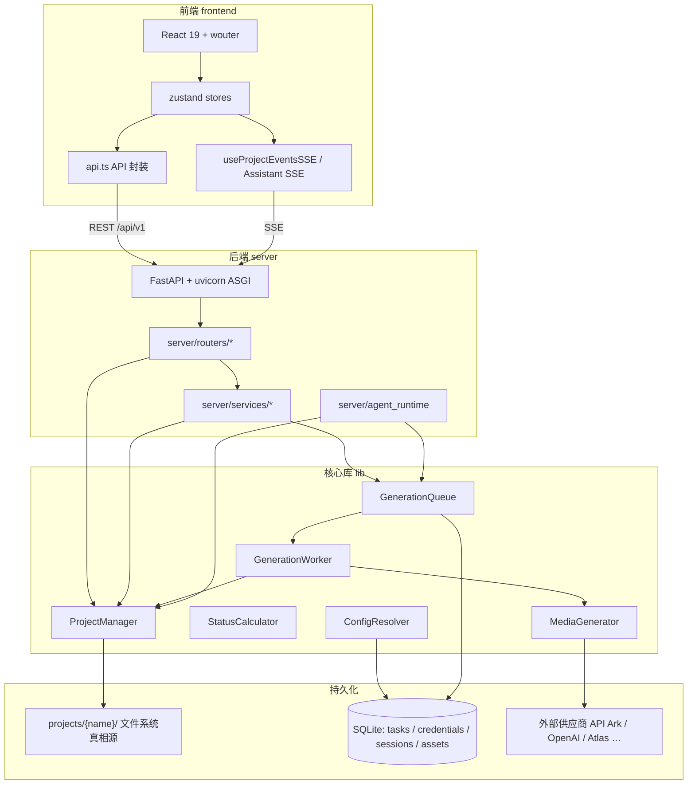
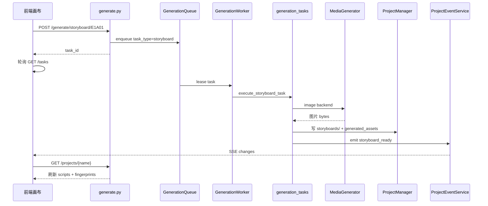
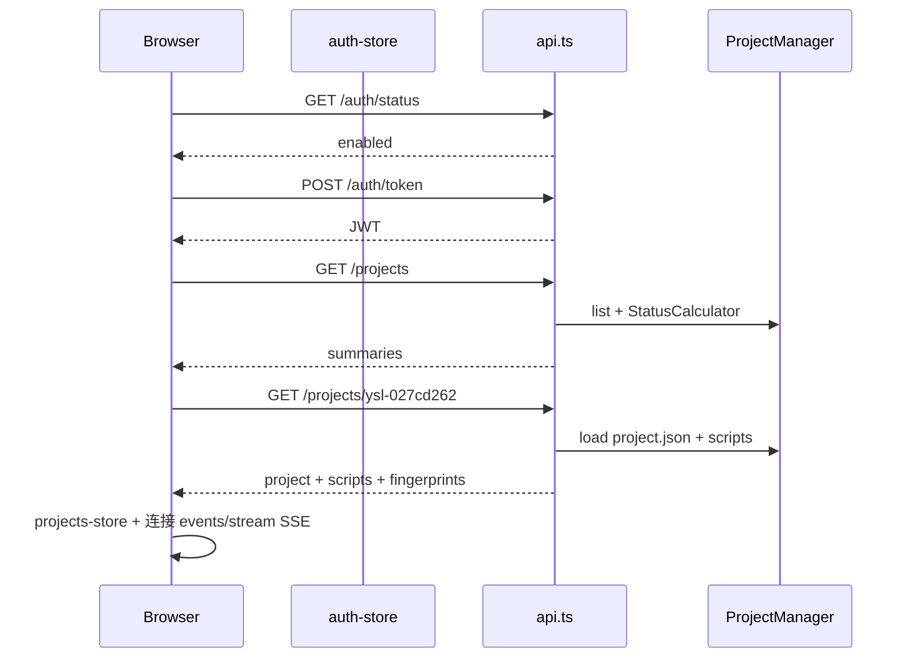

# ArcReel 端到端 API 与技术架构

作者：wanghaobo

本文从 **ReDoc / OpenAPI**（[http://127.0.0.1:1241/redoc](http://127.0.0.1:1241/redoc)）与代码实现出发，说明 ArcReel 的分层架构、**115** 个 HTTP 接口的统计与领域划分、各域数据流向，以及典型用户旅程下的前后端协同。项目目录与 episode/unit 语义见 [project-data-structure.md](./project-data-structure.md)；Agent 迁移与事件模型见 [agent-runtime-migration-design.md](./agent-runtime-migration-design.md)。

---

## 目录

1. [系统总览](#1-系统总览)
2. [API 清单与统计](#2-api-清单与统计)
3. [按领域：接口 · 数据流 · 技术栈](#3-按领域接口--数据流--技术栈)
4. [端到端用户旅程](#4-端到端用户旅程)
5. [横切能力](#5-横切能力)
6. [附录：115 个接口全表](#6-附录115-个接口全表)
7. [相关文档](#7-相关文档)

---

## 1. 系统总览

### 1.1 分层架构



| 层级 | 职责 | 关键路径 |
|------|------|----------|
| 前端 | 路由、画布、设置页、轮询与 SSE 消费 | `frontend/src/`、`frontend/src/api.ts`、`frontend/src/stores/` |
| 路由 | HTTP 契约、鉴权依赖、入参校验 | `server/routers/` |
| 服务 | 生成编排、归档导出、项目事件、费用 | `server/services/` |
| 核心库 | 项目 FS、队列、媒体后端、配置解析 | `lib/` |
| Agent | Claude SDK 会话、Skill、进程内 MCP 工具 | `server/agent_runtime/` |
| 运行时配置 | Agent profile 同步到项目目录 | `agent_runtime_profile/` → `projects/{name}/.claude/` |

### 1.2 进程与启动

[`server/app.py`](../../server/app.py) 在 **lifespan** 中依次：

1. 初始化日志、DB（`lib/db`）、`ProjectManager` 数据目录  
2. 启动 **GenerationWorker**（image / video 双通道并发）  
3. 启动 **ProjectEventService**（扫描项目目录、推送 SSE）  
4. 注册全部 `include_router`（前缀 `/api/v1`，Assistant 嵌套在 `/projects/{project_name}/assistant`）

开发启动：`uv run uvicorn server.app:app --reload --reload-dir server --reload-dir lib --port 1241`  
前端 Vite 将 `/api` 代理到 `1241`。

### 1.3 实时通道（与 REST 分工）

| 通道 | 端点 | 用途 | 前端 |
|------|------|------|------|
| Project Events SSE | `GET /api/v1/projects/{name}/events/stream` | 项目文件/生成产物变更 | `useProjectEventsSSE` → 刷新 `getProject`、破缓存 |
| Assistant SSE | `GET .../assistant/sessions/{id}/stream` | 对话流式回复 | Copilot / `useAssistantSession` |
| 任务轮询 | `GET /api/v1/tasks`、`/projects/{name}/tasks` | 队列状态（3s 轮询） | `tasks-store` |
| 任务 SSE（已弃用） | `GET /api/v1/tasks/stream` | 历史兼容 | 不推荐新用 |

**原则**：画布与媒体刷新走 **Project Events**，不把「生成完成」仅依赖聊天消息（见 migration 设计 §5.4）。

### 1.4 非业务 HTTP 路由

| 路径 | 说明 |
|------|------|
| `GET /health` | 健康检查（计入 OpenAPI，**115 之一**） |
| `GET /docs` | Swagger UI |
| `GET /redoc` | ReDoc |
| `GET /openapi.json` | OpenAPI 规范 |
| `GET /skill.md` | 动态 skill 模板（无需认证） |

---

## 2. API 清单与统计

### 2.1 统计口径

- **115** = `openapi.json` 中所有 `paths` × HTTP 方法（GET/POST/PATCH/PUT/DELETE）条目数。  
- 与 [ReDoc](http://127.0.0.1:1241/redoc) 左侧操作列表一致（以运行中服务为准）。  
- 前缀均为 `/api/v1`，**除** `GET /health` 无 `/api/v1` 前缀。

### 2.2 按 OpenAPI Tag 分布

| Tag | 数量 | 主要存储 | 路由模块 |
|-----|------|----------|----------|
| 项目管理 | 16 | FS + 读时计算 | `projects.py` |
| 文件管理 | 12 | FS | `files.py` |
| 助手会话 | 10 | DB + FS（项目内） | `assistant.py` |
| 任务队列 | 9 | SQLite `tasks` | `tasks.py` |
| 供应商管理 | 9 | SQLite `config` / `credentials` | `providers.py` |
| Agent 配置 | 8 | SQLite Agent 凭证 | `agent_config.py` |
| 全局资产库 | 8 | SQLite `assets` + 文件 | `assets.py` |
| 参考生视频 | 6 | FS `scripts` + `reference_videos/` | `reference_videos.py` |
| 生成 | 5 | 入队 → FS | `generate.py` |
| 宫格图 | 4 | FS `grids/` | `grids.py` |
| 认证 | 3 | env / JWT | `auth.py` |
| 角色 / 场景 / 道具管理 | 各 3 | FS `project.json` | `_asset_router_factory.py` |
| API Key 管理 | 3 | SQLite `api_keys` | `api_keys.py` |
| 系统配置 | 3 | SQLite | `system_config.py` |
| 费用统计 | 3 | SQLite `api_calls` 聚合 | `usage.py` |
| 版本管理 | 2 | FS `versions/` | `versions.py` |
| Agent 对话 | 1 | Assistant 运行时 | `agent_chat.py` |
| 费用估算 | 1 | 读时计算 | `cost_estimation.py` |
| 项目变更流 | 1 | SSE | `project_events.py` |
| 系统 | 1 | 日志文件 | `system.py` |
| （无 Tag） | 1 | — | `GET /health` |

**说明**：角色/场景/道具**无独立 GET 列表**；数据随 `GET /projects/{name}` 一次返回 `project.json` 三桶 + 全部 `scripts`。

---

## 3. 按领域：接口 · 数据流 · 技术栈

以下按领域聚合；单接口明细见 [§6 附录](#6-附录115-个接口全表)。

### 3.1 认证与 API Key

| 典型接口 | 数据流 | 技术组件 | 前端 |
|----------|--------|----------|------|
| `GET /auth/status` | 读 `AUTH_ENABLED` | `server/auth.is_auth_enabled` | `auth-store` 启动 |
| `POST /auth/token` | 校验用户密码 → 签发 JWT | `check_credentials` + `create_token` | 登录页 |
| `GET /auth/verify` | 校验 Bearer | `get_current_user` | 会话保活 |
| `GET/POST/DELETE /api-keys` | CRUD 哈希密钥 | `ApiKeyRepository` | 设置页 |

鉴权：**无全局中间件**；需登录的路由注入 `CurrentUser` / `CurrentUserFlexible`（SSE 支持 `?token=`）。API Key 以 `arc-` 前缀走 Bearer，与 JWT 共用校验链。

### 3.2 项目管理

| 典型接口 | 数据流 | 技术组件 | 前端 |
|----------|--------|----------|------|
| `GET /projects` | 扫描目录 + 摘要状态 | `ProjectManager.list` + `StatusCalculator` | 项目列表 |
| `POST /projects` | 建目录、`project.json`、同步 profile | `create_project` + `sync_profile_to_project` | 创建向导 |
| `GET /projects/{name}` | 读 `project.json`、加载各集 script、**注入** status/进度、fingerprint | `enrich_project` / `enrich_script` | `API.getProject` → `projects-store` |
| `PATCH /projects/{name}` | 写 `project.json`（episode 仅白名单字段） | `_project_lock` + `atomic_write_json` | 设置 / 集信息 |
| `GET/PATCH scripts、segments、script-scenes` | 读写 `scripts/episode_N.json` | `locked_script` + `script_shape()` | 画布 `updateSegment` |
| `POST /import`、`GET /export` | ZIP 打包/解包 | `ProjectArchiveService` | 导入导出 |
| `GET /video-capabilities` | 三级解析视频模型能力 | `ConfigResolver.video_capabilities` | 创建项目 / Agent |

**读时计算**：`scenes_count`、`status`、`storyboards`/`videos` 进度等**禁止** PATCH 写回（`EPISODE_PERSIST_FIELDS`）。

### 3.3 项目级资产（角色 / 场景 / 道具）

| 典型接口 | 数据流 | 技术组件 | 前端 |
|----------|--------|----------|------|
| `POST/PATCH/DELETE .../characters|scenes|props` | 更新 `project.json` 对应 bucket | `_asset_router_factory` + `ASSET_SPECS` | 资产侧栏 |
| `POST .../generate/character|scene|prop` | 入队 image 任务 → sheet 图写入 bucket 字段 | `generate.py` → Worker → `generation_tasks` | 资产生成按钮 |

营销模式下 **characters 桶表示产品**（如 YSL 圆管）。

### 3.4 文件、源稿与草稿

| 典型接口 | 数据流 | 技术组件 | 前端 |
|----------|--------|----------|------|
| `POST .../upload/{type}` | 写入 `source/`、`product_images/` 等 | `files.py` 校验路径 | 上传组件 |
| `GET/PUT/DELETE .../source/{filename}` | 本集源文本 | FS | 源文件页 |
| `GET/PUT/DELETE .../drafts/.../step{N}` | Agent 中间产物 markdown | FS `drafts/episode_N/` | 可选编辑器 |
| `GET /files/{project}/{path}` | 静态媒体（分镜/视频/缩略图） | `StaticFiles` 逻辑 + 路径校验 | `` / `<video>` URL |
| `GET .../files` | 列目录 | FS 遍历 | 文件浏览器 |

上传/写盘后 `emit_project_change_hint(source=webui|worker)` → Project Events。

### 3.5 生成（异步核心路径）



| 接口 | 入队类型 | Worker 产出 | 回写字段 |
|------|----------|-------------|----------|
| `POST .../generate/storyboard/{segment_id}` | storyboard | `storyboards/scene_*.png` | `generated_assets.storyboard_image` |
| `POST .../generate/video/{segment_id}` | video | `videos/scene_*.mp4` + thumbnail | `video_clip`, `status=completed` |
| `POST .../generate/character|scene|prop` | asset image | `characters|scenes|props/*.png` | `*_sheet` in project.json |
| `POST .../generate/grid/{episode}` | grid | `grids/` + 切格 | `grid_id`, `grid_cell_index` |
| `POST .../reference-videos/.../generate` | reference_video | `reference_videos/` | unit `generated_assets` |

解析链：`ConfigResolver` → `PROVIDER_REGISTRY` / 项目 `image_provider_*` → `MediaGenerator` + 各 `*_backends`（执行层决定 t2i/i2i，见 ADR-0001）。

### 3.6 宫格图与参考生视频

| 领域 | 读写 | 说明 |
|------|------|------|
| 宫格 | `GET/POST grids*` | 列表/详情/重新生成；依赖 `segment_break` 分组 |
| 参考视频 | `GET/POST/PATCH/DELETE .../units` | `video_units[]` CRUD；`generate` 跳过分镜直出视频 |

前端：`reference-video-store` 管理 unit；不走 `StudioCanvasRouter` 的 storyboard 回调（见 migration 设计 §7）。

### 3.7 任务队列

| 接口 | 作用 |
|------|------|
| `GET /tasks`、`GET /projects/{name}/tasks` | 列表（前端轮询） |
| `GET /tasks/{id}` | 单任务详情 |
| `POST /tasks/{id}/cancel` | 取消 |
| `GET /tasks/stats` | 全局统计 |

持久化：`lib/generation_queue.py` + SQLAlchemy `Task` 模型；Worker lease 保证并发安全。

### 3.8 项目变更流（SSE）

```
emit_project_change_hint / emit_project_change_batch
  → ProjectEventService（rebuild snapshot, fingerprint diff）
  → SSE: snapshot | changes[]
```

| 事件 | 含义 |
|------|------|
| `snapshot` | 首次连接，带 fingerprint |
| `changes` | `storyboard_ready` / `video_ready` / `grid_ready` / `segment:updated` 等 |

实现：[`server/services/project_events.py`](../../server/services/project_events.py)、[`frontend/src/hooks/useProjectEventsSSE.ts`](../../frontend/src/hooks/useProjectEventsSSE.ts)。

### 3.9 助手会话与 Agent 对话

| 接口 | 模式 | 组件 |
|------|------|------|
| `POST .../assistant/sessions/send` | 异步 + SSE 流 | `AssistantService` → `SessionManager` → Claude SDK |
| `GET .../sessions/{id}/stream` | SSE | `StreamProjector` |
| SDK 工具 | 进程内 MCP | `server/agent_runtime/sdk_tools/*` 入队生成、写 FS |
| `POST /agent/chat` | **同步**聚合 SSE（120s 超时） | 供 OpenClaw 等外部 Agent |

Transcript：可镜像到 DB（`ARCREEL_SDK_SESSION_STORE=db`）或 SDK 本地 jsonl。

### 3.10 供应商、系统配置、Agent 配置

| 模块 | 接口前缀 | 存储 |
|------|----------|------|
| 媒体供应商 | `/api/v1/providers` | `ConfigRepository` + `CredentialRepository` |
| 系统默认 | `/api/v1/system/config` | 全局 config 键值 |
| Agent 专用凭证 | `/api/v1/agent/credentials` | Agent 运行时密钥（与 providers 分离） |

`POST .../test` 发真实探测请求，不写项目 FS。

### 3.11 全局资产库、用量、版本、费用

| 领域 | 说明 |
|------|------|
| 全局资产库 `/api/v1/assets` | 跨项目复用；`from-project` / `apply-to-project` 与 `project.json` 同步 |
| 用量 `/api/v1/usage/*` | 聚合 `api_calls` |
| 版本 `/versions/.../restore` | `projects/{name}/versions/versions.json` + 历史文件 |
| 费用估算 `GET .../cost-estimate` | 读项目+剧本+单价表，**不持久化** |

---

## 4. 端到端用户旅程

### 4.1 登录与打开项目



### 4.2 Agent 工作流产出剧本（营销示例）

与 [project-data-structure.md §4](./project-data-structure.md#4-生成关系数据流向) 一致：

1. 用户上传简报 → `source/episode_1.txt`  
2. Assistant 调度 Skill → `drafts/episode_1/step0_*`、`step1_ad_units.md`  
3. `create-episode-script` → `scripts/episode_1.json`（`ad_units[]`）  
4. `generate-assets` 入队 → `characters/`、`scenes/`、`props/` sheet  
5. 画布展示读 `GET /projects/{name}` 聚合数据  

Agent 写盘应经 **ProjectManager / SDK 工具**，避免裸写越界路径。

### 4.3 用户在画布点击「生成分镜 / 视频」

1. `API.generateStoryboard(project, segmentId, { script_file, prompt })`  
2. 后端 `GenerationQueue.enqueue` → 立即返回 `task_id`  
3. `tasks-store` 轮询；Worker 调供应商 API  
4. 写 `storyboards/scene_E1A01.png`，PATCH script 内 `generated_assets`  
5. `emit_project_change_batch` → SSE `storyboard_ready`  
6. `useProjectEventsSSE` → `API.getProject()` 全量刷新 + `entityRevision` 破缓存  

视频路径相同，终点为 `videos/*.mp4` 与 `video_ready`。

### 4.4 助手对话与生成并行

- 对话：`sessions/send` + `stream` SSE，仅更新 Copilot UI。  
- 生成：走队列 + Project Events；**不假设**聊天里一定有「生成完成」文本。  
- 外部同步调用：`POST /agent/chat` 阻塞至回复或超时。

---

## 5. 横切能力

### 5.1 国际化

- 后端：`Translator` + `Accept-Language`（`zh` / `en` / `vi`）  
- 前端：`react-i18next`  
- CI：`tests/test_i18n_consistency.py`

### 5.2 并发与文件锁

- `project.json`：`.project.json.lock`  
- `scripts/*.json`：script lock；`locked_script` 内 RMW  
- 已持 script 锁时 `sync_project=False`，避免与 `_project_lock` 死锁  

### 5.3 配置与密钥

- 父进程 **禁止** `os.environ` 携带 provider 密钥（`assert_no_provider_secrets_in_environ`）  
- 密钥存 DB，Worker 执行时注入 SDK 子进程  
- 项目级覆盖：`image_provider_t2i/i2i`、`model_settings`、`generation_mode`

### 5.4 前端 API 客户端

[`frontend/src/api.ts`](../../frontend/src/api.ts) 统一封装 `/api/v1`；Bearer 来自 `auth-store`；开发态 Vite 代理 `/api` → `1241`。

### 5.5 文档与调试

- Swagger UI：`/docs`  
- ReDoc：`/redoc`  
- 生产可按需设置 `docs_url=None`（当前默认开启）

---

## 6. 附录：115 个接口全表

以下为 live `openapi.json` 导出（Method / Path / Tag / Summary），并补充 **读/写** 与 **主要持久化** 列（领域级归纳，非逐接口单测）。

| Method | Path | Tag | Summary | 读/写 | 主要持久化 |
|--------|------|-----|---------|-------|------------|
| POST | `/api/v1/agent/chat` | Agent 对话 | Agent Chat | 写 | AssistantService + agent_sessions（同步聚合 SSE） |
| GET | `/api/v1/agent/credentials` | Agent 配置 | List Credentials | 读 | SQLite config / credentials |
| POST | `/api/v1/agent/credentials` | Agent 配置 | Create Credential | 写 | SQLite config / credentials |
| PATCH | `/api/v1/agent/credentials/{cred_id}` | Agent 配置 | Update Credential | 写 | SQLite config / credentials |
| DELETE | `/api/v1/agent/credentials/{cred_id}` | Agent 配置 | Delete Credential | 写 | SQLite config / credentials |
| POST | `/api/v1/agent/credentials/{cred_id}/activate` | Agent 配置 | Activate Credential | 写 | SQLite config / credentials |
| POST | `/api/v1/agent/credentials/{cred_id}/test` | Agent 配置 | Test Credential | 写 | SQLite config / credentials |
| GET | `/api/v1/agent/preset-providers` | Agent 配置 | List Preset Providers | 读 | SQLite config / credentials |
| POST | `/api/v1/agent/test-connection` | Agent 配置 | Test Connection Draft | 写 | SQLite config / credentials |
| GET | `/api/v1/api-keys` | API Key 管理 | List Api Keys | 读 | SQLite api_keys |
| POST | `/api/v1/api-keys` | API Key 管理 | Create Api Key | 写 | SQLite api_keys |
| DELETE | `/api/v1/api-keys/{key_id}` | API Key 管理 | Delete Api Key | 写 | SQLite api_keys |
| GET | `/api/v1/assets` | 全局资产库 | List Assets | 读 | SQLite assets 表 + 全局资产文件 |
| POST | `/api/v1/assets` | 全局资产库 | Create Asset | 写 | SQLite assets 表 + 全局资产文件 |
| POST | `/api/v1/assets/apply-to-project` | 全局资产库 | Apply To Project | 写 | SQLite assets 表 + 全局资产文件 |
| POST | `/api/v1/assets/from-project` | 全局资产库 | From Project | 写 | SQLite assets 表 + 全局资产文件 |
| GET | `/api/v1/assets/{asset_id}` | 全局资产库 | Get Asset | 读 | SQLite assets 表 + 全局资产文件 |
| PATCH | `/api/v1/assets/{asset_id}` | 全局资产库 | Update Asset | 写 | SQLite assets 表 + 全局资产文件 |
| DELETE | `/api/v1/assets/{asset_id}` | 全局资产库 | Delete Asset | 写 | SQLite assets 表 + 全局资产文件 |
| POST | `/api/v1/assets/{asset_id}/image` | 全局资产库 | Replace Image | 写 | SQLite assets 表 + 全局资产文件 |
| GET | `/api/v1/auth/status` | 认证 | Auth Status | 读 | 无 |
| POST | `/api/v1/auth/token` | 认证 | Login For Access Token | 写 | JWT 内存 / api_keys 表 |
| GET | `/api/v1/auth/verify` | 认证 | Verify | 读 | 无 |
| GET | `/api/v1/files/{project_name}/{path}` | 文件管理 | Serve Project File | 读 | projects/{name}/ 目录下文件 |
| GET | `/api/v1/global-assets/{asset_type}/{filename}` | 文件管理 | Serve Global Asset | 读 | — |
| GET | `/api/v1/projects` | 项目管理 | List Projects | 读 | 扫描 projects/ 目录 |
| POST | `/api/v1/projects` | 项目管理 | Create Project | 写 | — |
| POST | `/api/v1/projects/import` | 项目管理 | Import Project Archive | 写 | project.json / scripts / 导出 ZIP |
| GET | `/api/v1/projects/{name}` | 项目管理 | Get Project | 读 | project.json / scripts / 导出 ZIP |
| PATCH | `/api/v1/projects/{name}` | 项目管理 | Update Project | 写 | project.json / scripts / 导出 ZIP |
| DELETE | `/api/v1/projects/{name}` | 项目管理 | Delete Project | 写 | project.json / scripts / 导出 ZIP |
| GET | `/api/v1/projects/{name}/export` | 项目管理 | Export Project Archive | 读 | project.json / scripts / 导出 ZIP |
| GET | `/api/v1/projects/{name}/export/jianying-draft` | 项目管理 | Export Jianying Draft | 读 | project.json / scripts / 导出 ZIP |
| POST | `/api/v1/projects/{name}/export/token` | 项目管理 | Create Export Token | 写 | project.json / scripts / 导出 ZIP |
| POST | `/api/v1/projects/{name}/generate-overview` | 项目管理 | Generate Overview | 写（入队） | SQLite tasks + FS（Worker 异步写） |
| PATCH | `/api/v1/projects/{name}/overview` | 项目管理 | Update Overview | 写 | projects/{name}/scripts/*.json |
| PATCH | `/api/v1/projects/{name}/script-scenes/{scene_id}` | 项目管理 | Update Scene | 写 | projects/{name}/scripts/*.json |
| GET | `/api/v1/projects/{name}/scripts/{script_file}` | 项目管理 | Get Script | 读 | projects/{name}/scripts/*.json |
| PATCH | `/api/v1/projects/{name}/segments/{segment_id}` | 项目管理 | Update Segment | 写 | projects/{name}/scripts/*.json |
| POST | `/api/v1/projects/{name}/source` | 项目管理 | Set Project Source | 写 | project.json / scripts / 导出 ZIP |
| GET | `/api/v1/projects/{name}/video-capabilities` | 项目管理 | Get Video Capabilities | 读 | project.json / scripts / 导出 ZIP |
| GET | `/api/v1/projects/{project_name}/assistant/sessions` | 助手会话 | List Sessions | 读 | project.json / scripts / 导出 ZIP |
| POST | `/api/v1/projects/{project_name}/assistant/sessions/send` | 助手会话 | Send Message | 写 | project.json / scripts / 导出 ZIP |
| GET | `/api/v1/projects/{project_name}/assistant/sessions/{session_id}` | 助手会话 | Get Session | 读 | project.json / scripts / 导出 ZIP |
| DELETE | `/api/v1/projects/{project_name}/assistant/sessions/{session_id}` | 助手会话 | Delete Session | 写 | project.json / scripts / 导出 ZIP |
| POST | `/api/v1/projects/{project_name}/assistant/sessions/{session_id}/interrupt` | 助手会话 | Interrupt Session | 写 | project.json / scripts / 导出 ZIP |
| GET | `/api/v1/projects/{project_name}/assistant/sessions/{session_id}/messages` | 助手会话 | List Messages | 读 | project.json / scripts / 导出 ZIP |
| POST | `/api/v1/projects/{project_name}/assistant/sessions/{session_id}/questions/{question_id}/answer` | 助手会话 | Answer Question | 写 | project.json / scripts / 导出 ZIP |
| GET | `/api/v1/projects/{project_name}/assistant/sessions/{session_id}/snapshot` | 助手会话 | Get Snapshot | 读 | project.json / scripts / 导出 ZIP |
| GET | `/api/v1/projects/{project_name}/assistant/sessions/{session_id}/stream` | 助手会话 | Stream Events | 读（流） | SSE；DB agent_sessions + transcript |
| GET | `/api/v1/projects/{project_name}/assistant/skills` | 助手会话 | List Skills | 读 | project.json / scripts / 导出 ZIP |
| POST | `/api/v1/projects/{project_name}/characters` | 角色管理 | Add Entry | 写 | project.json / scripts / 导出 ZIP |
| PATCH | `/api/v1/projects/{project_name}/characters/{entry_name}` | 角色管理 | Update Entry | 写 | project.json / scripts / 导出 ZIP |
| DELETE | `/api/v1/projects/{project_name}/characters/{entry_name}` | 角色管理 | Delete Entry | 写 | project.json / scripts / 导出 ZIP |
| GET | `/api/v1/projects/{project_name}/cost-estimate` | 费用估算 | Get Cost Estimate | 读 | project.json / scripts / 导出 ZIP |
| GET | `/api/v1/projects/{project_name}/drafts` | 文件管理 | List Drafts | 读 | projects/{name}/ 目录下文件 |
| GET | `/api/v1/projects/{project_name}/drafts/{episode}/step{step_num}` | 文件管理 | Get Draft Content | 读 | projects/{name}/ 目录下文件 |
| PUT | `/api/v1/projects/{project_name}/drafts/{episode}/step{step_num}` | 文件管理 | Update Draft Content | 写 | projects/{name}/ 目录下文件 |
| DELETE | `/api/v1/projects/{project_name}/drafts/{episode}/step{step_num}` | 文件管理 | Delete Draft | 写 | projects/{name}/ 目录下文件 |
| GET | `/api/v1/projects/{project_name}/events/stream` | 项目变更流 | Stream Project Events | 读（流） | SSE；扫描 FS fingerprint |
| GET | `/api/v1/projects/{project_name}/files` | 文件管理 | List Project Files | 读 | project.json / scripts / 导出 ZIP |
| POST | `/api/v1/projects/{project_name}/generate/character/{char_name}` | 生成 | Generate Character | 写（入队） | SQLite tasks + FS（Worker 异步写） |
| POST | `/api/v1/projects/{project_name}/generate/grid/{episode}` | 宫格图 | Generate Grid | 写（入队） | SQLite tasks + FS（Worker 异步写） |
| POST | `/api/v1/projects/{project_name}/generate/prop/{prop_name}` | 生成 | Generate Prop | 写（入队） | SQLite tasks + FS（Worker 异步写） |
| POST | `/api/v1/projects/{project_name}/generate/scene/{scene_name}` | 生成 | Generate Scene | 写（入队） | SQLite tasks + FS（Worker 异步写） |
| POST | `/api/v1/projects/{project_name}/generate/storyboard/{segment_id}` | 生成 | Generate Storyboard | 写（入队） | SQLite tasks + FS（Worker 异步写） |
| POST | `/api/v1/projects/{project_name}/generate/video/{segment_id}` | 生成 | Generate Video | 写（入队） | SQLite tasks + FS（Worker 异步写） |
| GET | `/api/v1/projects/{project_name}/grids` | 宫格图 | List Grids | 读 | projects/{name}/grids/ + script grid 字段 |
| GET | `/api/v1/projects/{project_name}/grids/{grid_id}` | 宫格图 | Get Grid | 读 | projects/{name}/grids/ + script grid 字段 |
| POST | `/api/v1/projects/{project_name}/grids/{grid_id}/regenerate` | 宫格图 | Regenerate Grid | 写（入队） | SQLite tasks + FS（Worker 异步写） |
| POST | `/api/v1/projects/{project_name}/props` | 道具管理 | Add Entry | 写 | project.json / scripts / 导出 ZIP |
| PATCH | `/api/v1/projects/{project_name}/props/{entry_name}` | 道具管理 | Update Entry | 写 | project.json / scripts / 导出 ZIP |
| DELETE | `/api/v1/projects/{project_name}/props/{entry_name}` | 道具管理 | Delete Entry | 写 | project.json / scripts / 导出 ZIP |
| GET | `/api/v1/projects/{project_name}/reference-videos/episodes/{episode}/units` | 参考生视频 | List Units | 读 | scripts/*.json video_units + reference_videos/ |
| POST | `/api/v1/projects/{project_name}/reference-videos/episodes/{episode}/units` | 参考生视频 | Add Unit | 写 | scripts/*.json video_units + reference_videos/ |
| POST | `/api/v1/projects/{project_name}/reference-videos/episodes/{episode}/units/reorder` | 参考生视频 | Reorder Units | 写 | scripts/*.json video_units + reference_videos/ |
| PATCH | `/api/v1/projects/{project_name}/reference-videos/episodes/{episode}/units/{unit_id}` | 参考生视频 | Patch Unit | 写 | scripts/*.json video_units + reference_videos/ |
| DELETE | `/api/v1/projects/{project_name}/reference-videos/episodes/{episode}/units/{unit_id}` | 参考生视频 | Delete Unit | 写 | scripts/*.json video_units + reference_videos/ |
| POST | `/api/v1/projects/{project_name}/reference-videos/episodes/{episode}/units/{unit_id}/generate` | 参考生视频 | Generate Unit | 写（入队） | SQLite tasks + FS（Worker 异步写） |
| POST | `/api/v1/projects/{project_name}/scenes` | 场景管理 | Add Entry | 写 | project.json / scripts / 导出 ZIP |
| PATCH | `/api/v1/projects/{project_name}/scenes/{entry_name}` | 场景管理 | Update Entry | 写 | project.json / scripts / 导出 ZIP |
| DELETE | `/api/v1/projects/{project_name}/scenes/{entry_name}` | 场景管理 | Delete Entry | 写 | project.json / scripts / 导出 ZIP |
| GET | `/api/v1/projects/{project_name}/source/{filename}` | 文件管理 | Get Source File | 读 | projects/{name}/ 目录下文件 |
| PUT | `/api/v1/projects/{project_name}/source/{filename}` | 文件管理 | Update Source File | 写 | projects/{name}/ 目录下文件 |
| DELETE | `/api/v1/projects/{project_name}/source/{filename}` | 文件管理 | Delete Source File | 写 | projects/{name}/ 目录下文件 |
| POST | `/api/v1/projects/{project_name}/style-image` | 文件管理 | Upload Style Image | 写 | projects/{name}/ 目录下文件 |
| GET | `/api/v1/projects/{project_name}/tasks` | 任务队列 | List Project Tasks | 读 | SQLite tasks |
| POST | `/api/v1/projects/{project_name}/tasks/cancel-all` | 任务队列 | Cancel All Queued | 写 | SQLite tasks |
| GET | `/api/v1/projects/{project_name}/tasks/cancel-all-preview` | 任务队列 | Cancel All Preview | 读 | SQLite tasks |
| POST | `/api/v1/projects/{project_name}/upload/{upload_type}` | 文件管理 | Upload File | 写 | projects/{name}/ 目录下文件 |
| GET | `/api/v1/projects/{project_name}/versions/{resource_type}/{resource_id}` | 版本管理 | Get Versions | 读 | projects/{name}/versions/ |
| POST | `/api/v1/projects/{project_name}/versions/{resource_type}/{resource_id}/restore/{version}` | 版本管理 | Restore Version | 写 | projects/{name}/versions/ |
| GET | `/api/v1/providers` | 供应商管理 | List Providers | 读 | SQLite config / credentials |
| GET | `/api/v1/providers/{provider_id}/config` | 供应商管理 | Get Provider Config | 读 | SQLite config / credentials |
| PATCH | `/api/v1/providers/{provider_id}/config` | 供应商管理 | Patch Provider Config | 写 | SQLite config / credentials |
| GET | `/api/v1/providers/{provider_id}/credentials` | 供应商管理 | List Credentials | 读 | SQLite config / credentials |
| POST | `/api/v1/providers/{provider_id}/credentials` | 供应商管理 | Create Credential | 写 | SQLite config / credentials |
| PATCH | `/api/v1/providers/{provider_id}/credentials/{cred_id}` | 供应商管理 | Update Credential | 写 | SQLite config / credentials |
| DELETE | `/api/v1/providers/{provider_id}/credentials/{cred_id}` | 供应商管理 | Delete Credential | 写 | SQLite config / credentials |
| POST | `/api/v1/providers/{provider_id}/credentials/{cred_id}/activate` | 供应商管理 | Activate Credential | 写 | SQLite config / credentials |
| POST | `/api/v1/providers/{provider_id}/test` | 供应商管理 | Test Provider Connection | 写 | SQLite config / credentials |
| GET | `/api/v1/system/config` | 系统配置 | Get System Config | 读 | SQLite config / credentials |
| PATCH | `/api/v1/system/config` | 系统配置 | Patch System Config | 写 | SQLite config / credentials |
| GET | `/api/v1/system/logs/download` | 系统 | Download Logs | 读 | — |
| GET | `/api/v1/system/version` | 系统配置 | Get System Version | 读 | — |
| GET | `/api/v1/tasks` | 任务队列 | List Tasks | 读 | SQLite tasks |
| GET | `/api/v1/tasks/stats` | 任务队列 | Get Task Stats | 读 | SQLite tasks |
| GET | `/api/v1/tasks/stream` | 任务队列 | Stream Tasks | 读（流） | SSE；tasks 表 |
| GET | `/api/v1/tasks/{task_id}` | 任务队列 | Get Task | 读 | SQLite tasks |
| POST | `/api/v1/tasks/{task_id}/cancel` | 任务队列 | Cancel Task | 写 | SQLite tasks |
| GET | `/api/v1/tasks/{task_id}/cancel-preview` | 任务队列 | Cancel Preview | 读 | SQLite tasks |
| GET | `/api/v1/usage/calls` | 费用统计 | Get Calls | 读 | SQLite api_calls 聚合（读） |
| GET | `/api/v1/usage/projects` | 费用统计 | Get Projects List | 读 | SQLite api_calls 聚合（读） |
| GET | `/api/v1/usage/stats` | 费用统计 | Get Stats | 读 | SQLite api_calls 聚合（读） |
| GET | `/health` |  | Health Check | 读 | 无 |
---

## 7. 相关文档

| 文档 | 内容 |
|------|------|
| [project-data-structure.md](./project-data-structure.md) | 项目目录、`project.json` / script、episode 与 unit 语义 |
| [agent-runtime-migration-design.md](./agent-runtime-migration-design.md) | Agent 迁移、Turn/SSE、与内部平台对接 |
| [getting-started.md](../getting-started.md) | 安装与启动 |
| [deployment.md](../deployment.md) | 部署要点 |
| [docs/adr/](../adr/) | 架构决策（如 ADR-0001 图片能力在执行层解析） |
| OpenAPI | `http://127.0.0.1:1241/openapi.json` / ReDoc |

---

*接口数量与路径以运行中服务的 OpenAPI 为准；升级路由后请重新导出附录校对。*
